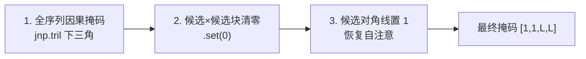

# 候选隔离注意力掩码

## 这一页回答什么

Phoenix 排序模型把多条候选拼进同一序列后,如何用一个特殊注意力掩码保证"每条候选独立打分"。

## 核心结论

1. **候选之间互相看不见**:掩码禁止候选 token 注意其它候选 token,只保留自注意。
2. **候选能注意上下文**:候选可以注意用户段与历史段。
3. **效果是分数独立**:一条候选的得分不依赖同批里有哪些别的候选 → 分数稳定、可缓存。
4. **由 `candidate_start_offset` 驱动**:掩码靠这个偏移量切出"候选区"。

## 为什么需要它

[[phoenix-ranking|排序模型]]把 `[用户(1) | 历史(S) | 候选(C)]` 拼成一条序列喂给同一个 transformer。若用普通注意力,候选 token 会互相注意 —— 那么一条帖子的得分就取决于"这一批里还有哪些帖子",同样的帖子换一批候选会得到不同分,既不稳定也无法缓存。

候选隔离掩码解决这个问题:**候选只能注意用户与历史,以及它自己**。

## 掩码构造

`make_recsys_attn_mask`(`grok.py:39-71`):

```python
def make_recsys_attn_mask(seq_len, candidate_start_offset, dtype=jnp.float32):
    # 1. 整条序列先建因果掩码(下三角)
    causal_mask = jnp.tril(jnp.ones((1, 1, seq_len, seq_len), dtype=dtype))
    # 2. 把"候选→候选"块整体清零(右下角方块)
    attn_mask = causal_mask.at[:, :, candidate_start_offset:, candidate_start_offset:].set(0)
    # 3. 把候选块的对角线恢复为 1(候选自注意)
    candidate_indices = jnp.arange(candidate_start_offset, seq_len)
    attn_mask = attn_mask.at[:, :, candidate_indices, candidate_indices].set(1)
    return attn_mask   # [1, 1, seq_len, seq_len],1 表示"可注意"
```

三步:



## 掩码长什么样

设 `U` = 用户段,`H` = 历史段,`C` = 候选段(`candidate_start_offset` = `1 + S`)。`✓` 可注意,`✗` 不可:

```
                 被注意的 key →
              │ U │  H ...  │  C0  C1  C2 ... │
        ┌─────┼───┼─────────┼─────────────────┤
   U    │  U  │ ✓ │ ✗ ✗ ✗   │  ✗  ✗  ✗        │
        ├─────┼───┼─────────┼─────────────────┤
   H    │ H0  │ ✓ │ ✓ ✗ ✗   │  ✗  ✗  ✗        │   ← 用户+历史:因果(下三角)
        │ H1  │ ✓ │ ✓ ✓ ✗   │  ✗  ✗  ✗        │
        ├─────┼───┼─────────┼─────────────────┤
   C    │ C0  │ ✓ │ ✓ ✓ ✓   │  ✓  ✗  ✗        │   ← 候选:看 U+H + 自己
        │ C1  │ ✓ │ ✓ ✓ ✓   │  ✗  ✓  ✗        │
        │ C2  │ ✓ │ ✓ ✓ ✓   │  ✗  ✗  ✓        │
        └─────┴───┴─────────┴─────────────────┘
```

候选区(右下 `C×C` 方块)只剩对角线 —— 候选彼此隔离,各自只注意 `U+H` 与自身。

> **与 README 图示的出入**:`phoenix/README.md` 的掩码示意把"用户+历史"段描述为彼此"完全双向注意力"。但代码用 `jnp.tril`(下三角),实际是**因果注意力** —— 位置 `i` 只能注意 `≤ i` 的位置。本页以代码为准。

## 在哪里被启用

`Transformer.__call__`(`grok.py:543-616`)按是否传 `candidate_start_offset` 二选一:

```python
if candidate_start_offset is not None:
    attn_mask = make_recsys_attn_mask(seq_len, candidate_start_offset, fprop_dtype)
    mask = mask * attn_mask                       # 候选隔离掩码
else:
    causal_mask = jnp.tril(jnp.ones((1, 1, seq_len, seq_len)))
    mask = mask * causal_mask                     # 标准因果掩码
```

掩码与 padding 掩码相乘后传入每个 `DecoderLayer`。在 `MultiHeadAttention` 里,掩码为 0 处的注意力 logit 被置为 `-1e30`,softmax 后权重≈0(`grok.py:378`)。

- [[phoenix-ranking|排序模型]] `PhoenixModel.__call__` 传入 `candidate_start_offset = 1 + S` → 启用候选隔离。
- [[phoenix-retrieval|召回模型]] `build_user_representation` 传 `candidate_start_offset=None` → 用标准因果掩码(序列里本就没有候选段)。

## 设计决策

| 决策 | 选择 | 理由 |
|------|------|------|
| 候选互不可见 | 清零候选×候选块 | 单候选得分不依赖同批其它候选 → 一致、可缓存 |
| 保留候选自注意 | 对角线置回 1 | 候选 token 至少要能注意自己,否则该位置无信息聚合 |
| 候选可注意 U+H | 因果掩码下三角天然保留 | 候选必须基于用户与历史上下文打分 |
| 复用同一掩码函数 | offset 为 `None` 时退化为标准因果 | 召回(无候选段)与排序共用一个 `Transformer` 实现 |
| 掩码值用 `-1e30` | 而非直接乘 0 | 在 softmax 前屏蔽,数值上更干净 |

## FAQ

**Q:候选隔离和"批内打分一致性"有什么关系?**
A:若候选能互相注意,把同一条帖子放进不同候选批会算出不同分,排序与缓存都失效。隔离后,给定相同的用户+历史,一条候选的分是确定的 —— 可跨请求缓存。

**Q:用户段和历史段为什么不也"完全双向"?**
A:代码用 `jnp.tril`,U+H 段实际是因果注意力。README 图示称"双向"与代码不符;以 `grok.py:62` 的 `jnp.tril` 为准。

## 源码锚点

- `phoenix/grok.py:39-71` —— `make_recsys_attn_mask`
- `phoenix/grok.py:571-581` —— `Transformer.__call__` 中掩码的二选一
- `phoenix/grok.py:370-379` —— `MultiHeadAttention` 中掩码屏蔽 logit
- `phoenix/recsys_model.py:644-662` —— 排序模型传入 `candidate_start_offset`

## 相关页面

- [[phoenix-ranking]] —— 使用候选隔离掩码的排序模型
- [[grok-transformer]] —— 掩码作用的 transformer 骨架
- [[phoenix-retrieval]] —— 不使用候选隔离的召回模型
- [[recsys-model]] —— `PhoenixModel` 如何传入 offset
- [[operating-myths]] —— 运营迷思 vs 源码真相:候选隔离打穿"被大V挤掉"的说法
