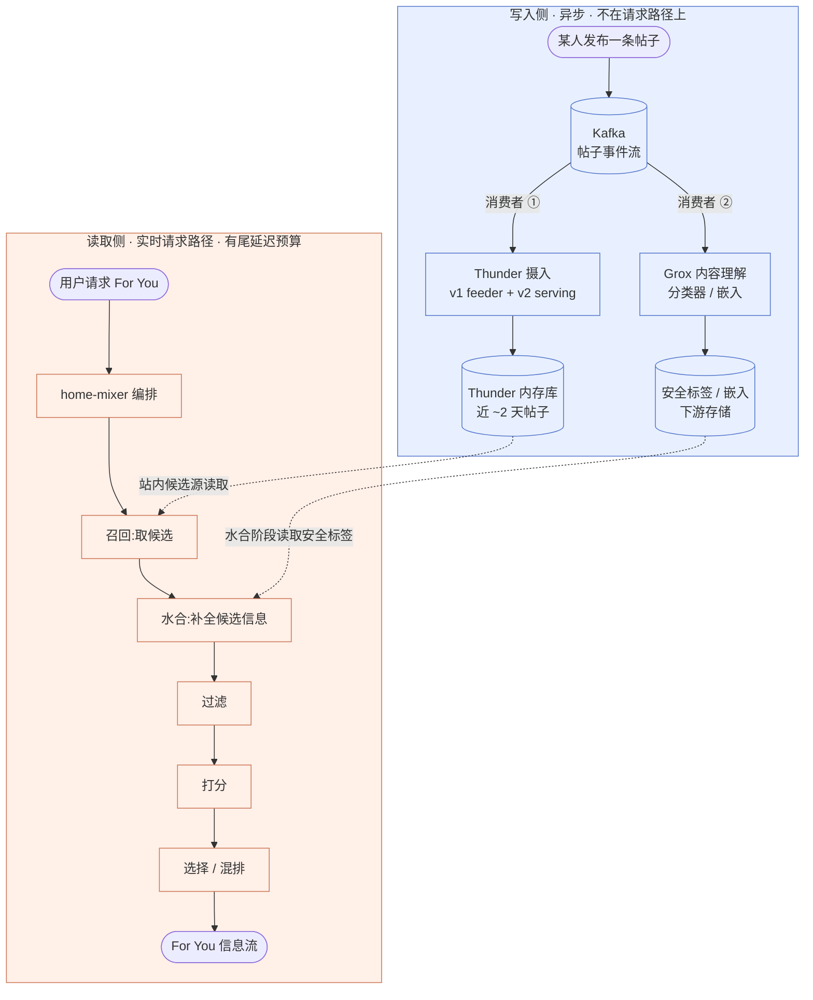

# 端到端数据流:一条帖子从发布到被推荐

## 这一页回答什么

各组件页已把子系统讲透了。这一页只做一件事:把它们**串成一条主线** —— 一条帖子被某人发出后,要经过哪些环节,才可能出现在另一个人的 For You 信息流里。

重点不是某个环节的细节(细节链到对应技术页),而是**哪些环节是离线/异步的、哪些在实时请求路径上**。这两类环节的时序、触发方式、对延迟的要求完全不同,混在一起看就理不清整个系统。

## 核心结论

1. **数据流分两条独立的线**:
   - **写入侧(异步)** —— 帖子一发布就触发,与任何人的请求无关。把帖子灌进 Thunder 内存库、让 Grox 跑内容理解。
   - **读取侧(实时请求路径)** —— 某个用户打开 For You 才触发,有严格的尾延迟预算。召回 → 水合 → 过滤 → 打分 → 选择。
2. **两条线靠"存储"解耦,不直接相连**。写入侧把结果沉淀到 Thunder 内存库、安全标签存储、嵌入 sink;读取侧请求来时**读**这些存储。帖子发布与帖子被推荐之间没有同步调用。
3. **Kafka 摄入、Grox 内容理解都在请求路径之外**。它们是后台流式管线,有处理延迟;一条帖子发布后要"等"它们处理完,才在读取侧可见、可被安全过滤。
4. **Thunder 是近期帖子的滑动窗口**,只保留最近约两天(默认 `retention_seconds` 2 天)的帖子。更早的帖子不在站内候选里。

## 全景图:两条线

关键是那两条**虚线**:它们是写入侧与读取侧唯一的接触点 —— 都是"读存储",不是调用。写入侧把数据准备好放在那儿,读取侧请求来时才去拿。

## 写入侧:帖子发布后异步发生什么

帖子一旦发布,X 会把它作为事件投递到 Kafka。`x-algorithm` 开源仓库里有**两个独立的 Kafka 消费者**各取所需:

### ① Thunder 摄入 —— 把帖子灌进站内内存库

Thunder 从 Kafka 消费帖子创建/删除事件,维护一个按作者组织的内存库。它分两个角色(由 `is_serving` 参数切换,`thunder/kafka_utils.rs:35,69`):

- **feeder(v1)** 消费原始 Thrift `TweetEvent`,转码成精简的 proto `InNetworkEvent` 再重发;
- **serving(v2)** 消费 `InNetworkEvent`,直接写进 `PostStore` 内存库。

一条帖子进库后,就成了"该作者最近发的帖"之一,可被站内候选源取到。Thunder 只保留近期帖 —— `insert_posts` 写入时就丢掉早于保留期的帖,后台任务每 2 分钟 trim 一次(`thunder/posts/post_store.rs:92-95`,默认保留 2 天)。

摄入细节(两个 listener 的分工、反序列化、保留期裁剪)见 [[thunder-kafka-ingestion]];内存库结构与站内候选服务见 [[thunder-in-network-store]]。

### ② Grox 内容理解 —— 旁路跑分类器和嵌入

Grox 是一个**独立的流式服务**,同样从 Kafka 消费帖子(数据源是 `KafkaPostLoader` 等,`grox/generators/stream_generator.py:6-13`)。它对每条帖子跑一批内容理解任务:安全分类、垃圾检测、质量("banger")初筛、多模态嵌入等(见 [[grox-classifiers]]、[[multimodal-embedders]])。

Grox 的产出**不直接返回给任何人** —— 它把结果写进下游存储。例如安全注解任务 `TaskWriteSafetyPostAnnotationsResultSink` 经 Strato 把安全标签写入 Manhattan(`grox/tasks/task_write_safety_post_annotations_result_sink.py:22-42`)。这些标签后面会被读取侧的水合阶段读回(见下)。

Grox 是流式异步管线,**有处理延迟**:一条帖子从发布到被 Grox 处理完、标签落到存储,中间隔着 Kafka 排队 + 任务执行。它的三进程架构、Plan/Task DAG 见 [[grox-architecture]]。

> **写入侧的本质**:这两条都是后台流式管线,**不在任何用户的请求路径上**。它们的触发源是"帖子发布"这个事件,不是"有人请求 For You"。它们的产物(Thunder 内存库里的帖子、存储里的安全标签和嵌入)是给读取侧用的"原料"。

## 读取侧:一次 For You 请求走的实时路径

当用户打开 For You,`home-mixer` 收到 gRPC 请求,真正的推荐才开始。这条路径有严格的尾延迟预算,与写入侧异步管线是两回事。

入口在 `home-mixer/for_you_server.rs:28-40` —— `get_for_you_feed` 直接 `pipeline.execute(query)`,把请求交给 [[candidate-pipeline-framework|候选流水线]]。实际跑的是两条嵌套流水线(外层混排 + 内层排序,见 [[home-mixer-orchestration]]、[[system-architecture]]);内层 `PhoenixCandidatePipeline` 才是干活的。流水线执行顺序由框架统一定义(`candidate-pipeline/candidate_pipeline.rs:88-137`)。

把内层流水线的十阶段归并成五步看主线:

### 1. 召回 —— 候选从哪来

流水线的"源"阶段(`phoenix_candidate_pipeline.rs:250-257`)并行跑 6 个候选源,两路是主力:

- **站内**:`ThunderSource` 调 Thunder gRPC,带上用户的关注列表,取"关注的人最近发的帖"。这一步**读的就是写入侧 ① 灌好的内存库**。
- **站外**:`PhoenixSource` / `PhoenixTopicsSource` / `PhoenixMOESource` 调 Phoenix 检索服务,用双塔模型从全局语料里 ML 召回"你可能感兴趣但没关注的"(见 [[phoenix-retrieval]])。

百万级语料经召回缩到数百~上千条候选。

### 2. 水合 —— 给候选补全信息

源阶段产出的候选是空壳(只有 `tweet_id`/`author_id` 等)。水合阶段(`phoenix_candidate_pipeline.rs:259-272`)并行跑多个水合器,补全帖子正文、媒体、互动计数、以及**安全标签**。

其中 `AdsBrandSafetyHydrator` 通过 `SafetyLabelStoreClient.batch_get_all_labels` 从安全标签存储批量读标签(`home-mixer/candidate_hydrators/ads_brand_safety_hydrator.rs:100-119`)—— **读的就是写入侧 ② Grox 写下去的标签**。这是 Grox 离线产物进入实时路径的接入点:Grox 不在请求路径上,但它的产出在这一步被请求路径"取用"。

### 3. 过滤 —— 顺序剔除不该出现的候选

预打分过滤阶段顺序跑 14 个过滤器(可见性、去重、社交图等,见 [[filtering-pipeline]])。上一步水合进来的安全标签等信息,在这里成为过滤判据之一。

### 4. 打分 —— ML 排序

打分阶段顺序跑 `PhoenixScorer` → `RankingScorer` → `VMRanker`。`PhoenixScorer` 调 [[phoenix-ranking|Phoenix 排序模型]](基于 Grok 的 transformer)预测每条帖子的多种互动概率;`RankingScorer` 加权成最终分(见 [[scoring-and-ranking]])。

### 5. 选择与混排 —— 成型为信息流

内层 `TopKScoreSelector` 按分数取 top-K,经选后水合/过滤;外层 `ForYouCandidatePipeline` 的 `BlenderSelector` 再把帖子流与广告、Who-to-Follow、Prompts 混排(见 [[candidate-selection]]、[[ads-blending]]),最终成为用户看到的 For You。

`ScoredPostsServer::run_pipeline` 是内层流水线的服务封装(`home-mixer/scored_posts_server.rs:41-73`)。

> **读取侧的本质**:这五步**全部在一次请求内同步完成**,有尾延迟预算。它不"处理"帖子,只是把写入侧已经准备好的原料(Thunder 里的帖子、存储里的标签和嵌入)组装、筛选、排序成一份信息流。

## 离线/异步 vs 实时:一张对照表

| 环节 | 属于哪条线 | 离线/实时 | 触发源 | 时效特性 |
|------|-----------|----------|--------|----------|
| Kafka 帖子事件流 | 写入侧 | 异步 | 帖子发布 | 流式,有传播延迟 |
| Thunder 摄入(灌内存库) | 写入侧 | 异步 | 消费 Kafka 事件 | 准实时,稳态低 lag;启动追赶 |
| Grox 内容理解(分类/嵌入) | 写入侧 | **离线/异步** | 消费 Kafka 事件 | 流式,**有明显处理延迟** |
| Grox 写标签/嵌入到存储 | 写入侧 | 异步 | Grox 任务完成 | 落库后供读取侧读 |
| 召回(取候选) | 读取侧 | **实时** | 用户请求 For You | 一次请求内完成 |
| 水合(读正文/标签) | 读取侧 | **实时** | 同上 | 同上 |
| 过滤 | 读取侧 | **实时** | 同上 | 同上 |
| 打分(ML 排序) | 读取侧 | **实时** | 同上 | 同上 |
| 选择 / 混排 | 读取侧 | **实时** | 同上 | 同上 |

一句话:**Kafka 摄入、Grox 内容理解 = 离线/异步、不在请求路径上;召回→水合→过滤→打分→选择 = 实时请求路径。**

## 时效性:帖子发布后多久能被推荐

机制层面的几个要点(线上具体数值仓库未给,不臆测):

- **Thunder 摄入有 lag**。稳态下 Thunder 的 Kafka 消费 lag 很低,新帖很快进库;但摄入是异步的,不存在"发布即入库"的强一致。Thunder 还对自己产出的新鲜度做了细致埋点(`GET_IN_NETWORK_POSTS_FOUND_FRESHNESS_SECONDS` 等,见 [[thunder-in-network-store]]),freshness 偏高通常意味着摄入有 lag。
- **Thunder 只看近 ~2 天**。超过保留期的帖子会被 trim 掉,不再是站内候选。一条帖子"能被站内推荐"的时间窗本身是有限的。
- **Grox 内容理解有处理延迟**。一条新帖从发布到被 Grox 处理完、安全标签落到存储,中间隔着 Kafka 排队和任务执行。在标签就绪之前,读取侧水合阶段读到的可能是空标签。
- **读取侧本身不产生"帖子级"延迟**。它是请求内同步路径,延迟预算针对的是"一次 For You 请求",与"这条帖子发布了多久"无关。

所以"一条帖子从发布到出现在某人 For You 里"的端到端时延,主要由**写入侧异步管线的处理速度**决定,而不是读取侧。

## 设计决策

| 决策 | 选择 | 理由 |
|------|------|------|
| 写入与读取分离 | 两条线靠存储解耦,不直接调用 | 帖子发布的吞吐与 For You 请求的尾延迟是两种约束,分开各自优化 |
| 内容理解旁路化 | Grox 不在请求路径,异步产标签 | VLM 分类/嵌入是重计算,放进请求路径会拖垮尾延迟;离线算好、请求时只读 |
| 站内库用内存 + 滑动窗口 | Thunder 只存近 ~2 天帖 | 站内候选对延迟极敏感;只存近期帖,内存可控、查询亚毫秒 |
| 召回当"源"、排序当"打分器" | 经典两阶段 | 先廉价地把百万缩到千(召回),再用昂贵 transformer 精排 |

## FAQ

**Q:为什么不在用户请求 For You 时,实时给候选帖跑安全分类?**
A:Grox 的内容分类靠 VLM、嵌入靠多模态模型,都是重计算。塞进请求路径会让 For You 的尾延迟不可控。系统的做法是:Grox 离线/流式地把每条帖子算好、标签写进存储;请求来时,水合阶段只做一次廉价的"读标签"(`AdsBrandSafetyHydrator`,`ads_brand_safety_hydrator.rs:100-119`)。计算与读取在时间上彻底分开。

**Q:一条刚发布几秒的帖子,会立刻出现在关注者的 For You 里吗?**
A:不保证。要先经写入侧异步管线:Thunder 消费 Kafka 把它灌进内存库(有 lag),Grox 也要消费同一事件流跑内容理解(有处理延迟)。在 Thunder 摄入完成前,站内候选源取不到它;在 Grox 标签就绪前,水合到的安全标签可能为空。端到端时延由这些异步环节决定。

**Q:写入侧和读取侧之间到底怎么"连"上的?**
A:不直接连。写入侧把产物沉淀进**存储**:Thunder 内存库、安全标签存储(Manhattan)、嵌入 sink。读取侧请求来时去**读**这些存储 —— `ThunderSource` 读 Thunder 内存库,`AdsBrandSafetyHydrator` 读安全标签存储,Phoenix 召回用到 Grox 产的内容嵌入。帖子发布与帖子被推荐之间没有任何同步 RPC。

## 源码锚点

- `thunder/kafka_utils.rs:35-115` —— Thunder 两个 Kafka 消费者(feeder / serving)按 `is_serving` 分流
- `thunder/posts/post_store.rs:92-95` —— `insert_posts` 写入时按保留期过滤
- `grox/generators/stream_generator.py:6-13,38-53` —— Grox 任务生成器以 `KafkaPostLoader` 为数据源
- `grox/tasks/task_write_safety_post_annotations_result_sink.py:22-42` —— Grox 经 Strato 把安全注解写入下游存储
- `home-mixer/for_you_server.rs:28-40` —— For You 请求入口,`pipeline.execute(query)`
- `candidate-pipeline/candidate_pipeline.rs:88-137` —— 流水线 `execute` 十阶段(读取侧主流程)
- `home-mixer/candidate_pipeline/phoenix_candidate_pipeline.rs:250-272` —— 内层流水线的 6 个候选源与候选水合器
- `home-mixer/candidate_hydrators/ads_brand_safety_hydrator.rs:100-119` —— 水合阶段从安全标签存储读回 Grox 标签
- `home-mixer/scored_posts_server.rs:41-73` —— `run_pipeline` 调内层 `PhoenixCandidatePipeline`

## 相关页面

- [[system-architecture]] —— 五大组件与两层流水线的静态总览
- [[home-mixer-orchestration]] —— 读取侧的编排:gRPC 服务、两条嵌套流水线、候选源
- [[candidate-pipeline-framework]] —— 读取侧流水线的十阶段框架
- [[thunder-kafka-ingestion]] —— 写入侧 ①:Thunder 的 Kafka 摄入细节
- [[thunder-in-network-store]] —— 写入侧产物 + 读取侧站内候选源
- [[grox-architecture]] —— 写入侧 ②:Grox 内容理解的旁路管线
- [[phoenix-retrieval]] —— 读取侧召回:站外双塔模型
- [[scoring-and-ranking]] —— 读取侧打分:打分器链与最终分
- [[how-it-works]] —— 整套系统的白话入口
- [[how-posts-are-picked]] —— "一条帖子如何被选中"的白话版
