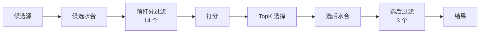

# 过滤流水线

## 这一页回答什么

`PhoenixCandidatePipeline` 在哪两个阶段过滤候选、各有哪些过滤器、每个过滤器的判定逻辑。

## 核心结论

1. **两道过滤**:打分前 14 个过滤器(剔除不合格候选),选择后 3 个过滤器(最终可见性与会话去重)。
2. **顺序执行**:过滤器逐个跑,前序的 `kept` 是后序的输入(见 [[candidate-pipeline-framework]])。
3. **不丢候选,只分流**:每个过滤器返回 `FilterResult { kept, removed }`,被剔除的候选进入 `non_selected`,可用于日志与统计。
4. **多数过滤器无条件启用,少数靠 `enable()` 门控**:如 `VideoFilter` 仅当 `exclude_videos`、`TopicIdsFilter` 仅当话题请求时才跑。

## 两道过滤的位置



过滤器统一实现 `Filter<ScoredPostsQuery, PostCandidate>` trait,核心方法:

```rust
fn filter(&self, query: &ScoredPostsQuery, candidates: Vec<PostCandidate>)
    -> FilterResult<PostCandidate>;   // { kept, removed }
fn enable(&self, query: &ScoredPostsQuery) -> bool;  // 默认 true
```

## 预打分过滤(14 个)

按 `phoenix_candidate_pipeline.rs:274-289` 的顺序。

### 去重类

**DropDuplicatesFilter** —— 用 `HashSet` 按 `tweet_id` 去重,首次出现保留:

```rust
// home-mixer/filters/drop_duplicates_filter.rs:18-24
for candidate in candidates {
    if seen_ids.insert(candidate.tweet_id) { kept.push(candidate); }
    else { removed.push(candidate); }
}
```

**RetweetDeduplicationFilter** —— 按 `retweeted_tweet_id.unwrap_or(tweet_id)` 去重:同一条帖子无论以原帖还是转发形式出现,只保留第一次(`retweet_deduplication_filter.rs:20-27`)。

### 数据完整性 / 时效

**CoreDataHydrationFilter** —— `kept = author_id != 0`。核心数据水合失败的候选 `author_id` 仍为 0,在此剔除(`core_data_hydration_filter.rs:13`)。

**AgeFilter** —— 剔除超过 `max_age` 的帖子。年龄由 `duration_since_creation_opt(tweet_id)` 从雪花 ID 解析得到;`max_age` 在流水线组装时设为 `Duration::from_secs(params::MAX_POST_AGE)`(`age_filter.rs:17-21`)。

### 作者关系

**SelfTweetFilter** —— 剔除 `author_id == query.user_id` 的帖子(`self_tweet_filter.rs:14-17`),不给用户看自己的帖。

**AuthorSocialgraphFilter** —— 剔除与社交图冲突的候选。命中任一即移除(`author_socialgraph_filter.rs:46-52`):

- 作者被 viewer 静音(`muted_user_ids`)或拉黑(`blocked_user_ids`)
- 作者拉黑了 viewer(`author_blocks_viewer`)
- 引用帖作者拉黑了 viewer / viewer 拉黑了引用帖作者
- viewer 拉黑了被转发的作者

### 内容偏好

**MutedKeywordFilter** —— 用 `TweetTokenizer` 把用户的 `muted_keywords` 与帖子正文都分词,经 `MatchTweetGroup` 匹配则剔除。无静音词时直接全部放行;匹配在 `tokio::task::block_in_place` 中执行以避免阻塞异步运行时(`muted_keyword_filter.rs:28-55`)。

**IneligibleSubscriptionFilter** —— 若候选是订阅专属帖(`subscription_author_id` 为 `Some`),只有当 viewer 订阅了该作者(在 `subscribed_user_ids` 中)才保留;非订阅帖一律保留(`ineligible_subscription_filter.rs:24-28`)。

**VideoFilter** —— `enable()` 仅当 `query.exclude_videos`;启用时剔除含视频的帖(`kept = min_video_duration_ms.is_none()`,`video_filter.rs:8-21`)。

### 已看 / 已服务去重

三个过滤器从不同来源剔除"用户已经见过"的帖,都用 `get_related_post_ids()` 把帖子及其关联 ID 一起检查:

| 过滤器 | 数据来源 | 说明 |
|--------|----------|------|
| `PreviouslySeenPostsFilter` | `seen_ids` + 客户端传来的 Bloom 过滤器 | Bloom 由 `bloom_filter_entries`(size_cap、false_positive_rate)重建,`may_contain` 判定(`previously_seen_posts_filter.rs:17-30`) |
| `PreviouslySeenPostsBackupFilter` | `impressed_post_ids` | 曝光帖兜底;`impressed_post_ids` 为空则跳过(`previously_seen_posts_backup_filter.rs:14-19`) |
| `PreviouslyServedPostsFilter` | `served_ids` | `enable()` 条件:`EnableServedFilterAllRequests` 参数为真,或 `is_bottom_request` 且请求上下文非 `ForegroundTruncate`(`previously_served_posts_filter.rs:13-18`) |

### 话题过滤

**TopicIdsFilter** —— `enable()`:话题请求或有排除话题。逻辑分两支(`topic_ids_filter.rs:20-106`):

- **话题请求**:按 `query.topic_ids` 经 `TopicIdExpansion` 展开(分类→子话题、超话题层级)匹配候选的 `filtered_topic_ids` / `unfiltered_topic_ids`;批量话题请求(>6 个话题)走"排除补集"逻辑。
- **排除话题**:把 `excluded_topic_ids` 展开后,剔除命中排除话题的候选。

`TopicIdExpansion`(`topic_ids_filter.rs:109-515`)内置完整话题分类法 —— 如 `SPORTS` 展开为 NBA/NFL/MLB/足球各联赛等数十个子话题,`supertopic()` 反向把子话题归并到超话题。

**NewUserTopicIdsFilter** —— `enable()`:`EnableNewUserTopicFiltering` 参数 + 有 `new_user_topic_ids` + 非话题请求。保留站内帖或命中新用户话题的候选(`new_user_topic_ids_filter.rs:10-30`),用于冷启动用户的兴趣聚焦。

## 选后过滤(3 个)

在 TopK 选择与选后水合之后运行(`phoenix_candidate_pipeline.rs:317-321`)。

**VFFilter** —— 按可见性过滤结果剔除。`should_drop` 判定(`vf_filter.rs:22-30`):

```rust
fn should_drop(reason: &Option<FilteredReason>) -> bool {
    match reason {
        Some(FilteredReason::SafetyResult(r)) => matches!(r.action, Action::Drop(_)),
        Some(_) => true,   // 其它任何 FilteredReason 一律丢弃
        None => false,
    }
}
```

删除帖、垃圾、暴力血腥等由可见性过滤(Visibility Filtering)服务判定,结果挂在候选的 `visibility_reason` 上。

**AncillaryVFFilter** —— 剔除 `drop_ancillary_posts == Some(true)` 的候选(`ancillary_vf_filter.rs:13-15`),即可见性服务标记需连带丢弃的附属帖。

**DedupConversationFilter** —— 同一会话线程只保留得分最高的一条。会话 ID 取候选 `ancestors` 的最小值(无祖先则用 `tweet_id` 自身);遇到同会话更高分候选则替换,被替换者进 `removed`(`dedup_conversation_filter.rs:18-48`)。

## 设计决策

| 决策 | 选择 | 理由 |
|------|------|------|
| 过滤分两道 | 打分前 + 选择后 | 打分前剔除不合格候选省下打分开销;可见性/会话去重依赖打分结果与选后水合,只能放后面 |
| 顺序执行 | 过滤器串行 | 前序过滤缩小集合、塑造后序输入,且每个过滤器的统计独立可观测 |
| 不真正删除 | `removed` 单独收集 | 被剔除候选用于 debug JSON、统计与日志归因 |
| 已看去重三件套 | seen_ids / Bloom / impressed / served 多源 | 客户端能力不一,Bloom 压缩历史、impressed 兜底、served 防同会话重复服务 |
| 话题展开 | 内置层级分类法 | 客户端只传顶层话题,服务端展开成细粒度子话题做精确匹配 |

## FAQ

**Q:为什么 `DropDuplicatesFilter` 和 `RetweetDeduplicationFilter` 都做去重?**
A:前者按 `tweet_id` 去精确重复;后者按"原帖 ID"去重 —— 同一原帖的多个转发、以及原帖本身,只留一个。两者维度不同。

**Q:`enable()` 返回 false 的过滤器会怎样?**
A:框架在 `run_filters` 里 `filter(|f| f.enable(query))` 直接跳过,并在 tracing span 记录被禁用的组件名(见 [[candidate-pipeline-framework]])。

## 源码锚点

- `home-mixer/candidate_pipeline/phoenix_candidate_pipeline.rs:274-289` —— 14 个预打分过滤器装配
- `home-mixer/candidate_pipeline/phoenix_candidate_pipeline.rs:317-321` —— 3 个选后过滤器装配
- `home-mixer/filters/topic_ids_filter.rs:109-515` —— `TopicIdExpansion` 话题分类法
- `home-mixer/filters/author_socialgraph_filter.rs:28-57` —— 社交图六类剔除判定

## 相关页面

- [[candidate-pipeline-framework]] —— `Filter` trait 与顺序执行模型
- [[home-mixer-orchestration]] —— 过滤器在内层流水线中的装配位置
- [[scoring-and-ranking]] —— 过滤之后的打分阶段
- [[candidate-selection]] —— 选后两道过滤所在的选择阶段
- [[visibility-and-shadowban]] —— 限流与 shadowban:这些过滤器从"压制创作者"角度怎么解读
- [[system-architecture]] —— 过滤在十阶段流水线中的位置
