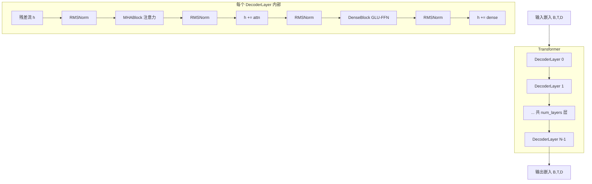

# Grok Transformer 骨架

## 这一页回答什么

Phoenix 的召回用户塔和排序模型共用同一个 transformer 骨架。这个骨架不是为推荐从零写的,而是**从 xAI 的 Grok-1 开源版移植过来**,改造为推荐系统用途(`phoenix/README.md:5`)。本页讲清这个 `Transformer` 类的内部构造:decoder 层怎么堆、注意力怎么算、RoPE/RMSNorm/GLU-FFN 各自做什么、分组查询注意力(GQA)与注意力软封顶的细节,以及哪些 Grok-1 特性在本次发布里**被去掉了**。

源码全部集中在一个文件:`phoenix/grok.py`(617 行)。

## 核心结论

1. **一个文件、一个骨架**:`phoenix/grok.py` 定义了完整的 transformer。召回([[phoenix-retrieval]])和排序([[phoenix-ranking]])都通过 `TransformerConfig.make()` 构造同一个 `Transformer` 类(`grok.py:125-133`),只是配置不同。
2. **不含 MoE**:完整的 Grok-1 是 Mixture-of-Experts 架构,但本次发布的 FFN 是**普通稠密块** `DenseBlock`,没有专家路由、没有 gating network。这是与完整 Grok-1 最显著的差异。
3. **Pre-Norm + 双 RMSNorm 残差**:每个 `DecoderLayer` 在子层前归一化,子层输出后**再归一化一次**才加回残差流 —— 这是 Grok-1 的特殊设计,与标准 Pre-Norm transformer 不同。
4. **分组查询注意力(GQA)**:Q 头数与 KV 头数可以不同,KV 头被多个 Q 头共享(`grok.py:346,357`)。mini 配置里两者相等,等价于标准 MHA。
5. **RoPE 旋转位置编码**:位置信息通过旋转 Q/K 注入,不用可学习位置嵌入。支持自定义位置数组,服务于 right-anchored 历史对齐。
6. **注意力 logit 软封顶**:attention logits 经过 `30 · tanh(x/30)` 压缩,防止极端值,这是 Grok-1 的稳定性技巧(`grok.py:367-368`)。
7. **掩码可切换**:`Transformer` 既能跑标准因果掩码(自回归),也能跑推荐专用的候选隔离掩码 —— 由 `candidate_start_offset` 参数决定,详见 [[candidate-isolation-masking]]。

## 整体结构



注意 decoder 层里出现了 **4 次 RMSNorm**:子层前 2 次、子层后 2 次。这点下面详述。

## TransformerConfig:配置入口

`Transformer` 不直接构造,而是通过 `TransformerConfig` 这个 dataclass 的 `make()` 工厂方法:

```python
# phoenix/grok.py:112-133
@dataclass
class TransformerConfig:
    emb_size: int
    key_size: int
    num_q_heads: int
    num_kv_heads: int
    num_layers: int
    widening_factor: float = 4.0

    attn_output_multiplier: float = 1.0

    name: Optional[str] = None

    def make(self) -> "Transformer":
        return Transformer(
            num_q_heads=self.num_q_heads,
            num_kv_heads=self.num_kv_heads,
            widening_factor=self.widening_factor,
            key_size=self.key_size,
            attn_output_multiplier=self.attn_output_multiplier,
            num_layers=self.num_layers,
        )
```

| 字段 | 含义 | mini 配置取值 |
|------|------|---------------|
| `emb_size` | 模型维度 D | 128 |
| `key_size` | 每个注意力头的 K/Q/V 维度 | 32(`run_pipeline.py` 路径)/ 64(`run_ranker.py` demo) |
| `num_q_heads` | 查询头数 | 4 |
| `num_kv_heads` | 键值头数(GQA) | 4 |
| `num_layers` | decoder 层数 | 4 |
| `widening_factor` | FFN 隐层放大系数 | 2.0 |
| `attn_output_multiplier` | 注意力 logit 缩放 | 0.125 |

> mini 配置的官方表格(`phoenix/README.md:254-268`)给出 128 维、4 层、4 头、key_size=32。`run_pipeline.py` 从 `config.json` 读取真实导出配置,`build_model_config()` 把 `num_heads` 同时填给 `num_q_heads` 和 `num_kv_heads`,并硬编码 `widening_factor=2.0`、`attn_output_multiplier=0.125`(`run_pipeline.py:144-152`)。`run_ranker.py` / `run_retrieval.py` 是另一套独立的 2 层 demo 配置(`key_size=64`),不要与 pipeline 配置混淆。

## Transformer:堆叠 decoder 层

`Transformer.__call__` 把输入嵌入逐层过 `DecoderLayer`,层数由 `num_layers` 决定:

```python
# phoenix/grok.py:543-616(节选)
def __call__(
    self,
    embeddings: jax.Array,  # [B, T, D]
    mask: jax.Array,  # [B, T]
    candidate_start_offset: Optional[int] = None,
    positions: Optional[jax.Array] = None,
) -> TransformerOutput:
    fprop_dtype = embeddings.dtype
    _, seq_len, _ = embeddings.shape
    padding_mask = mask.copy()
    mask = mask[:, None, None, :]  # [B, H=1, T'=1, T]

    if candidate_start_offset is not None:
        # 推荐系统:候选隔离掩码
        attn_mask = make_recsys_attn_mask(seq_len, candidate_start_offset, fprop_dtype)
        mask = mask * attn_mask
    else:
        # 标准自回归因果掩码
        causal_mask = jnp.tril(jnp.ones((1, 1, seq_len, seq_len))).astype(fprop_dtype)
        mask = mask * causal_mask

    h = embeddings
    for i in range(self.num_layers):
        decoder_output = block(h, mask, padding_mask, layer_index=i, name=f"decoder_layer_{i}")
        h = decoder_output.embeddings

    return TransformerOutput(embeddings=h)
```

要点:

- **掩码二选一**:`candidate_start_offset` 非空走候选隔离掩码(`make_recsys_attn_mask`),否则走标准下三角因果掩码。推荐推理总是传 offset(由 `PhoenixModel.build_inputs` 计算,见 `recsys_model.py:624`)。掩码细节见 [[candidate-isolation-masking]]。
- **padding mask 与注意力 mask 相乘**:`mask[:, None, None, :]` 是 `[B,1,1,T]` 的 padding mask(标记哪些位置是真实 token),与 `[1,1,T,T]` 的注意力结构掩码逐元素相乘,合成最终的 `[B,1,T,T]` 掩码。
- **逐层命名**:每层 `name=f"decoder_layer_{i}"`,checkpoint 里的参数路径据此组织(见 [[run-pipeline]] 的 `load_model_params`)。
- **没有最终归一化**:`Transformer` 自身不在堆叠末尾做 LayerNorm;最终归一化由调用方负责(`recsys_model.py:666` 的 `out_embeddings = layer_norm(out_embeddings)`)。
- **没有 unembedding / 输出头**:`Transformer` 只输出隐藏态 `[B,T,D]`。投影到 action logits 由 [[phoenix-ranking]] 完成。

## DecoderLayer:Pre-Norm + 双 RMSNorm 残差

单层的结构是这个骨架最值得注意的地方 —— 它在每个子层**前后各做一次** RMSNorm:

```python
# phoenix/grok.py:469-524(节选)
@dataclass
class DecoderLayer(hk.Module):
    """A transformer stack."""

    num_q_heads: int
    num_kv_heads: int
    key_size: int
    num_layers: int
    layer_index: Optional[int] = None
    widening_factor: float = 4.0
    name: Optional[str] = None
    attn_output_multiplier: float = 1.0

    def __call__(self, inputs, mask, padding_mask, positions=None) -> DecoderOutput:
        del padding_mask  # Unused.

        def layer_norm(x):
            return hk_rms_norm(x)

        h = inputs

        # --- 注意力子层 ---
        attn_output = MHABlock(...)(layer_norm(h), mask, positions=positions)
        h_attn = attn_output.embeddings
        h_attn = layer_norm(h_attn)   # 子层输出再归一化
        h += h_attn                   # 残差相加

        # --- FFN 子层 ---
        h_dense = base_dense_block(layer_norm(h))
        h_dense = layer_norm(h_dense)  # 子层输出再归一化
        h += h_dense                   # 残差相加

        return DecoderOutput(embeddings=h)
```

对比标准 Pre-Norm transformer `h += SubLayer(LN(h))`,Grok-1 的形式是:

```
h += LN( SubLayer( LN(h) ) )
```

也就是**子层输入和子层输出都过一次 RMSNorm**。这是从 Grok-1 原样移植的设计,目的是稳定残差流的尺度。注意 `padding_mask` 参数在 `DecoderLayer` 里被显式 `del` 掉 —— 它不参与单层计算,padding 信息已经合并进了传入的 4 维 `mask`。

`MHABlock`(`grok.py:403-437`)是对 `MultiHeadAttention` 的薄封装:它把同一个 `inputs` 同时当作 query / key / value(自注意力),`side_input = inputs`:

```python
# phoenix/grok.py:434
attn_output = attn_block(inputs, side_input, side_input, mask)
```

## MultiHeadAttention:GQA + RoPE + 软封顶

注意力是骨架里最复杂的模块。`MultiHeadAttention.__call__`(`grok.py:310-388`)按顺序做这几件事:

### 1. 投影到多头 Q/K/V

```python
# phoenix/grok.py:346-349
assert self.num_q_heads % self.num_kv_heads == 0
query_heads = projection(query, self.key_size, self.num_q_heads, name="query")
key_heads = projection(key, self.key_size, self.num_kv_heads, name="key")
value_heads = projection(value, self.value_size, self.num_kv_heads, name="value")
```

`num_q_heads` 必须是 `num_kv_heads` 的整数倍 —— 这是**分组查询注意力(GQA)** 的前提:多个查询头共享一组键值头,减少 KV cache 内存。投影用 `Linear`(`with_bias=False`)实现,reshape 成 `[..., num_heads, head_size]`。

### 2. 对 Q/K 施加 RoPE

```python
# phoenix/grok.py:351-353
rotate = RotaryEmbedding(dim=self.key_size, base_exponent=int(1e4))
key_heads = rotate(key_heads, seq_dim=1, offset=0, t=positions)
query_heads = rotate(query_heads, seq_dim=1, offset=0, t=positions)
```

位置信息通过旋转 Q 和 K 注入(不旋转 V)。`t=positions` 允许传入自定义位置数组(默认 `None` 时用顺序位置),这是 right-anchored RoPE 的接入点(下文详述)。

### 3. 计算注意力 logits + 软封顶

```python
# phoenix/grok.py:359-368
query_heads = jnp.reshape(query_heads, (b, t, kv_h, h // kv_h, d))

# Attention softmax is always carried out in fp32.
attn_logits = jnp.einsum("...thHd,...Thd->...hHtT", query_heads, key_heads).astype(jnp.float32)
attn_logits *= self.attn_output_multiplier
max_attn_val = jnp.array(30.0, dtype=attn_logits.dtype)
attn_logits = max_attn_val * jnp.tanh(attn_logits / max_attn_val)
```

三个细节:

- **GQA 的 reshape**:`query_heads` 被 reshape 成 `(b, t, kv_h, h//kv_h, d)` —— 把 `h` 个查询头分成 `kv_h` 组,每组 `h//kv_h` 个头共享同一个 KV 头。einsum 下标 `hH` 即 (KV组, 组内查询头)。
- **`attn_output_multiplier` 缩放**:logits 先乘配置项(mini 配置 = 0.125)。注意这**替代了** transformer 里常见的 `1/√d` 缩放 —— Grok-1 把缩放因子做成可配置常量。
- **软封顶(soft cap)**:`30 · tanh(logits/30)` 把 attention logits 平滑地压进 ±30,防止个别极大值主导 softmax。这是 Grok-1 的数值稳定技巧。softmax 始终在 fp32 下做(`grok.py:362` 的注释明确指出)。

### 4. 应用掩码并 softmax

```python
# phoenix/grok.py:370-388(节选)
mask = mask[:, :, None, :, :]
if mask is not None:
    attn_logits = jnp.where(mask, attn_logits, -1e30)
attn_weights = jax.nn.softmax(attn_logits).astype(query.dtype)

attn = jnp.einsum("...hHtT,...Thd->...thHd", attn_weights, value_heads)
leading_dims = attn.shape[:2]
attn = jnp.reshape(attn, (*leading_dims, -1))  # [T', H*V]

final_projection = Linear(self.model_size, with_bias=False)
return MHAOutput(final_projection(attn))
```

被掩掉的位置 logit 设为 `-1e30`(softmax 后约等于 0)。注意力权重加权 V 后,展平多头,再过一个无偏置 `Linear` 投影回 `model_size`(= D)。

## RotaryEmbedding(RoPE)

`RotaryEmbedding`(`grok.py:229-285`)实现 RoPE(论文 arXiv:2104.09864)。核心是对特征向量做位置相关的旋转:把每个位置的 Q/K 向量按"位置 × 频率"决定的角度转一下 —— 两个 token 做注意力点积时,结果只取决于它们的**旋转角之差**,也就是相对距离。位置信息因此被自然编码进点积,不需要额外的位置嵌入向量。

```python
# phoenix/grok.py:221-227
def rotate_half(x: jax.Array) -> jax.Array:
    """Obtain the rotated counterpart of each feature"""
    x1, x2 = jnp.split(x, 2, axis=-1)
    return jnp.concatenate((-x2, x1), axis=-1)
```

```python
# phoenix/grok.py:257-285(节选)
exponents = jnp.arange(0, self.dim, 2, dtype=jnp.float32)
inv_freq = jnp.asarray(1.0 / (self.base_exponent ** (exponents / self.dim)), dtype=jnp.float32)
...
elif t is None:
    t = jnp.arange(x.shape[seq_dim], dtype=jnp.float32) + jnp.expand_dims(offset, -1)
phase = jnp.einsum("bi,j->bij", t, inv_freq)
phase = jnp.tile(phase, reps=(1, 2))[:, :, None, :]

x = x * jnp.cos(phase) + rotate_half(x) * jnp.sin(phase)
```

- `base_exponent` 默认 10000,`MultiHeadAttention` 调用时显式传 `int(1e4)`。
- `dim` 必须是偶数(`grok.py:247` 的 `assert`)。
- 位置 `t` 来源三选一:`const_position`(所有位置同值)、显式 `t`、或顺序位置 `arange + offset`。

### Right-anchored RoPE 位置

`recsys_model.py` 里有个可选项 `right_anchored_rope`:开启时,RoPE 位置不再是简单的 `0..T-1`,而由 `right_anchored_rope_positions` 计算:

```python
# phoenix/grok.py:88-109
def right_anchored_rope_positions(
    padding_mask: jax.Array,
    history_seq_len: int,
    num_user_prefix_tokens: int,
) -> jax.Array:
    """Compute RoPE positions where the newest history token always gets a fixed position."""
    history_start = num_user_prefix_tokens
    history_end = num_user_prefix_tokens + history_seq_len

    idx = jnp.arange(padding_mask.shape[1], dtype=jnp.int32)[None, :]
    history_len = padding_mask[:, history_start:history_end].sum(axis=1, dtype=jnp.int32)

    positions = jnp.where(
        (history_start <= idx) & (idx < history_end),
        history_end - history_len[:, None] + idx - history_start,
        idx,
    )
    positions = jnp.where(idx >= history_end, history_end, positions)
    positions = jnp.where(padding_mask, positions, 0).astype(jnp.float32)
    return positions
```

含义:用户历史长度不一,但**最新的历史 token 永远落在固定位置**(`history_end`)。短历史被"右对齐"到历史区段末尾。这样模型对"最近一次互动"的位置感知是一致的,与历史是否填满无关。该选项在 `PhoenixModel.__call__` 里启用(`recsys_model.py:649-654`)。

## RMSNorm

骨架用 RMSNorm 而非 LayerNorm:

```python
# phoenix/grok.py:196-218(节选)
def __call__(self, inputs: jax.Array):
    fprop_dtype = inputs.dtype
    param_shape = (inputs.shape[-1],)
    if self.create_scale:
        scale = hk.get_parameter("scale", param_shape, dtype=jnp.float32,
                                 init=hk.initializers.Constant(0))
        scale = jnp.broadcast_to(scale.astype(jnp.float32), inputs.shape)
    else:
        scale = 1.0
    inputs = inputs.astype(jnp.float32)
    mean_squared = jnp.mean(jnp.square(inputs), axis=[-1], keepdims=True)
    normed_inputs = inputs * jax.lax.rsqrt(mean_squared + self.eps)
    outputs = scale * normed_inputs
    return outputs.astype(fprop_dtype)
```

- 只按均方根归一,**不减均值**(这是 RMSNorm 与 LayerNorm 的区别)。
- `eps = 1e-5`。
- 计算在 fp32 下做,输出转回原 dtype(`fprop_dtype`,推理时是 `bfloat16`,见 `recsys_model.py:346`)。
- 模块级 `hk_rms_norm`(`grok.py:136-142`)是便捷封装,`DecoderLayer` 内部用的就是它。

## DenseBlock:GLU 门控 FFN(不含 MoE)

FFN 子层是 **GLU(Gated Linear Unit)风格的门控前馈网络**,即 `DenseBlock`:

```python
# phoenix/grok.py:440-466
@dataclass
class DenseBlock(hk.Module):
    num_q_heads: int
    num_kv_heads: int
    key_size: int
    widening_factor: float = 4.0

    @hk.transparent
    def __call__(self, inputs: jax.Array) -> jax.Array:  # [B, T, D] -> [B, T, D]
        _, _, model_size = inputs.shape
        h_v = Linear(ffn_size(model_size, self.widening_factor), with_bias=False, name="linear_v")(inputs)
        h_w1 = jax.nn.gelu(
            Linear(ffn_size(model_size, self.widening_factor), with_bias=False)(inputs)
        )
        h_dense = Linear(model_size, with_bias=False)(h_w1 * h_v)
        return h_dense
```

结构:`out = Linear( gelu(Linear_w1(x)) ⊙ Linear_v(x) )`。两个并行的上投影,一个过 GELU 作"门",逐元素乘另一个,再下投影。这是 Grok-1 / 现代 LLM 普遍采用的 GeGLU 变体。

隐层维度由 `ffn_size` 算:

```python
# phoenix/grok.py:32-36
def ffn_size(emb_size, widening_factor):
    _ffn_size = int(widening_factor * emb_size) * 2 // 3
    _ffn_size = _ffn_size + (8 - _ffn_size) % 8  # ensure it's a multiple of 8
    return _ffn_size
```

`* 2 // 3` 是 GLU-FFN 的标准修正(GLU 多一个矩阵,缩小隐层保持参数量相当);再向上取整到 8 的倍数(对齐硬件)。以 mini 配置 `emb_size=128, widening_factor=2` 算:`int(2*128)*2//3 = 170`,`170 + (8-170)%8 = 176`。

> **关键:本次发布的 FFN 没有 MoE。** 完整的 Grok-1 在这里是 Mixture-of-Experts —— 多个专家 FFN + 路由 gating。本仓库的 `DenseBlock` 是单个稠密 GLU-FFN,无专家、无路由。`phoenix/README.md:5` 说明本仓库的 transformer "ported from the Grok-1 open source release ... with the exception of specific scaling optimizations",MoE 即被省略的部分之一。`grok.py` 全文搜不到任何 expert / router / gating 相关代码。

## Linear:全连接层

骨架自带一个 `Linear`(继承 `hk.Linear`,`grok.py:145-183`),与标准 Haiku Linear 的区别:权重 `w` 和偏置 `b` 都用 `Constant(0)` 初始化 —— 因为推理时参数从 checkpoint 加载,初始值无所谓;计算时把 `w` 转成输入的 dtype(`fprop_dtype`)以支持 bf16 推理。注意力和 FFN 里的投影矩阵全部 `with_bias=False`。

## 设计决策

| 决策 | 选择 | 理由 |
|------|------|------|
| 骨架来源 | 直接移植 Grok-1 而非自研 | 复用 xAI 成熟的 LLM transformer,推荐侧只改输入嵌入和注意力掩码(`phoenix/README.md:5`) |
| MoE | 本次发布去掉,改用稠密 `DenseBlock` | mini 版无需专家容量;省去路由复杂度,checkpoint 更小(`phoenix/README.md:5` 提到省略了 scaling optimizations) |
| 归一化 | RMSNorm,不减均值 | 比 LayerNorm 省一次均值计算,现代 LLM 标准做法 |
| 残差形式 | `h += LN(SubLayer(LN(h)))`,子层前后各归一一次 | Grok-1 原始设计,双重归一稳定残差流尺度 |
| 注意力缩放 | 可配置 `attn_output_multiplier` 替代 `1/√d` | 缩放因子作为超参可调 |
| logit 软封顶 | `30·tanh(x/30)` | 平滑限幅,防止极端 logit 主导 softmax,提升数值稳定 |
| 注意力 | GQA(Q/KV 头数解耦) | KV 头可少于 Q 头,减少 KV cache;mini 配置取相等即退化为 MHA |
| 位置编码 | RoPE,支持自定义位置 | 无需可学习位置嵌入;自定义位置数组支撑 right-anchored 历史对齐 |
| FFN | GeGLU 门控,隐层 `*2//3` 后对齐 8 | 门控 FFN 表达力更强,`*2//3` 补偿 GLU 多出的矩阵 |

## FAQ

**Q:这个 transformer 和完整的 Grok-1 差在哪?**
A:最大差异是**没有 MoE** —— 本仓库 FFN 是单个稠密 `DenseBlock`,完整 Grok-1 是专家混合。其次 `phoenix/README.md:5` 提到省略了"specific scaling optimizations"。注意力、RoPE、RMSNorm、软封顶、双归一残差这些核心结构都原样保留。

**Q:为什么 decoder 层里 RMSNorm 出现 4 次?**
A:Grok-1 的残差形式是 `h += LN(SubLayer(LN(h)))`。注意力子层用 2 次(输入归一 + 输出归一),FFN 子层再用 2 次,合计 4 次。标准 Pre-Norm 只在子层输入归一,这里多了输出侧的归一。

**Q:`candidate_start_offset` 不传会怎样?**
A:`Transformer` 退回标准下三角因果掩码,变成普通自回归 transformer。推荐推理总是传 offset 走候选隔离掩码;不传的分支是为通用自回归场景保留的。详见 [[candidate-isolation-masking]]。

**Q:GQA 在 mini 配置里有用吗?**
A:mini 配置 `num_q_heads == num_kv_heads == 4`,此时 GQA 退化为标准 MHA,每个查询头独享一个 KV 头。GQA 的省内存收益要在 KV 头数小于 Q 头数时才体现 —— 生产大模型可能这样配。

**Q:为什么 softmax 强制 fp32?**
A:`grok.py:362` 注释明确"Attention softmax is always carried out in fp32"。推理整体跑 bf16,但 attention logits 和 softmax 用 fp32 避免精度损失导致的权重塌缩。

## 源码锚点

- `phoenix/grok.py:32-36` —— `ffn_size`,GLU-FFN 隐层维度计算
- `phoenix/grok.py:88-109` —— `right_anchored_rope_positions`,历史右对齐位置
- `phoenix/grok.py:112-133` —— `TransformerConfig` 及 `make()` 工厂
- `phoenix/grok.py:145-183` —— `Linear` 全连接层
- `phoenix/grok.py:186-218` —— `RMSNorm`
- `phoenix/grok.py:221-285` —— `rotate_half` 与 `RotaryEmbedding`(RoPE)
- `phoenix/grok.py:288-388` —— `MultiHeadAttention`(GQA + 软封顶)
- `phoenix/grok.py:403-437` —— `MHABlock` 自注意力封装
- `phoenix/grok.py:440-466` —— `DenseBlock`(GeGLU FFN,无 MoE)
- `phoenix/grok.py:469-524` —— `DecoderLayer`(双归一残差)
- `phoenix/grok.py:531-616` —— `Transformer` 主类
- `phoenix/recsys_model.py:644-666` —— 排序模型如何调用 `Transformer` 并做最终归一

## 相关页面

- [[candidate-isolation-masking]] —— 候选隔离注意力掩码,决定 `Transformer` 走哪种掩码
- [[hash-based-embeddings]] —— 喂给 transformer 的输入嵌入怎么从哈希表查出来
- [[phoenix-ranking]] —— 排序模型,用本骨架 + unembedding 头预测多种互动概率
- [[phoenix-retrieval]] —— 召回模型,用户塔复用同一个 transformer 骨架
- [[recsys-model]] —— `PhoenixModel` 实体,把哈希嵌入、本骨架、输出头串成排序模型
- [[run-pipeline]] —— 端到端运行器,从 `config.json` 构造 `TransformerConfig`
- [[open-source-vs-production]] —— 开源版 vs 线上真实算法:本骨架去掉 MoE 等差异的完整清单
- [[system-architecture]] —— Phoenix 在整个 For You 系统中的位置
