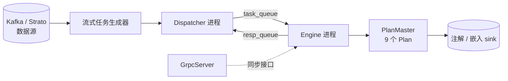
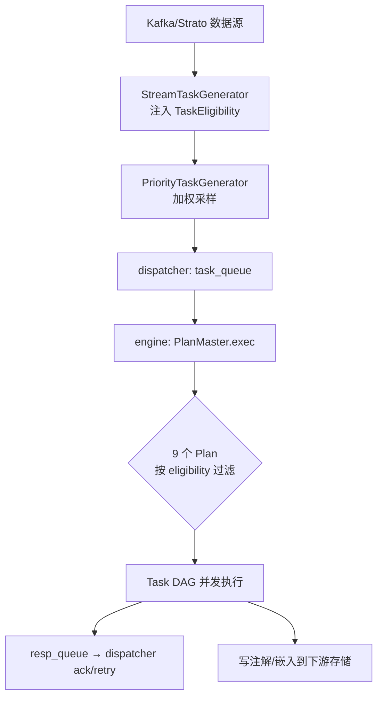

# Grox 服务架构

## 这一页回答什么

Grox 这个内容理解服务由哪些进程构成、任务如何从数据源流到执行、Task 与 Plan 是什么关系。

## 核心结论

1. **三进程架构**:`Dispatcher`(拉取调度)、`Engine`(执行)、`GrpcServer`,经共享队列通信。
2. **Plan 是 Task 的 DAG**:一个 `Plan` 用 `TASKS` + `TASK_DEPENDENCIES` 定义任务依赖图,并发执行。
3. **PlanMaster 并行跑所有 Plan**:每个任务交给 9 个 Plan,按 `REQUIRED_ELIGIBILITY` 过滤出真正该跑的。
4. **旁路服务**:Grox 不在 For You 请求路径上,是流式消费帖子、产出内容信号(安全标签、嵌入、质量分)的离线管线。

## 三进程

`main.py::serve()` 创建一个共享 `ScheduleContext`(含 `task_queue`、`resp_queue`、shutdown 事件),启动三个组件:



`Dispatcher` 与 `Engine` 各跑在独立的 `multiprocessing.Process` 里(`engine.py:122`、`dispatcher.py:357`),靠 `task_queue` / `resp_queue` 两个进程间队列通信。关停时 `main.py` 先发 `queue_connection_shutdown`、**等 300 秒**排空在途任务,再 `shutdown_context` 并停各组件(`main.py:39-49`)。

## Dispatcher:拉取与重试

`Dispatcher`(`dispatcher.py`)两个并发循环 + 一个关停等待(`dispatcher.py:342-349`):

- **`_fill_loop`**:从任务生成器 `poll()` 出 `TaskPayload`,在 `len(in_flights) < max_in_flight` 时 `_submit_task` 推入 `task_queue`(`dispatcher.py:251-266`)。
- **`_result_loop`**:从 `resp_queue` 取 `TaskResult`(`dispatcher.py:283-333`):
  - 成功 → 从 `in_flights` 移除,`ack`
  - 失败且 `attempt < max_attempts` → `attempt += 1`,重新 `_submit_task`
  - 失败且重试用尽 → 记 `dispatcher.result.failed.final.count`,按 origin `ack`

任务生成器是 `PriorityTaskGenerator`,包了多个带权重的 `StreamTaskGenerator`(`dispatcher.py:84-232`)。每种生成器对应一个数据流,如 `PostStreamTaskGenerator`、`PostSafetyStreamTaskGenerator`、`PostEmbeddingV5StreamTaskGenerator`、`SafetyPtosDeluxeStreamTaskGenerator`、`ReplyRankingRecoveryTaskGenerator` 等十余种,按 `weight` 加权采样。

## Engine:执行

`Engine`(`engine.py`)从 `task_queue` 取任务,对每个任务 `asyncio.create_task(self._run_task(task))` 并发跑(`engine.py:104-113`):

```python
async def _process_task(self, task: TaskPayload) -> TaskResult:
    res = await PlanMaster.exec(task)         # 核心:交给 PlanMaster
    Metrics.histogram("engine.task.processing_time").record(...)
    return res
```

成功的 `TaskResult` 推回 `resp_queue`,失败则推一个 `success=False` 的结果。`_init_run` 还会启动 `MediaProcessor` 与 `ASRProcessor`(媒体与视频转写,`engine.py:46-49`)。

## Task:最小执行单元

`Task`(`grox/tasks/task.py:27`)是抽象基类:

```python
class Task(ABC):
    DISABLE_RULES: list[type[DisableTaskRule]] = []

    @classmethod
    @retry(stop=stop_after_attempt(2), wait=wait_fixed(1))
    async def exec(cls, ctx: TaskContext) -> TaskResultCategory:
        if cls.should_skip(ctx):              # DISABLE_RULES + _should_skip
            return TaskResultCategory.SKIPPED
        try:
            await cls._exec(ctx)              # 子类实现
        except TaskStopExecution:
            return TaskResultCategory.SKIPPED
        return TaskResultCategory.SUCCESS
```

- `exec` 自带 **2 次重试**;`should_skip` 先查 `DISABLE_RULES`(运行时开关)再查 `_should_skip`。
- 四个便捷子类按 payload 自动取数据:`TaskWithPost`、`TaskWithUser`、`TaskWithUserContext`、`TaskWithContentAnalysis` —— 取不到对应数据就抛 `TaskStopExecution` → SKIPPED(`task.py:93-150`)。
- `TaskResultCategory` 只有 `SUCCESS` / `SKIPPED`,失败靠异常上抛。

## Plan:Task 的 DAG

`Plan`(`grox/plans/plan.py:16`)把若干 Task 编成依赖图:

```python
class Plan(ABC):
    TASKS: dict[str, type[Task]]              # 任务名 → 任务类
    TASK_DEPENDENCIES: dict[str, set[str]]    # 任务名 → 依赖的任务名集合
    REQUIRED_ELIGIBILITY: TaskEligibility     # 该 Plan 生效的条件
```

`execute()`(`plan.py:28-75`):

1. `_eligible` —— `REQUIRED_ELIGIBILITY` 不在 payload 的 `eligibilities` 里则直接返回 `None`
2. 为每个被依赖的任务建一个 `asyncio.Future`
3. `asyncio.gather` 并发跑所有任务 —— 每个任务先 `await` 其依赖的 future
4. **依赖被 SKIPPED → 该任务也 SKIPPED**(短路传播,`plan.py:89-92`)

依赖图保证顺序,无依赖关系的任务并发跑。

## PlanMaster:并行所有 Plan

`PlanMaster`(`plans/plan_master.py`)持有 **9 个 Plan**:

| Plan | 用途 |
|------|------|
| `PlanInitialBanger` | 帖子质量("banger")初筛 |
| `PlanPostSafety` | 帖子安全筛查 |
| `PlanSpamComment` | 垃圾评论检测 |
| `PlanPostEmbeddingWithSummary` / `…ForReply` | 带摘要的帖子嵌入 |
| `PlanPostEmbeddingV5` / `…ForReply` | v5 多模态帖子嵌入 |
| `PlanReplyRanking` | 回复排序打分 |
| `PlanSafetyPtos` | PTOS 安全策略 |

```python
@classmethod
async def exec(cls, task: TaskPayload) -> TaskResult:
    results = await asyncio.gather(*[p.execute(task) for p in cls.ALL_PLANS])
    return cls.merge_results(task, [r for r in results if r is not None])
```

每个任务都被丢给全部 9 个 Plan 并发执行,但只有 `REQUIRED_ELIGIBILITY` 匹配的 Plan 真正跑任务(其余 `execute` 返回 `None`)。`merge_results` 合并各 Plan 的 `content_categories`、`multimodal_post_embedding`、`reason`,`success` 取全部 Plan 的与。

## 数据流总览



`TaskEligibility` 由生成器在产出 `TaskPayload` 时注入 —— 它既是"该任务该走哪些 Plan"的路由标签,也是 Plan 的 `_eligible` 判据。

## 设计决策

| 决策 | 选择 | 理由 |
|------|------|------|
| 三进程分离 | dispatcher / engine / grpc | 拉取调度与重型执行隔离,一方崩溃不拖垮另一方 |
| 进程间队列 | `task_queue` / `resp_queue` | 解耦生产与消费速率,dispatcher 可独立做限流与重试 |
| Plan = Task DAG | `TASK_DEPENDENCIES` 显式声明 | 无依赖的任务自动并发;依赖 SKIPPED 自动短路下游 |
| PlanMaster 全量并行 | 9 个 Plan 都跑,eligibility 过滤 | 一个帖子可同时被多种分析覆盖,互不阻塞 |
| 双层重试 | Task 内 2 次 + dispatcher `max_attempts` 次 | 瞬时错误就地重试,持久错误重新入队 |
| 关停等 300s | `queue_connection_shutdown` 后 sleep 300 | 排空在途任务,避免丢数据 |

## FAQ

**Q:同一个帖子会被处理几次?**
A:取决于它命中了哪些数据流。一个帖子可能既进 `PostSafetyStream` 又进 `PostEmbeddingV5Stream`,生成多个带不同 `TaskEligibility` 的 `TaskPayload`,各自被对应 Plan 处理。

**Q:Grox 的产出去哪了?**
A:写入下游存储(如 Manhattan 的统一帖子注解、嵌入 sink),供 [[home-mixer-orchestration|home-mixer]] 的可见性过滤、品牌安全、[[phoenix-retrieval|召回]]等使用。Grox 本身不参与在线打分。

## 源码锚点

- `grox/main.py:21-50` —— 三进程启动与关停
- `grox/dispatcher.py:251-333` —— `_fill_loop` 与 `_result_loop`
- `grox/engine.py:51-113` —— 任务执行循环
- `grox/plans/plan.py:28-102` —— Plan 的 DAG 执行
- `grox/plans/plan_master.py:18-62` —— 9 个 Plan 与 `merge_results`

## 相关页面

- [[grox-classifiers]] —— Plan 里跑的 VLM 内容分类器
- [[multimodal-embedders]] —— 嵌入类 Plan 调用的多模态嵌入器
- [[system-architecture]] —— Grox 作为旁路服务的定位
- [[ads-blending]] —— 消费 Grox 安全标签的下游之一
- [[end-to-end-dataflow]] —— 端到端数据流:Grox 旁路管线如何与 feed 请求路径汇合
