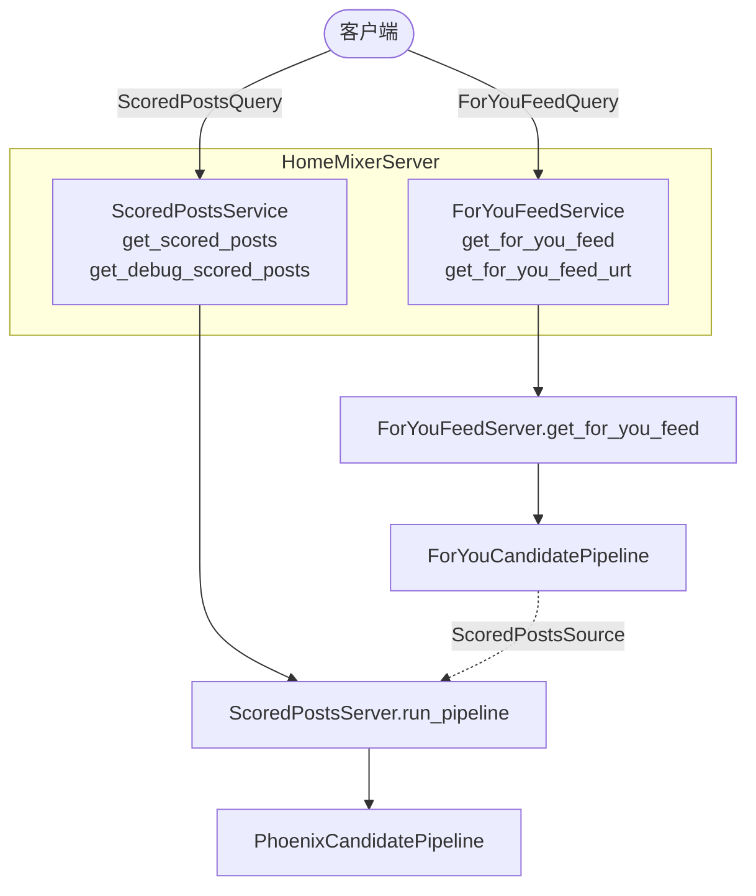

# home-mixer 编排层

## 这一页回答什么

`home-mixer` 是 For You 信息流的服务进程:它如何启动、暴露什么 gRPC 接口、如何把 [[candidate-pipeline-framework|流水线框架]] 组装成两条嵌套流水线、候选从哪些源来、请求与候选用什么数据模型承载。

## 核心结论

1. **一个进程,两个 gRPC 服务**:`ScoredPostsService`(纯帖子打分)与 `ForYouFeedService`(成品信息流)。
2. **两条嵌套流水线**:外层 `ForYouCandidatePipeline` 把内层 `PhoenixCandidatePipeline` 当作一个候选源(`ScoredPostsSource`)。
3. **QueryBuilder 是请求入口的统一适配器**:proto 请求 → 抓取 viewer 数据 → 评估 feature switches → 构造 `ScoredPostsQuery`。
4. **候选源即"召回"**:Thunder(站内)、Phoenix 检索(站外)、TweetMixer、缓存等 6 个源并行供给内层流水线。

## 服务启动

入口 `home-mixer/main.rs`,用 `XServiceBuilder` 搭 gRPC 服务:

```rust
// home-mixer/main.rs:48-62
XServiceBuilder::new("home-mixer")
    .grpc_port(args.grpc_port)          // 默认 50051
    .metrics_port(args.metrics_port)    // 默认 9090
    .datacenter(args.datacenter)        // 默认 "atla"
    .with_featureswitches(params::FS_PATH, true)
    .with_decider(params::decider_path(), None)
    .with_tls(TlsMode::server_mtls_from_env()?)
    .with_max_connection_age(Duration::from_secs(300))
    .with_reflection(pb::FILE_DESCRIPTOR_SET)
    .with_layer(dark_traffic_setup::resolve_layer())
    .with_layer(RejectDarkTrafficLayer::from_env())
    .run::<HomeMixerServer>(HomeMixerConfig { shard_coordinate })
```

CLI 参数(`main.rs:13-28`):`grpc_port`(50051)、`metrics_port`(9090)、`shard_coordinate`(-1 表示不分片)、`shard_total_size`(500)、`datacenter`("atla")。

`HomeMixerServer::build()`(`server.rs:353-395`)是装配中心,依次创建:Gizmoduck 客户端 → `QueryBuilder` → `PhoenixCandidatePipeline::prod()`(内层流水线)→ `ScoredPostsServer` → `ForYouCandidatePipeline::new()`(外层流水线)→ `ForYouFeedServer`。

`register()`(`server.rs:397-420`)挂上两个 gRPC 服务,均启用 gzip/zstd 双向压缩,消息上限 `params::MAX_GRPC_MESSAGE_SIZE`。

## 两个 gRPC 服务



| 服务 | 实现 | 方法 | 返回 |
|------|------|------|------|
| `ScoredPostsService` | `ScoredPostsServer` | `get_scored_posts`、`get_debug_scored_posts` | `ScoredPost` 列表(`server.rs:206-268`) |
| `ForYouFeedService` | `ForYouFeedServer` | `get_for_you_feed`、`get_for_you_feed_urt` | `FeedItem` 列表 / URT 二进制(`server.rs:271-347`) |

`get_debug_scored_posts` 会 `force_sample()` 强制采样(`server.rs:236-267`),并经 `build_debug_json` 把完整流水线中间结果(retrieved/filtered/selected 候选 + 计数)序列化成 debug JSON(`scored_posts_server.rs:115-132`)。`get_for_you_feed_urt` 额外把 `FeedItem` 列表经 `urt::make_urt_timeline` 转成 X 的 URT(Unified Rich Timeline)Thrift 格式再二进制序列化(`for_you_server.rs:43-74`)。

## QueryBuilder:请求入口适配器

每个 gRPC 入口都先过 `QueryBuilder::build()`(`server.rs:59-136`):

1. 校验 `viewer_id != 0`,否则返回 `invalid_argument`
2. `fetch_viewer_data()` —— 调 Gizmoduck 拿用户角色/订阅等,**200ms 超时**(`VIEWER_ROLES_TIMEOUT_MS`),超时则用 `ViewerData::default()`
3. `evaluate_feature_switches()` —— 用 `RecipientBuilder`(含 user_id、国家、语言、账号天龄、是否有手机号、角色)匹配 feature switches,得到 `Params`。feature switches 是 X 的灰度/实验开关系统:按用户画像命中一组配置值,流水线各组件再从 `Params` 读这些值决定行为(开/关、阈值、走哪个集群等)
4. 构造 `ScoredPostsQuery`

注意 `in_network_only` 的推导:`proto_query.in_network_only || viewer_data.allow_for_you_recommendations == Some(false)`(`server.rs:75-76`)—— 用户若关闭"为你推荐",则只走站内。

## 两条嵌套流水线

两条流水线都实现 [[candidate-pipeline|CandidatePipeline]] trait,但泛型候选类型不同:

### 外层 ForYouCandidatePipeline

`CandidatePipeline<ScoredPostsQuery, FeedItem>`。`FeedItem` 是 oneof —— 帖子 / 广告 / Who-to-Follow 模块 / Prompt / PushToHome。它只用 4 个阶段(`for_you_candidate_pipeline.rs:155-195`):

- **2 个 query 水合器**:`ServedHistoryQueryHydrator`、`PastRequestTimestampsQueryHydrator`
- **5 个源**:`ScoredPostsSource`、`AdsSource`、`WhoToFollowSource`、`PromptsSource`、`PushToHomeSource`
- **选择器**:`BlenderSelector`
- **8 个 side effect**:广告注入日志、seen ids → Kafka、served candidates → Kafka、客户端事件、响应统计、更新/截断 served history、更新请求时间戳

hydrators / filters / scorers / post-selection 全部返回 `&[]`(`for_you_candidate_pipeline.rs:247-269`)—— 帖子的过滤打分已在内层做完。

### 内层 PhoenixCandidatePipeline

`CandidatePipeline<ScoredPostsQuery, PostCandidate>`。真正执行召回→水合→过滤→打分→选择的流水线,组件清单见 [[system-architecture]]。`result_size()` 返回 `params::RESULT_SIZE`。

`ScoredPostsSource`(`sources/scored_posts_source.rs`)是连接两层的桥:

```rust
// home-mixer/sources/scored_posts_source.rs:13-32
impl Source<ScoredPostsQuery, FeedItem> for ScoredPostsSource {
    async fn source(&self, query: &ScoredPostsQuery) -> Result<Vec<FeedItem>, String> {
        let output = self.scored_posts_server.run_pipeline(query.clone()).await
            .map_err(|e| format!("ScoredPostsSource: {e}"))?;
        let feed_items = output.scored_posts.into_iter()
            .map(|post| FeedItem { position: 0, item: Some(feed_item::Item::Post(post)) })
            .collect();
        Ok(feed_items)
    }
}
```

`ScoredPostsServer::run_pipeline()`(`scored_posts_server.rs:41-73`)先对 `params::TEST_USER_IDS` 短路返回空,再 `phoenix_candidate_pipeline.execute(query)`,最后把 `PostCandidate` 转成 `ScoredPost` proto。

## 候选源

内层流水线的 6 个源(`phoenix_candidate_pipeline.rs:250-257`)并行执行:

| 源 | 内容 | `enable()` 条件(节选) |
|----|------|------|
| `ThunderSource` | 站内(关注的人)帖子 | `!has_cached_posts` |
| `TweetMixerSource` | TweetMixer 召回 | —— |
| `PhoenixSource` | Phoenix 双塔站外召回 | 非话题请求、非站内限定、`!has_cached_posts` |
| `PhoenixTopicsSource` | Phoenix 话题召回 | —— |
| `PhoenixMOESource` | Phoenix MoE 召回 | —— |
| `CachedPostsSource` | 上次请求缓存的帖子 | —— |

**ThunderSource**(`sources/thunder_source.rs`)调 Thunder gRPC 服务 `InNetworkPostsService.get_in_network_posts`,请求里带 `following_user_ids`(关注列表)、`exclude_tweet_ids`(= `seen_ids`)、`max_results`(`ThunderMaxResults` 参数);返回的帖子按是否站内限定标 `ForYouInNetwork` 或 `RankedFollowing`。

**PhoenixSource**(`sources/phoenix_source.rs`)调 Phoenix 检索服务。`resolve_cluster()` 体现新用户特殊路由:若 `retrieval_sequence` 的动作数 `< PhoenixRetrievalNewUserHistoryThreshold`,改用新用户推理集群;decider 开关还能在 `Lap7` 与 `Fou` 集群间互换。返回候选标 `ForYouPhoenixRetrieval`。

外层流水线另有 `AdsSource` / `WhoToFollowSource` / `PromptsSource` / `PushToHomeSource` 供给非帖子的 `FeedItem`。

## 选择器

| 选择器 | 用于 | 行为 |
|--------|------|------|
| `TopKScoreSelector` | 内层 | 按 `candidate.score` 降序,取 `params::TOP_K_CANDIDATES_TO_SELECT` 个(`selectors/top_k_score_selector.rs`) |
| `BlenderSelector` | 外层 | 把 `FeedItem` 按类型分桶,帖子与广告混排,再插入 Prompt / WTF / PushToHome |

`BlenderSelector`(`home-mixer/selectors/blender_selector.rs:24-75`)按 `AdsBlenderType` 参数二选一广告 blender(`"safe_gap"` → `SafeGapAdsBlender`,否则 `PartitionOrganicAdsBlender`,见 [[ads-blending]]);混排后 `insert_prompts` 插到 `PROMPTS_POSITION`、`insert_who_to_follow` 插到 `WHO_TO_FOLLOW_POSITION`、`pin_push_to_home` 钉在位置 0。

## 数据模型

### ScoredPostsQuery

请求贯穿全流水线的查询对象(`home-mixer/models/query.rs:24-95`),~60 个字段。关键分组:

- **身份/上下文**:`user_id`、`client_app_id`、`country_code`、`language_code`、`request_context`、`cursor`
- **去重输入**:`seen_ids`、`served_ids`、`bloom_filter_entries`、`impressed_post_ids`
- **互动序列**:`scoring_sequence`、`retrieval_sequence`(及其 columnar 变体)—— 喂给 Phoenix 模型
- **用户特征**:`user_features`、`user_demographics`、`subscription_level`、关注话题/starter pack 位图
- **请求形态**:`in_network_only`、`is_bottom_request`、`is_top_request`、`topic_ids`、`excluded_topic_ids`、`exclude_videos`
- **配置**:`params`(feature switches)、`decider`

它实现 `PipelineQuery` trait(`query.rs:226-234`),向框架暴露 `params()` 与 `decider()`。便捷判定:`is_topic_request()`、`is_bulk_topic_request()`(topic_ids > 6)、`has_excluded_topics()` 等。

### PostCandidate

内层流水线的候选(`home-mixer/models/candidate.rs:8-55`)。从空壳逐阶段被水合:源阶段只填 `tweet_id`/`author_id`/`served_type`,之后水合器补 `tweet_text`、`phoenix_scores`、`brand_safety_verdict`、`safety_labels`、`visibility_reason`、互动计数等;打分器写入 `weighted_score` 与 `score`。`CandidateHelpers` trait 提供 `get_original_tweet_id()`(转发取源帖)、`as_tweet_info()`(转成喂给模型的 `TweetInfo`)。

### UserFeatures

`muted_keywords`、`blocked_user_ids`、`muted_user_ids`、`followed_user_ids`、`subscribed_user_ids`、`follower_count`(`home-mixer/models/user_features.rs:5-14`)。实现 `MValCodec`,从 Strato 的 Thrift 字节反序列化(各字段有固定 field id)。

## 设计决策

| 决策 | 选择 | 理由 |
|------|------|------|
| 流水线分层 | 外层 FeedItem + 内层 PostCandidate 两条 | 帖子排序与多类型混排关注点分离;内层可独立作为 `ScoredPostsService` 复用 |
| 请求适配 | 统一 `QueryBuilder` | proto→领域对象、feature switch 评估、viewer 数据抓取集中一处 |
| viewer 数据 | 200ms 超时 + 默认值兜底 | Gizmoduck 慢调用不拖垮请求 |
| 测试用户 | `TEST_USER_IDS` 短路返回空 | 避免给测试账号产生真实推荐与副作用 |
| 候选源 | 6 源并行 | 站内/站外/缓存多路召回,框架层 `join_all` 并发 |

## FAQ

**Q:`get_for_you_feed` 和 `get_for_you_feed_urt` 区别?**
A:前者返回结构化 `FeedItem` 列表;后者把同样的结果再编码成 X 客户端用的 URT Thrift 二进制(`for_you_server.rs:43-74`),并会解析请求里的 cursor 判断 `is_bottom_request`/`is_top_request`。

**Q:内层流水线能单独用吗?**
A:能。`ScoredPostsService` 就是直接暴露内层 `PhoenixCandidatePipeline` 的接口,返回纯 `ScoredPost`,不含广告/模块混排。

## 源码锚点

- `home-mixer/main.rs:41-63` —— 服务启动
- `home-mixer/server.rs:206-347` —— 两个 gRPC 服务的方法实现
- `home-mixer/server.rs:353-420` —— `HomeMixerServer::build()` 与 `register()`
- `home-mixer/scored_posts_server.rs:41-113` —— `run_pipeline()` 与候选→proto 转换
- `home-mixer/selectors/blender_selector.rs:24-75` —— 外层混排选择器

## 相关页面

- [[system-architecture]] —— 整体两层流水线与十阶段总览
- [[end-to-end-dataflow]] —— 端到端数据流:home-mixer 编排的一次请求从头到尾
- [[your-data]] —— 算法用了你的哪些数据:`ScoredPostsQuery` 各字段从用户侧的来源
- [[candidate-pipeline-framework]] —— 流水线框架的 trait 设计
- [[candidate-pipeline]] —— `CandidatePipeline` 执行器
- [[filtering-pipeline]] —— 内层流水线的过滤器
- [[scoring-and-ranking]] —— 内层流水线的打分器
- [[candidate-selection]] —— 内 / 外两层流水线的选择器与选后成型
- [[ads-blending]] —— `BlenderSelector` 调用的广告混排
- [[thunder-in-network-store]] —— `ThunderSource` 背后的站内库
- [[phoenix-retrieval]] —— `PhoenixSource` 背后的召回模型
