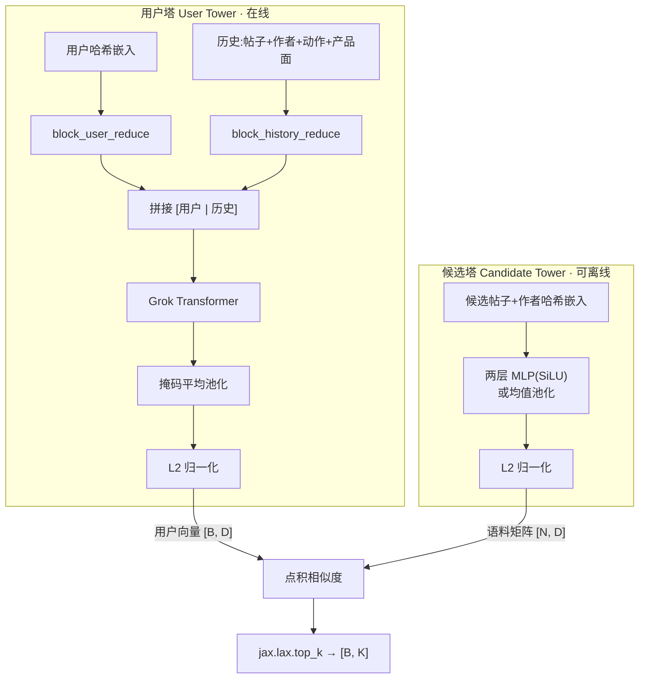

# Phoenix 召回:双塔检索架构

## 这一页回答什么

X "For You" 信息流在排序之前,先得从**数百万**全局候选里筛出**数百到上千**条值得精排的帖子。这一步叫**召回**(retrieval)。Phoenix 的召回用**双塔架构**(two-tower)实现:一座塔编码用户,一座塔编码帖子,两边都产出 L2 归一化向量,检索退化成一次点积 + top-K。

本页讲召回的**架构与机制**——为什么双塔能在百万级语料上高效检索、用户塔/候选塔各自怎么编码、点积相似度怎么取 top-K。代码构件层面的逐方法拆解见实体页 [[recsys-retrieval-model]];本页与之不重复。

## 核心结论

1. **双塔分离是效率的根本**。用户塔依赖请求时才知道的用户历史,必须在线算;候选塔只依赖帖子自身特征,可以**离线**对整个语料预计算好。检索时只需把一个用户向量和一张预算好的语料矩阵做矩阵乘法。
2. **用户塔复用 Grok transformer**。它和 [[phoenix-ranking|排序模型]] 用的是同一个 [[grok-transformer]] 骨架(`PhoenixRetrievalModelConfig` 持有一个 `TransformerConfig`),区别只在输入序列里**没有候选段**——只有 `[用户 | 历史]`。
3. **候选塔很轻**。它不是 transformer,而是一个两层 MLP(SiLU 激活)或干脆是均值池化,把帖子的多哈希嵌入投影到共享空间。`enable_linear_proj` 开关二选一。
4. **两边都 L2 归一化**。归一化后点积等价于余弦相似度,使得近似最近邻(ANN)检索成立。
5. **检索 = 点积 + `jax.lax.top_k`**。`user_representation @ corpus_embeddings.T` 得 `[B, N]` 分数矩阵,直接取 top-K。mini 版在 ~537K 的 sports 语料上演示这一步。

## 双塔架构总览



候选塔的输出就是"语料矩阵"的来源:线上把整个语料的帖子离线喂过候选塔,得到 `[N, D]` 矩阵存起来;请求来时只算用户塔。

## 为什么双塔能在百万级高效检索

朴素做法是把每个 (用户, 候选) 对一起喂进模型打分,代价是 `O(N)` 次完整前向。双塔把这件事拆成**可分解**的两半:

```
score(user, item) = user_vec(user) · item_vec(item)
```

- `item_vec(item)` 只依赖帖子本身 → 整个语料可以**离线批量**算好,存成一张 `[N, D]` 矩阵。
- `user_vec(user)` 每个请求算**一次**。
- 检索退化为一次 `[1, D] × [D, N]` 矩阵乘法 + top-K,GPU 上是单个 kernel,而不是 N 次 transformer 前向。

代价是表达力受限:用户和候选在打分前**不能交叉**(没有交叉注意力),只能各自压成一个向量再点积。这正是两阶段设计的分工——召回用廉价的双塔把百万缩到上千,把昂贵的交叉建模留给 [[phoenix-ranking|排序阶段]]。

## 用户塔:把用户 + 历史编码成一个向量

用户塔是 `PhoenixRetrievalModel.build_user_representation()`(`phoenix/recsys_retrieval_model.py:221-291`)。它和排序模型的 `build_inputs` 几乎一样,唯一区别是**输入序列没有候选段**。

### 第一步:历史的产品面与动作嵌入

```python
# phoenix/recsys_retrieval_model.py:242-249
history_product_surface_embeddings = self._single_hot_to_embeddings(
    batch.history_product_surface,
    config.product_surface_vocab_size,   # 默认 16
    config.emb_size,
    "product_surface_embedding_table",
)
history_actions_embeddings = self._get_action_embeddings(batch.history_actions)
```

- **产品面**(product surface)是单热索引(帖子被看到的界面位置),走一张 `[16, D]` 查找表。
- **动作**是多热向量(用户在这条历史帖上做过哪些互动)。`_get_action_embeddings`(`:176-199`)把 0/1 向量转成有符号 `(2*actions-1)`,过一个 `[num_actions, D]` 投影矩阵;全零(无动作)的位置用 `valid_mask` 清零。

### 第二步:block_user_reduce 与 block_history_reduce

这两个 reduce 函数定义在 `phoenix/recsys_model.py`,被召回与排序**共享**:

```python
# phoenix/recsys_retrieval_model.py:251-268
user_embeddings, user_padding_mask = block_user_reduce(
    batch.user_hashes,
    recsys_embeddings.user_embeddings,
    hash_config.num_user_hashes,         # 默认 2
    config.emb_size,
    1.0,
)
history_embeddings, history_padding_mask = block_history_reduce(
    batch.history_post_hashes,
    recsys_embeddings.history_post_embeddings,
    recsys_embeddings.history_author_embeddings,
    history_product_surface_embeddings,
    history_actions_embeddings,
    hash_config.num_item_hashes,         # 默认 2
    hash_config.num_author_hashes,       # 默认 2
    1.0,
)
```

- `block_user_reduce`(`recsys_model.py:147-197`):每个用户由 `num_user_hashes` 个哈希嵌入表示([[hash-based-embeddings]]),reshape 成 `[B, 1, num_user_hashes*D]` 后过投影矩阵 `proj_mat_1` 压回 `[B, 1, D]`。
- `block_history_reduce`(`recsys_model.py:200-268`):把历史每个位置的「帖子哈希嵌入 + 作者哈希嵌入 + 动作嵌入 + 产品面嵌入」沿最后一维拼接,过投影矩阵 `proj_mat_3` 压回 `[B, S, D]`。
- 两个函数都返回 **padding mask**:哈希值为 0 表示该位置无效(padding),mask 标记有效位。

### 第三步:拼接 → transformer → 池化 → 归一化

```python
# phoenix/recsys_retrieval_model.py:270-291
embeddings = jnp.concatenate([user_embeddings, history_embeddings], axis=1)
padding_mask = jnp.concatenate([user_padding_mask, history_padding_mask], axis=1)

model_output = self.model(
    embeddings.astype(self.fprop_dtype),
    padding_mask,
    candidate_start_offset=None,         # 没有候选段
)
user_outputs = model_output.embeddings

mask_float = padding_mask.astype(jnp.float32)[:, :, None]   # [B, T, 1]
user_embeddings_masked = user_outputs * mask_float
user_embedding_sum = jnp.sum(user_embeddings_masked, axis=1) # [B, D]
mask_sum = jnp.sum(mask_float, axis=1)                       # [B, 1]
user_representation = user_embedding_sum / jnp.maximum(mask_sum, 1.0)

user_norm_sq = jnp.sum(user_representation**2, axis=-1, keepdims=True)
user_norm = jnp.sqrt(jnp.maximum(user_norm_sq, EPS))         # EPS = 1e-12
user_representation = user_representation / user_norm
```

关键点:

- 序列只有 `[用户 | 历史]`,所以传给 transformer 的 `candidate_start_offset=None`——**不需要候选隔离掩码**([[candidate-isolation-masking]] 只在排序阶段用)。
- transformer 输出后做**掩码平均池化**:把所有有效位置的输出向量求和,除以有效位置数,得单个 `[B, D]` 向量。padding 位置被 `mask_float` 清零、不计入分母。
- 最后 L2 归一化。`user_norm` 也作为第二个返回值传出(`build_user_representation` 返回 `(user_representation, user_norm)`),归一化前的范数可用于温度缩放等。

`test_user_representation_normalized`(`test_recsys_retrieval_model.py:205-222`)验证输出范数恒为 1。

## 候选塔:把帖子投影到共享空间

候选塔是独立的 `CandidateTower` 模块(`phoenix/recsys_retrieval_model.py:46-112`),**不是 transformer**。它接收帖子嵌入和作者嵌入拼起来的张量,产出归一化的候选向量。

### 入口:build_candidate_representation

```python
# phoenix/recsys_retrieval_model.py:293-328
candidate_post_embeddings = recsys_embeddings.candidate_post_embeddings
candidate_author_embeddings = recsys_embeddings.candidate_author_embeddings

post_author_embedding = jnp.concatenate(
    [candidate_post_embeddings, candidate_author_embeddings], axis=2
)

candidate_tower = CandidateTower(
    emb_size=config.emb_size,
    enable_linear_proj=config.enable_linear_proj,
)
candidate_representation = candidate_tower(post_author_embedding)

candidate_padding_mask = (batch.candidate_post_hashes[:, :, 0] != 0).astype(jnp.bool_)
```

帖子和作者的多哈希嵌入沿 `axis=2`(哈希维)拼接,形状 `[B, C, num_hashes, D]`(`num_hashes` 是帖子哈希数 + 作者哈希数)。

### 两种模式:线性投影 vs 均值池化

`CandidateTower.__call__`(`:63-112`)由 `enable_linear_proj` 二选一:

**模式 A — 两层 MLP 投影**(`enable_linear_proj=True`,默认):

```python
# phoenix/recsys_retrieval_model.py:81-112
if len(post_author_embedding.shape) == 4:
    B, C, _, _ = post_author_embedding.shape
    post_author_embedding = jnp.reshape(post_author_embedding, (B, C, -1))
# ...
proj_1 = hk.get_parameter("candidate_tower_projection_1",
    [post_author_embedding.shape[-1], self.emb_size * 2], ...)
proj_2 = hk.get_parameter("candidate_tower_projection_2",
    [self.emb_size * 2, self.emb_size], ...)

hidden = jnp.dot(post_author_embedding.astype(proj_1.dtype), proj_1)
hidden = jax.nn.silu(hidden)
candidate_embeddings = jnp.dot(hidden.astype(proj_2.dtype), proj_2)

candidate_norm_sq = jnp.sum(candidate_embeddings**2, axis=-1, keepdims=True)
candidate_norm = jnp.sqrt(jnp.maximum(candidate_norm_sq, EPS))
candidate_representation = candidate_embeddings / candidate_norm
```

先把所有哈希嵌入展平(`reshape(B, C, -1)`),过 `D→2D→D` 的两层全连接,中间 SiLU 激活,最后 L2 归一化。表达力强,但有学习参数。

**模式 B — 均值池化**(`enable_linear_proj=False`):

```python
# phoenix/recsys_retrieval_model.py:74-79
if not self.enable_linear_proj:
    candidate_representation = jnp.mean(post_author_embedding, axis=-2)
    candidate_norm_sq = jnp.sum(candidate_representation**2, axis=-1, keepdims=True)
    candidate_norm = jnp.sqrt(jnp.maximum(candidate_norm_sq, EPS))
    candidate_representation = candidate_representation / candidate_norm
    return candidate_representation.astype(post_author_embedding.dtype)
```

直接对哈希维(`axis=-2`)求均值再归一化。**没有任何学习参数**(`test_mean_pooling_has_no_params` 在 `test_recsys_retrieval_model.py:108-127` 验证 `total_params == 0`),更省参数但表达力弱。

两种模式输出形状都是 `[B, C, D]`,都 L2 归一化(`test_candidate_tower_normalized`、`test_candidate_tower_mean_pooling` 验证范数为 1)。

## top-K 检索:点积 + jax.lax.top_k

模型的 `__call__`(`phoenix/recsys_retrieval_model.py:330-360`)是召回的总入口:

```python
def __call__(self, batch, recsys_embeddings, corpus_embeddings, top_k, corpus_mask=None):
    user_representation, _ = self.build_user_representation(batch, recsys_embeddings)
    top_k_indices, top_k_scores = self._retrieve_top_k(
        user_representation, corpus_embeddings, top_k, corpus_mask
    )
    return RetrievalOutput(
        user_representation=user_representation,
        top_k_indices=top_k_indices,
        top_k_scores=top_k_scores,
    )
```

注意:`__call__` 只调用了**用户塔**。候选塔在这里没被调用——它的产物 `corpus_embeddings`(`[N, D]`)是**外部预计算**好后作为参数传进来的,这正体现了"候选可离线"。检索本身在 `_retrieve_top_k`(`:362-388`):

```python
# phoenix/recsys_retrieval_model.py:381-388
scores = jnp.matmul(user_representation, corpus_embeddings.T)   # [B, N]

if corpus_mask is not None:
    scores = jnp.where(corpus_mask[None, :], scores, -INF)       # INF = 1e12

top_k_scores, top_k_indices = jax.lax.top_k(scores, top_k)
return top_k_indices, top_k_scores
```

- `user_representation [B, D]` 乘 `corpus_embeddings.T [D, N]` 得 `[B, N]` 分数矩阵。两边都已归一化,所以这就是余弦相似度。
- `corpus_mask`(可选 `[N]`)用来屏蔽无效语料项:被屏蔽位的分数被设成 `-INF`,确保不会进 top-K。
- `jax.lax.top_k` 一次取出每个用户的 top-K 索引与分数。`test_retrieve_top_k`(`test_recsys_retrieval_model.py:245-269`)验证索引落在 `[0, corpus_size)`、分数降序。

### RetrievalOutput

召回模型的输出是一个 `NamedTuple`(`phoenix/recsys_retrieval_model.py:38-43`):

| 字段 | 形状 | 含义 |
|------|------|------|
| `user_representation` | `[B, D]` | L2 归一化用户向量 |
| `top_k_indices` | `[B, K]` | 检索到的语料项索引 |
| `top_k_scores` | `[B, K]` | 对应相似度分数(降序) |

## 端到端:run_pipeline 里召回怎么跑

`phoenix/run_pipeline.py` 演示了真实流程。值得注意的是 pipeline **没有调用** `_retrieve_top_k`,而是用 numpy 在 CPU 上做检索——但语义完全一致:

```python
# phoenix/run_pipeline.py:299-310
user_repr = ret_fn.apply(ret_params, batch, emb_batch, dummy_gn, dummy_gn)
# ...
TOP_K = min(args.top_k_retrieval, len(corpus_post_ids))   # 默认 200
scores = corpus_repr @ np.asarray(user_repr[0])           # 语料矩阵 · 用户向量
top_idx = np.argpartition(scores, -TOP_K)[-TOP_K:]
top_idx = top_idx[np.argsort(-scores[top_idx])]
```

- `corpus_repr` 来自 `sports_corpus.npz` 里的 `candidate_representations` 字段——这正是候选塔的**预计算输出**,~537K 条 sports 主题帖。
- 默认 `--top_k_retrieval 200`:从 537K 召回 200 条,交给 [[phoenix-ranking|排序模型]]。
- 检索深度可调:`--top_k_retrieval 500` 召回更多。

mini 配置(`phoenix/README.md`)下召回相关维度:`emb_size=128`、`history_seq_len=127`、`candidate_seq_len=64`、4 层 transformer、user/item/author 词表各 1,000,000、每实体 2 个哈希。注意 `PhoenixRetrievalModelConfig` 源码里 `history_seq_len` 默认 `128`、`candidate_seq_len` 默认 `32`(`recsys_retrieval_model.py:125-126`),实际值由导出的 `config.json` 覆盖。

## 设计决策

| 决策 | 选择 | 理由 |
|------|------|------|
| 整体架构 | 双塔(用户塔 + 候选塔)分离 | 候选塔输出可离线预计算成 `[N, D]` 矩阵,在线只算用户塔,检索退化成一次矩阵乘法 |
| 用户塔骨架 | 复用 Grok transformer | 与排序模型共享架构与代码,用户侧序列建模能力强;`PhoenixRetrievalModelConfig` 直接持有 `TransformerConfig` |
| 用户塔输出 | 掩码平均池化所有有效位置 | 把变长 `[用户\|历史]` 序列压成单个向量,padding 位不计入 |
| 候选塔结构 | 两层 MLP(SiLU)/ 均值池化二选一 | `enable_linear_proj` 开关:MLP 表达力强,均值池化零参数更省 |
| 相似度度量 | 两塔输出都 L2 归一化后点积 | 归一化后点积 = 余弦相似度,使 ANN 检索成立 |
| 检索算子 | `jax.lax.top_k` 一次取 top-K | 单 kernel 完成,GPU 友好 |
| 无效语料屏蔽 | `corpus_mask` 把分数置 `-INF` | 保证被屏蔽项绝不进 top-K |
| 候选段缺席 | 用户塔传 `candidate_start_offset=None` | 召回序列无候选,不需要 [[candidate-isolation-masking|候选隔离掩码]] |

## FAQ

**Q:候选塔为什么不也用 transformer?**
A:候选塔的输入只是单条帖子的几个哈希嵌入,没有序列结构可建模;而且它要对**整个语料**(数十万条)跑,必须足够轻才能离线批量预计算。两层 MLP 甚至均值池化就够,transformer 反而是浪费。

**Q:用户塔和排序模型是同一个模型吗?**
A:不是同一个**实例**,但用同一个 [[grok-transformer]] **架构**。召回有自己的 `PhoenixRetrievalModelConfig` 和独立 checkpoint(`artifacts/retrieval/`),排序有自己的(`artifacts/ranker/`)。最大区别:召回的输入序列是 `[用户 | 历史]`,排序是 `[用户 | 历史 | 候选]`。

**Q:为什么 `__call__` 里看不到候选塔被调用?**
A:因为候选塔的产物 `corpus_embeddings` 是**离线算好后当参数传进来**的。`__call__` 在线只跑用户塔。`build_candidate_representation` 是独立方法,供离线建语料矩阵时调用。

**Q:`top_k` 检索多少条合适?**
A:由调用方决定。`run_pipeline.py` 默认 200。召回得越多,排序阶段精度上限越高,但排序代价也越大——这是两阶段系统的经典权衡。

## 源码锚点

- `phoenix/recsys_retrieval_model.py:38-43` —— `RetrievalOutput` 输出三元组
- `phoenix/recsys_retrieval_model.py:46-112` —— `CandidateTower` 模块(MLP / 均值池化两模式)
- `phoenix/recsys_retrieval_model.py:115-156` —— `PhoenixRetrievalModelConfig` 配置与 `make()`
- `phoenix/recsys_retrieval_model.py:221-291` —— `build_user_representation` 用户塔
- `phoenix/recsys_retrieval_model.py:293-328` —— `build_candidate_representation` 候选塔入口
- `phoenix/recsys_retrieval_model.py:330-388` —— `__call__` 与 `_retrieve_top_k` 检索
- `phoenix/recsys_model.py:147-268` —— 共享的 `block_user_reduce` / `block_history_reduce`
- `phoenix/run_pipeline.py:245-310` —— 端到端召回阶段
- `phoenix/test_recsys_retrieval_model.py:38-127` —— 候选塔形状/归一化/零参数测试

## 相关页面

- [[recsys-retrieval-model]] —— 召回模型的代码构件:配置 dataclass、两塔类、各方法逐个拆解
- [[phoenix-ranking]] —— 召回的下游:排序阶段对召回结果做多行为精排
- [[grok-transformer]] —— 用户塔复用的 transformer 骨架
- [[hash-based-embeddings]] —— 用户/帖子/作者的多哈希嵌入查找
- [[candidate-isolation-masking]] —— 排序阶段才用的注意力掩码,召回阶段不需要
- [[new-account-cold-start]] —— 新号与冷启动:新用户的召回历史不足时如何特殊路由
- [[run-pipeline]] —— 端到端脚本:召回 → 排序串起来跑
- [[system-architecture]] —— 召回在整个 For You 流水线里作为"候选源"的位置
- [[candidate-pipeline]] —— 召回服务被 home-mixer 当作 `PhoenixSource` 调用
