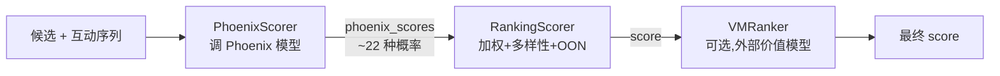

# 打分与排序

## 这一页回答什么

候选帖子从 Phoenix 模型的原始预测,如何变成一个可排序的最终分。

## 核心结论

1. **流水线里实际只有 3 个打分器**:`PhoenixScorer`、`RankingScorer`、`VMRanker`(`scorers/mod.rs` 只声明这三个)。
2. **`RankingScorer` 是核心**:加权求和、作者多样性衰减、站外(OON)降权全部内联在它一个打分器里。
3. **多行为预测 → 加权求和**:Phoenix 预测 ~22 种互动概率,`Final Score = Σ(weight_i × P(action_i))`,负向行为(block/mute/report 等)是负权重。
4. **`VMRanker` 是可选的二次排序**:仅当 `EnableVMRanker` 参数开启时调用外部价值模型服务。

> 注:`scorers/` 目录下另有 `weighted_scorer.rs`、`author_diversity_scorer.rs`、`oon_scorer.rs` 三个文件,但 `scorers/mod.rs` 未声明它们,**不在编译模块树内**。它们的逻辑(加权、多样性、OON)已被 `RankingScorer` 合并实现。本页以实际生效的 `RankingScorer` 为准。

## 三个打分器

打分器顺序执行(见 [[candidate-pipeline-framework]]),装配于 `phoenix_candidate_pipeline.rs:291-300`:



## PhoenixScorer:取 ML 预测

`PhoenixScorer`(`scorers/phoenix_scorer.rs`)调用 [[phoenix-ranking|Phoenix 排序模型]],把预测概率写入候选的 `phoenix_scores` 字段。

- **`enable()`**:`!query.has_cached_posts`(缓存命中时不重新打分)。
- **集群路由 `resolve_cluster()`**:默认集群来自 `PhoenixInferenceClusterId` 参数;若 `scoring_sequence` 动作数 `< PhoenixRankerNewUserHistoryThreshold`,改用新用户集群 `PhoenixRankerNewUserInferenceClusterId`;decider 开关 `override_qf_use_lap7` / `override_qf_use_fou` 可在两个实验集群间互换。
- **产品面**:`in_network_only` 时为 `HomeTimelineRankedFollowing`,否则 `HomeTimelineRanking`。
- **空序列短路**:`scoring_sequence` 为 `None` 时直接返回默认候选(`phoenix_scorer.rs:79-81`)。
- **Egress 兜底**:`UseEgressSidecar` 参数开启时走 egress 客户端,失败再回退主客户端(`phoenix_scorer.rs:86-98`)。

```rust
// home-mixer/scorers/phoenix_scorer.rs:107-116
candidates.iter().map(|c| PostCandidate {
    phoenix_scores: predictions.candidate_scores(&c.get_original_tweet_id()),
    prediction_request_id: Some(query.prediction_id),
    last_scored_at_ms,
    ..Default::default()
}).map(Ok).collect()
```

## RankingScorer:加权 → 多样性 → OON

`RankingScorer`(`scorers/ranking_scorer.rs`)是真正算出 `score` 的地方,`score()` 分三步(`ranking_scorer.rs:248-284`)。

### 第 1 步:加权求和

`ScoringWeights::from_params()` 从 feature switch 读入 ~22 个权重(`FavoriteWeight`、`ReplyWeight`、`RetweetWeight`、`ClickWeight`、`DwellWeight`、`FollowAuthorWeight`、`NotInterestedWeight`、`BlockAuthorWeight`、`MuteAuthorWeight`、`ReportWeight`、`NotDwelledWeight` 等)。

`compute_weighted_score()`(`ranking_scorer.rs:125-173`)对每个候选求加权和:

```
combined = Σ  P(action_i) × weight_i      // ~22 个行为
```

涵盖的行为包括:favorite、reply、retweet、photo_expand、click、profile_click、vqv(视频质量观看)、share / share_via_dm / share_via_copy_link、dwell、quote、quoted_click、quoted_vqv、连续型 dwell_time / click_dwell_time、follow_author,以及负向的 not_interested、block_author、mute_author、report、not_dwelled。

其中 `negative_sum = -(not_interested + block_author + mute_author + report + not_dwelled)`(`ranking_scorer.rs:83`)—— 这 5 个是负向行为。vqv 与 quoted_vqv 的权重还会按视频时长是否达标动态置 0(`vqv_weight()` / `quoted_vqv_weight()`)。

`offset_score()` 把 combined 偏移到非负区间(`ranking_scorer.rs:175-183`):

```rust
fn offset_score(combined_score: f64, w: &ScoringWeights) -> f64 {
    if w.total_sum == 0.0 {
        combined_score.max(0.0)
    } else if combined_score < 0.0 {
        (combined_score + w.negative_sum) / w.total_sum * NEGATIVE_SCORES_OFFSET
    } else {
        combined_score + NEGATIVE_SCORES_OFFSET
    }
}
```

结果再经 `normalize_score()` 归一化,得到 `weighted_score`。

### 第 2 步:作者多样性衰减

`apply_author_diversity()`(`ranking_scorer.rs:190-217`)防止同一作者刷屏:

1. 按 `weighted_score` 降序排;
2. 为每个作者维护一个位置计数 `position`(该作者第几次出现);
3. 乘衰减因子:

```rust
// ranking_scorer.rs:186-188
fn diversity_multiplier(decay_factor: f64, floor: f64, position: usize) -> f64 {
    (1.0 - floor) * decay_factor.powf(position as f64) + floor
}
```

`decay_factor`(`AuthorDiversityDecay`)、`floor`(`AuthorDiversityFloor`)均为参数。同一作者第 0 条乘 `1.0`,第 1 条乘 `decay+floor·(1-decay)`,逐条衰减但不低于 `floor`。

### 第 3 步:站外(OON)降权

`effective_oon_weight()`(`ranking_scorer.rs:220-239`)决定站外内容的降权系数:

- 话题请求 → `TopicOonWeightFactor`
- 否则 → `OonWeightFactor`;但若是**符合条件的新用户**(账号年龄 < `NewUserAgeThresholdSecs` 且关注数 ≥ `NEW_USER_MIN_FOLLOWING`)→ 用 `NEW_USER_OON_WEIGHT_FACTOR`

最终分:

```rust
// ranking_scorer.rs:270-275
let final_score = match c.in_network {
    Some(false) => after_diversity * effective_oon,  // 站外:乘 OON 系数降权
    _            => after_diversity,                  // 站内:不降权
};
```

站内(in-network)候选不降权,站外(out-of-network)候选乘 OON 系数 —— 这是站内/站外内容平衡的核心旋钮。

## VMRanker:可选的价值模型重排

`VMRanker`(`scorers/vm_ranker.rs`)在 `EnableVMRanker` 参数开启时,把所有候选(连同 `phoenix_scores`、是否站内、转发/回复标志、作者粉丝数等)打包成 `RankRequest`,调用外部 VM Ranker gRPC 服务重排:

- 支持 **DPP**(行列式点过程)多样性:`VMRankerDppTheta`、`VMRankerDppMaxSelectedRank` 参数非零时传 `DppParams`。
- 服务返回的分按 `tweet_id` 映射回候选;未返回的候选保留原 `score`(`vm_ranker.rs:46-47`)。

## 设计决策

| 决策 | 选择 | 理由 |
|------|------|------|
| 多行为预测 | 预测 ~22 种行为概率,而非单一相关性 | 不同行为价值不同,可通过权重灵活调节;负向行为给负权重直接压制 |
| 打分器合并 | 加权/多样性/OON 内联进 `RankingScorer` | 三步强耦合(多样性依赖加权结果、OON 依赖多样性结果),合并避免候选在打分器间反复拷贝 |
| 权重来自参数 | 全部走 feature switch | 无需发版即可调权重、做实验 |
| 分数偏移 | `offset_score` 把分推到非负 | 负分候选(强负向行为)仍需有序,偏移后保持单调可比 |
| OON 降权 | 站外乘系数,新用户/话题单独系数 | 默认偏向站内;新用户站内内容少,放宽站外;话题页本就要站外 |
| VMRanker 可选 | `enable()` 由参数门控 | 价值模型重排是可灰度的增量层,不影响主打分链 |

## FAQ

**Q:README 里说有 Weighted / Author Diversity / OON 三个独立 Scorer,和这里说的对得上吗?**
A:README 描述的是**概念阶段**。代码实现里这三段逻辑被合并进 `RankingScorer` 一个打分器(`scorers/mod.rs` 只声明 `phoenix_scorer`/`ranking_scorer`/`vm_ranker`)。仓库里 `weighted_scorer.rs`/`author_diversity_scorer.rs`/`oon_scorer.rs` 文件存在但未加入模块树。

**Q:负向行为概率高的帖子会怎样?**
A:block/mute/report/not_interested/not_dwelled 的权重为负,加权和会被拉低甚至为负;`offset_score` 对负分走 `(combined + negative_sum)/total_sum × OFFSET` 这一支,使其排到正向帖之后。

## 源码锚点

- `home-mixer/scorers/mod.rs:1-3` —— 仅声明三个打分器
- `home-mixer/scorers/ranking_scorer.rs:125-183` —— 加权求和与 `offset_score`
- `home-mixer/scorers/ranking_scorer.rs:186-217` —— 作者多样性衰减
- `home-mixer/scorers/ranking_scorer.rs:220-239` —— OON 权重决策
- `home-mixer/scorers/phoenix_scorer.rs:25-58` —— Phoenix 集群路由

## 相关页面

- [[phoenix-ranking]] —— `PhoenixScorer` 调用的排序模型,产出 `phoenix_scores`
- [[candidate-selection]] —— 打分之后:按分数排序、截断、选后处理
- [[operating-myths]] —— 运营迷思 vs 源码真相:加权/多样性/OON 如何打穿流行说法
- [[posting-guide]] —— 发帖指南:基于打分机制,创作者能怎么做
- [[home-mixer-orchestration]] —— 打分器在内层流水线中的位置
- [[candidate-pipeline-framework]] —— `Scorer` trait 与顺序执行
- [[filtering-pipeline]] —— 打分前的候选过滤
- [[system-architecture]] —— 打分在十阶段流水线中的位置
