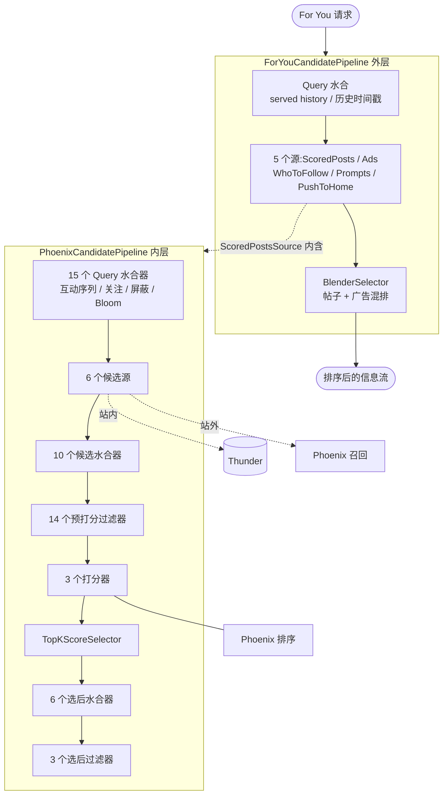
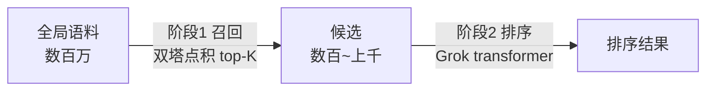

# 系统架构总览

## 这一页回答什么

X "For You" 信息流推荐系统从一个请求到一份排序结果,中间经过哪些组件、按什么顺序、谁调用谁。这是整个 wiki 的入口页,其它页面是对各子系统的深入。

## 核心结论

1. **两个内容来源**:站内(Thunder,关注的人发的帖)+ 站外(Phoenix 召回,从全局语料里 ML 检索)。两路候选合并后统一排序。
2. **一个排序模型**:Phoenix —— 一个基于 Grok 的 transformer,预测每条帖子的多种互动概率,加权成最终分。
3. **零手工特征**:系统几乎删除了所有手工特征和启发式规则,由 transformer 从用户互动序列直接学习相关性(`README.md:55`)。
4. **两层流水线嵌套**:外层 [[home-mixer-orchestration|ForYouCandidatePipeline]] 负责把帖子流与广告、Who-to-Follow、Prompts 混排;内层 `PhoenixCandidatePipeline` 负责真正的召回、过滤、打分、选择。
5. **统一框架**:两条流水线都构建在 [[candidate-pipeline-framework|candidate-pipeline]] 框架之上,阶段、并行性、错误处理由框架统一保证。

## 五大组件

| 组件 | 语言 | 角色 | 详见 |
|------|------|------|------|
| **home-mixer** | Rust | 编排层:组装 For You 流水线,暴露 gRPC | [[home-mixer-orchestration]] |
| **candidate-pipeline** | Rust | 可复用流水线框架(7 个 trait + 执行器) | [[candidate-pipeline-framework]]、[[candidate-pipeline]] |
| **thunder** | Rust | 站内帖子内存库,亚毫秒级查询 | [[thunder-in-network-store]] |
| **phoenix** | Python/JAX | ML 核心:双塔召回 + Grok transformer 排序 | [[phoenix-retrieval]]、[[phoenix-ranking]] |
| **grox** | Python | 内容理解服务(离线/流式,产出安全标签、嵌入) | [[grox-architecture]] |

Grox 不在请求路径上 —— 它是独立的流式服务,产出的信号(安全标签、内容嵌入、质量分)反哺其它组件。详见 [[grox-architecture]]。

## 端到端数据流



## 两层流水线嵌套

home-mixer 实际跑的是**两条** `CandidatePipeline`,外层把内层当成一个候选源:

### 外层:ForYouCandidatePipeline

`home-mixer/candidate_pipeline/for_you_candidate_pipeline.rs:48` 定义。泛型为 `CandidatePipeline<ScoredPostsQuery, FeedItem>` —— 候选类型是 `FeedItem`(可以是帖子、广告、模块)。

它只用到框架的 4 个阶段(`for_you_candidate_pipeline.rs:155-195`),其余阶段返回空切片:

- **2 个 query 水合器**:`ServedHistoryQueryHydrator`、`PastRequestTimestampsQueryHydrator`
- **5 个源**(`for_you_candidate_pipeline.rs:164-177`):
  - `ScoredPostsSource` —— 持有 `ScoredPostsServer`,内部执行 `PhoenixCandidatePipeline`
  - `AdsSource`、`WhoToFollowSource`、`PromptsSource`、`PushToHomeSource`
- **选择器**:`BlenderSelector` —— 把帖子和广告等混排
- **8 个 side effect**:广告注入日志、seen ids 发 Kafka、served candidates 发 Kafka、客户端事件、响应统计、更新历史时间戳、更新/截断 served history

外层没有 hydrator / filter / scorer(`for_you_candidate_pipeline.rs:247-269` 均返回 `&[]`)。结果规模 `params::FOR_YOU_MAX_RESULT_SIZE`。

### 内层:PhoenixCandidatePipeline

`home-mixer/candidate_pipeline/phoenix_candidate_pipeline.rs:143` 定义。泛型为 `CandidatePipeline<ScoredPostsQuery, PostCandidate>` —— 候选类型是 `PostCandidate`(纯帖子)。这是真正干活的流水线:

| 阶段 | 数量 | 内容(节选) |
|------|------|------|
| Query 水合器 | 15 | `ScoringSequenceQueryHydrator`、`RetrievalSequenceQueryHydrator`、屏蔽/静音/关注/订阅用户、互关、用户画像、关注话题、Bloom 过滤器…(`phoenix_candidate_pipeline.rs:185-232`) |
| 源 | 6 | `ThunderSource`、`TweetMixerSource`、`PhoenixSource`、`PhoenixTopicsSource`、`PhoenixMOESource`、`CachedPostsSource`(`:250-257`) |
| 候选水合器 | 10 | `InNetworkCandidateHydrator`、`CoreDataCandidateHydrator`、`QuoteHydrator`、`VideoDurationCandidateHydrator`、`HasMediaHydrator`、`SubscriptionHydrator`、`GizmoduckCandidateHydrator`、`BlockedByHydrator`、`FilteredTopicsHydrator`、`LanguageCodeHydrator`(`:259-272`) |
| 过滤器 | 14 | 见 [[filtering-pipeline]](`:274-289`) |
| 打分器 | 3 | `PhoenixScorer`、`RankingScorer`、`VMRanker`(`:291-300`) |
| 选择器 | 1 | `TopKScoreSelector`(`:302`) |
| 选后水合器 | 6 | `VFCandidateHydrator`、`AdsBrandSafetyHydrator`、`AdsBrandSafetyVfHydrator`、`TweetTypeMetricsHydrator`、`FollowingRepliedUsersHydrator`、`MutualFollowJaccardHydrator`(`:304-315`) |
| 选后过滤器 | 3 | `VFFilter`、`AncillaryVFFilter`、`DedupConversationFilter`(`:317-321`) |
| Side effect | 6 | Phoenix 实验、reranking Kafka、Redis 缓存、统计、互关统计、Phoenix 请求缓存(`:323-338`) |

结果规模 `params::RESULT_SIZE`。

## 流水线十阶段

无论外层内层,执行顺序由框架的 `CandidatePipeline::execute()` 统一定义(`candidate-pipeline/candidate_pipeline.rs:88-137`)。`PipelineStage` 枚举共 10 个阶段(`candidate_pipeline.rs:21-33`):

```rust
// candidate-pipeline/candidate_pipeline.rs:89-137(节选)
async fn execute(&self, query: Q) -> PipelineResult<Q, C> {
    let hydrated_query = self.hydrate_query(query).await;            // 1
    let hydrated_query = self.hydrate_dependent_query(hydrated_query).await; // 2
    let candidates = self.fetch_candidates(&hydrated_query).await;   // 3
    let hydrated_candidates = self.hydrate(&hydrated_query, candidates).await; // 4
    let (kept_candidates, mut filtered_candidates) =
        self.filter(&hydrated_query, hydrated_candidates.clone());   // 5
    let scored_candidates = self.score(&hydrated_query, kept_candidates).await; // 6
    let SelectResult { selected, non_selected } =
        self.select(&hydrated_query, scored_candidates);             // 7
    let post_hydrated = self.hydrate_post_selection(..).await;       // 8
    let (mut final_candidates, post_filtered) =
        self.filter_post_selection(..);                              // 9
    // 截断到 result_size,运行 side effects                          // 10
    self.run_side_effects(input);
    ...
}
```

| # | 阶段 | 并行性 | 说明 |
|---|------|--------|------|
| 1 | Query 水合 | **并行** | `join_all` 跑所有水合器,合并进 query(`:202-218`) |
| 2 | 依赖型 Query 水合 | **并行** | 在阶段 1 之后,可用前序结果(`:229-248`) |
| 3 | 候选源 | **并行** | `join_all` 跑所有源,候选汇成一个 `Vec`(`:257-272`) |
| 4 | 候选水合 | **并行** | 多个水合器并行作用于同一候选集(`:302-319`) |
| 5 | 过滤 | **顺序** | 每个过滤器把候选切成 kept/removed,前序结果喂给后序(`:355-386`) |
| 6 | 打分 | **顺序** | 每个打分器依次更新候选分数(`:394-404`) |
| 7 | 选择 | 单次 | 排序 + 截断 |
| 8 | 选后水合 | **并行** | 只作用于已选中的候选 |
| 9 | 选后过滤 | **顺序** | 最终可见性 / 去重检查 |
| 10 | Side effect | **并行后台** | `tokio::spawn` 异步执行,不阻塞响应(`:419-428`) |

并行/顺序的取舍是刻意的:水合彼此独立故并行;过滤要让前序过滤塑造后序上下文故顺序。详见 [[candidate-pipeline-framework]]。

## 两阶段推荐:召回 + 排序

Phoenix 在概念上是**召回 → 排序**两段(`phoenix/README.md`),映射到 home-mixer 流水线里是两个不同阶段:



- **召回** = 流水线的**源**。`PhoenixSource` / `PhoenixTopicsSource` / `PhoenixMOESource` 调用 Phoenix 召回服务,用 [[phoenix-retrieval|双塔模型]] 做近似最近邻检索。
- **排序** = 流水线的**打分器**。`PhoenixScorer` 调用 [[phoenix-ranking|Phoenix 排序模型]],输出多种互动概率;`RankingScorer` 把它们加权成最终分。

两段共用 [[grok-transformer|Grok transformer]] 骨架与 [[hash-based-embeddings|哈希嵌入]]。

## 候选从哪来,信号到哪去

```mermaid
flowchart TB
    subgraph 候选源
        TH[Thunder<br/>站内] 
        PH[Phoenix 召回<br/>站外]
        TM[TweetMixer]
        CA[缓存帖子]
    end
    TH & PH & TM & CA --> POOL[候选池]
    POOL --> RANK[Phoenix 排序打分]
    GROX[Grox 内容理解] -. 安全标签/嵌入/质量分 .-> TH
    GROX -. .-> PH
```

Thunder 从 Kafka 实时消费帖子事件维护内存库(见 [[thunder-kafka-ingestion]]);Phoenix 召回在全局语料上做相似度搜索;Grox 离线产出的内容信号供安全过滤与召回使用。

## 外部依赖

home-mixer 流水线在 `prod()` 构造时并发初始化大量 gRPC / 存储客户端(`phoenix_candidate_pipeline.rs:353-627`),包括:SocialGraph(关注图)、TES(Tweet Entity Service,帖子正文)、Gizmoduck(用户)、Visibility Filtering、Strato、Redis、Kafka、UserActionAggregation(互动历史)等。这些是 X 的内部服务,开源版用 `Mock*` 实现替身(`:661-728`),因此**整套在线服务无法脱离 X 基础设施独立运行**,主要供阅读架构。

## 设计决策

| 决策 | 选择 | 理由 |
|------|------|------|
| 特征工程 | 零手工特征,全靠 transformer | 把复杂度从数据/serving 管线转移到模型,大幅简化基础设施(`README.md:55,325`) |
| 流水线分层 | 外层混排 + 内层排序两条流水线嵌套 | 帖子排序与广告/模块混排关注点分离,各自独立演化 |
| 框架抽象 | 统一 `candidate-pipeline` 框架 | 阶段、并行性、错误处理、可观测性集中实现,业务只填组件 |
| 阶段并行性 | 水合/源并行,过滤/打分顺序 | 独立工作并行提速;有依赖的工作顺序保证正确性 |
| 召回/排序分离 | 召回当源、排序当打分器 | 经典两阶段:先廉价地把百万缩到千,再用昂贵模型精排 |

## FAQ

**Q:外层为什么没有过滤器和打分器?**
A:外层 `ForYouCandidatePipeline` 的帖子候选来自 `ScoredPostsSource`,而该源内部已经跑完整条 `PhoenixCandidatePipeline`(含过滤、打分、选择)。外层只需把成品帖子流与广告等混排,所以 hydrator/filter/scorer 都是空的(`for_you_candidate_pipeline.rs:247-269`)。

**Q:一条帖子的最终分怎么算出来的?**
A:`PhoenixScorer` 先拿到 transformer 预测的多种互动概率(P(favorite)、P(reply)…),`RankingScorer` 再把它们加权求和:`Final Score = Σ(weight_i × P(action_i))`,负向行为(block/mute/report)是负权重。详见 [[scoring-and-ranking]]。

**Q:站内和站外内容怎么平衡?**
A:候选合并后统一排序,但 `RankingScorer` 会对站外(out-of-network)内容乘一个权重因子降权,偏向关注内容。详见 [[scoring-and-ranking]]。

## 源码锚点

- `candidate-pipeline/candidate_pipeline.rs:21-33` —— `PipelineStage` 十阶段枚举
- `candidate-pipeline/candidate_pipeline.rs:88-137` —— `execute()` 编排主流程
- `home-mixer/candidate_pipeline/for_you_candidate_pipeline.rs:48-203` —— 外层流水线
- `home-mixer/candidate_pipeline/phoenix_candidate_pipeline.rs:143-351` —— 内层流水线组装
- `home-mixer/candidate_pipeline/phoenix_candidate_pipeline.rs:732-771` —— `CandidatePipeline` trait 实现

## 相关页面

- [[how-it-works]] —— 本页的白话版:零代码、配类比讲清整套系统
- [[candidate-pipeline-framework]] —— 十阶段流水线框架的 trait 设计与执行细节
- [[home-mixer-orchestration]] —— 两条流水线的组装、gRPC 服务、候选源
- [[phoenix-retrieval]] —— 召回阶段:双塔模型
- [[phoenix-ranking]] —— 排序阶段:Grok transformer 多行为预测
- [[scoring-and-ranking]] —— 打分器链与最终分计算
- [[filtering-pipeline]] —— 预打分与选后两道过滤
- [[thunder-in-network-store]] —— 站内候选源
- [[ads-blending]] —— 外层广告混排
- [[grox-architecture]] —— 旁路的内容理解服务
