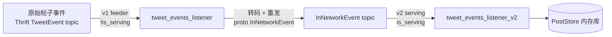

# Thunder Kafka 摄入

## 这一页回答什么

Thunder 如何从 Kafka 实时摄入帖子创建/删除事件、两个 listener 版本的分工、事件如何反序列化、以及旧帖的保留与裁剪。

## 核心结论

1. **两个 listener 对应两种角色**:v1 是 **feeder**(把原始 Thrift `TweetEvent` 转成精简 proto `InNetworkEvent` 再发出),v2 是 **serving 实例**(消费 `InNetworkEvent` 直接灌进内存库)。
2. **角色由 `is_serving` 参数切换**:`is_serving=true` 启动 v2,`false` 启动 v1 + 一个 Kafka producer。
3. **摄入后台多线程**:每个 listener 起 `kafka_num_threads` 个线程,Kafka 分区在线程间轮流分配。
4. **保留期裁剪**:serving 实例每 2 分钟裁剪一次超过保留期的旧帖。

## 两个 listener 的分工



`kafka_utils.rs::start_kafka` 按 `is_serving` 分流(`kafka_utils.rs:35-112`):

| 角色 | `is_serving` | 消费 topic | listener | 输出 |
|------|-------------|-----------|----------|------|
| **feeder** | `false` | `TweetEvent`(Thrift) | v1 `start_tweet_event_processing` | 转码后 proto `InNetworkEvent` 发到下游 topic |
| **serving** | `true` | `InNetworkEvent`(proto) | v2 `start_tweet_event_processing_v2` | 写入 `PostStore` |

这样设计把"解析臃肿的原始事件 + 计算视频时长资格"等重活放在 feeder,serving 实例只需消费已精简的 `InNetworkEvent`,反序列化更轻。

## 反序列化

`deserializer.rs` 提供两套(`deserializer.rs:8-26`):

```rust
// Thrift 二进制 → TweetEvent(v1 用)
pub fn deserialize_tweet_event(payload: &[u8]) -> Result<TweetEvent> {
    let mut cursor = std::io::Cursor::new(payload);
    let mut protocol = TBinaryInputProtocol::new(&mut cursor, true);
    TweetEvent::read_from_in_protocol(&mut protocol)...
}

// proto 二进制 → InNetworkEvent(v2 用)
pub fn deserialize_tweet_event_v2(payload: &[u8]) -> Result<InNetworkEvent> {
    InNetworkEvent::decode(payload)...
}
```

`kafka/utils.rs::deserialize_kafka_messages` 是通用批量反序列化器,接受一个 deserializer 函数;单条解析失败只记 `KAFKA_MESSAGES_FAILED_PARSE` 指标并跳过,不中断整批。

## v1:feeder 的转码

`tweet_events_listener.rs` 的 `process_message_batch`(`tweet_events_listener.rs:193-346`)把 Thrift `TweetEvent` 转成 `LightPost`:

- **TweetCreateEvent** → `LightPost`:取 `tweet.id`、`author_id`、`created_at_secs`、回复/转发关系、`conversation_id`;`has_video` 由 `is_eligible_video()` 判定(首个媒体是视频且 `duration_millis >= MIN_VIDEO_DURATION_MS`);`nullcast`(定向广告帖)直接跳过。
- **TweetDeleteEvent / QuotedTweetDeleteEvent** → 收集待删 post_id;删除事件若帖龄已超 `post_retention_sec` 则忽略。

然后把每个 `LightPost` 重新包成 proto `InNetworkEvent`(`TweetCreateEvent` / `TweetDeleteEvent` 变体),逐条 `spawn` 发到 producer(`tweet_events_listener.rs:274-330`)。feeder **不持有 PostStore**,是纯转发器。

## v2:serving 的内存库写入

`tweet_events_listener_v2.rs` 的 `deserialize_batch`(`tweet_events_listener_v2.rs:119-167`)把 proto `InNetworkEvent` 拆成两个列表:

```rust
for tweet_event in results {
    match tweet_event.event_variant.unwrap() {
        in_network_event::EventVariant::TweetCreateEvent(create_event) => {
            create_tweets.push(LightPost { post_id, author_id, created_at, ... });
        }
        in_network_event::EventVariant::TweetDeleteEvent(delete_event) => {
            delete_tweets.push(delete_event);
        }
    }
}
```

`process_tweet_events_v2` 攒够 `batch_size` 后,在阻塞线程池里执行(`tweet_events_listener_v2.rs:222-232`):

```rust
post_store_clone.insert_posts(light_posts);
post_store_clone.mark_as_deleted(delete_posts);
```

注意 `is_reply` 的兜底:`create_event.is_reply || in_reply_to_post_id.is_some() || in_reply_to_user_id.is_some()` —— 任一回复信号都算回复。

### 信号量与启动追赶

v2 用 `Semaphore::new(3)` 限流(`tweet_events_listener_v2.rs:56`)。**仅在启动追赶完成后**,每个批处理才需先 `acquire` 一个许可(`tweet_events_listener_v2.rs:215-219`)—— 这样稳态时摄入最多占 3 个并发,给请求服务留 CPU;而追赶期不限流,尽快灌满内存库。

追赶完成的判定:某线程的 `总 lag < 分区数 × batch_size` 时,认为该分区已基本追上,通过 `tx` 发信号(`tweet_events_listener_v2.rs:189-204`)。这里 lag 是消费者还落后多少条未消费的消息;当总落后量已经小于"再 poll 一轮能取的量"(每分区一批 × 分区数)时,就视作追平了。`main.rs` 等齐 `kafka_num_threads` 个信号后才 `finalize_init()` 并对外就绪(`main.rs:70-92`)。

## 多线程与分区

两个 listener 都按 `kafka_num_threads` 起线程,分区轮流切给各线程(`partitions_per_thread = num_partitions.div_ceil(kafka_num_threads)`)。每线程一个 `KafkaConsumer`,并起一个分区 lag 监控任务(`monitor_partition_lag`,周期 `lag_monitor_interval_secs`)。处理线程若意外退出会 `panic` —— "feeder 没有 tweet 事件处理就无法工作"。

## 保留与裁剪

`PostStore` 按保留期管理生命周期:

- **写入时过滤**:`insert_posts` 只保留 `created_at` 在过去 `retention_seconds` 内、且不在未来的帖(`post_store.rs:92-95`)。
- **启动裁剪**:`finalize_init()` 先 `sort_all_user_posts()` 再 `trim_old_posts()`,并把 `deleted_posts` 里的帖从主表清掉(处理 feeder 中创建/删除事件顺序丢失的竞态,`post_store.rs:103-113`)。
- **周期裁剪**:`start_auto_trim(2)` —— serving 实例每 **2 分钟**跑一次 `trim_old_posts()`(`main.rs:85`)。
- **裁剪逻辑**:`trim_old_posts()` 在 `spawn_blocking` 中,对三个 per-user 队列从队首(最旧)弹出 `current_time - created_at > retention_seconds` 的帖,同步从主表删除;队列容量过剩时 `shrink_to`;空用户移除(`post_store.rs:409-476`)。
- 默认保留期 2 天(`PostStore::default()`,`post_store.rs:521-526`)。

## 设计决策

| 决策 | 选择 | 理由 |
|------|------|------|
| 双 listener | feeder(v1)+ serving(v2)分离 | 重活(Thrift 解析、视频资格)集中在 feeder;serving 只消费精简事件,反序列化更快 |
| v2 反序列化 | proto 而非 Thrift | proto 解码比 Thrift 快,且 `InNetworkEvent` 字段已精简 |
| 信号量限流 | 稳态摄入限 3 并发,追赶期不限 | 启动尽快灌满库;就绪后把 CPU 让给请求服务 |
| 启动追赶门控 | 等 lag 追上才对外就绪 | 避免半空的内存库返回不完整的站内候选 |
| 解析容错 | 单条失败跳过 + 计数 | 个别坏消息不该中断整批摄入 |
| 处理线程崩溃即 panic | 不静默重启 | 摄入停摆等于数据腐烂,宁可整进程退出被编排系统重启 |

## FAQ

**Q:为什么删除事件可能早于创建事件到达?**
A:feeder 把创建/删除拆成独立 `InNetworkEvent` 分别发送,跨分区后顺序不保证。`PostStore` 用 `deleted_posts` 墓碑表化解:`insert_posts_internal` 遇到已在墓碑表的 post_id 直接跳过(`post_store.rs:122`),`finalize_init` 再兜底清一遍。

**Q:feeder 和 serving 是同一个二进制吗?**
A:是,`thunder` 一个二进制,靠 `is_serving` 参数决定扮演哪个角色(`kafka_utils.rs:35,70`)。

## 源码锚点

- `thunder/kafka_utils.rs:35-112` —— `is_serving` 分流与两套 Kafka 配置
- `thunder/kafka/tweet_events_listener.rs:193-346` —— v1 转码与重发
- `thunder/kafka/tweet_events_listener_v2.rs:119-249` —— v2 反序列化与写库
- `thunder/posts/post_store.rs:409-476` —— `trim_old_posts` 裁剪逻辑
- `thunder/main.rs:67-90` —— 启动追赶与后台任务

## 相关页面

- [[thunder-in-network-store]] —— Thunder 的内存库与站内候选服务
- [[post-store]] —— `PostStore` 结构体细节
- [[system-architecture]] —— Thunder 作为站内候选源的角色
- [[home-mixer-orchestration]] —— `ThunderSource` 如何调用 Thunder
- [[end-to-end-dataflow]] —— 端到端数据流:Kafka 摄入是一条帖子"被推荐"链路的起点
