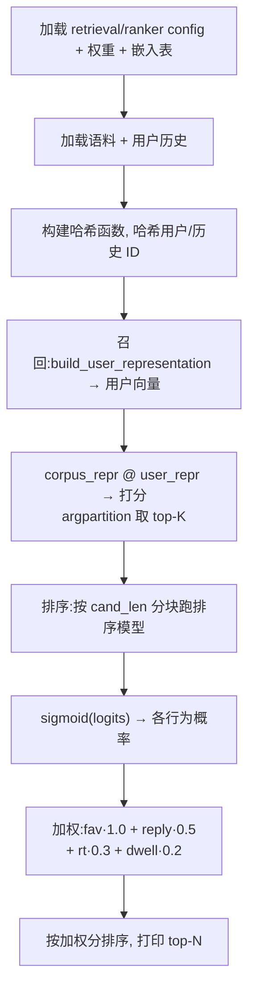

# run_pipeline.py(端到端推理脚本)

## 是什么

`run_pipeline.py` 是 Phoenix 的可运行入口 —— 从导出的 checkpoint 加载召回与排序两个模型,在一份预置语料上跑完整的 **召回 → 排序**,打印带各行为概率的排序结果。定义于 `phoenix/run_pipeline.py`,2026-05-15 release 用它取代了原来分开的 `run_ranker.py` / `run_retrieval.py`。

## 运行方式

```shell
uv run run_pipeline.py --artifacts_dir artifacts/oss-phoenix-artifacts
```

CLI 参数(`run_pipeline.py:166-180`):

| 参数 | 默认 | 说明 |
|------|------|------|
| `--artifacts_dir` | `./artifacts` | artifacts 根目录 |
| `--sequence_file` | `<artifacts>/example_sequence.json` | 用户互动历史 |
| `--corpus_file` | `<artifacts>/sports_corpus.npz` | 召回语料 |
| `--top_k_retrieval` | `200` | 召回阶段取多少候选 |
| `--top_k_display` | `30` | 打印多少条排序结果 |

## artifacts 目录结构

```
artifacts/
  retrieval/
    model_params.npz        召回 transformer + 候选塔权重
    embedding_tables.npz     用户/帖/作者哈希嵌入
    config.json              模型配置 + 哈希函数参数
  ranker/
    model_params.npz         排序 transformer + 动作头权重
    embedding_tables.npz
    config.json
  sports_corpus.npz          ~53.7 万条体育帖,含预计算候选表示
  example_sequence.json      示例用户历史(3 条体育帖)
```

> artifacts 通过 Git LFS 分发(`*.npz`、`*.zip` 在 `.gitattributes` 标了 lfs)。克隆后需 `git lfs pull` 并解压 `oss-phoenix-artifacts.zip` 才能运行。

## 动作索引常量

`run_pipeline.py:68-73`,对应 proto `ActionName` 枚举:

```python
IDX_FAV   = 1    # 点赞
IDX_REPLY = 4    # 回复
IDX_QUOTE = 5    # 引用
IDX_RT    = 6    # 转发
IDX_DWELL = 11   # 停留
IDX_VQV   = 13   # 视频质量观看
```

## 执行流程



### 1. 加载(`run_pipeline.py:186-224`)

读 `retrieval/config.json` 与 `ranker/config.json`;用 `runners.load_model_params` / `load_embedding_table` 载入权重;`build_unified_emb_table` 把拆分的用户/帖/作者嵌入拼成单一大表(见 [[hash-based-embeddings]])。语料 `sports_corpus.npz` 含 `post_ids`、`candidate_representations`、`author_ids`、`topics`。

### 2. 召回(`run_pipeline.py:245-310`)

`build_model_config` 用 config 造 `PhoenixRetrievalModelConfig`(`TransformerConfig` 的 `widening_factor=2.0`、`attn_output_multiplier=0.125`)。`ret_forward` 调 `model.build_user_representation` 得用户向量 `[1, D]`。然后:

```python
scores = corpus_repr @ np.asarray(user_repr[0])     # 对全语料点积
top_idx = np.argpartition(scores, -TOP_K)[-TOP_K:]  # 取 top-K
top_idx = top_idx[np.argsort(-scores[top_idx])]      # 降序排
```

分两步是因为 `argpartition` 只保证"top-K 这批被挑出来",**这 K 个彼此之间并不有序**;所以再对这 K 个(而非全语料)`argsort` 排成降序。先 partition 后只对 K 个排序,比直接对整个语料 `argsort` 快得多。

### 3. 排序(`run_pipeline.py:312-354`)

`build_model_config` 造 `PhoenixModelConfig`。把召回出的 `TOP_K` 条候选按 `cand_len` 分块,每块:哈希候选帖/作者 ID → 组 `RecsysBatch` + `RecsysEmbeddings` → 跑排序模型 → `sigmoid(out.logits)` 得各行为概率;不足一块的补零 pad。

### 4. 加权与输出(`run_pipeline.py:354-389`)

```python
weighted = (all_probs[:, IDX_FAV]   * 1.0
          + all_probs[:, IDX_REPLY] * 0.5
          + all_probs[:, IDX_RT]    * 0.3
          + all_probs[:, IDX_DWELL] * 0.2)
ranked = np.argsort(-weighted)
```

按加权分降序,打印 top `--top_k_display` 条,每行含召回分、各行为概率、话题、帖子 URL。

> 这里的权重(1.0 / 0.5 / 0.3 / 0.2)是脚本内的演示权重,与线上 `home-mixer` 的 [[scoring-and-ranking|RankingScorer]] 用 feature switch 配置的权重不是同一套。

## 关键辅助函数

| 函数 | 来源 | 作用 |
|------|------|------|
| `build_hash_functions(config)` | run_pipeline.py:93 | 由 config 的 `hash_params` 造用户/帖/作者哈希函数 |
| `build_unified_emb_table(emb_dict, config)` | run_pipeline.py:118 | 拆分嵌入表 → 单一大表 |
| `build_model_config(config, config_class)` | run_pipeline.py:132 | JSON config → `PhoenixModelConfig` / `PhoenixRetrievalModelConfig` |
| `load_model_params` / `load_embedding_table` | runners.py | 从 npz 读权重 |

模型用 `hk.transform` 包成纯函数后 `apply`(`run_pipeline.py:278,318`)。

## 设计决策

| 决策 | 选择 | 理由 |
|------|------|------|
| 单一入口 | `run_pipeline.py` 合并召回+排序 | 镜像线上"召回→排序"两阶段的真实组合 |
| 候选分块 | 按 `cand_len` 切块跑排序 | 排序模型的候选序列长度固定,超出需分批 |
| 不足块补零 | `np.pad` 到 `cand_len` | 哈希 0 = padding,被掩码自然忽略 |
| 召回/排序各自哈希 | 两个模型各用自己的 config | 两模型嵌入表独立,哈希参数不共享 |
| 冻结 checkpoint | 用导出的 npz 而非在线训练 | 公开版是持续训练的某时刻快照 |

## 源码锚点

- `phoenix/run_pipeline.py:165-224` —— `main` 与加载阶段
- `phoenix/run_pipeline.py:245-310` —— 召回阶段
- `phoenix/run_pipeline.py:312-354` —— 排序阶段(分块)
- `phoenix/run_pipeline.py:132-162` —— `build_model_config`

## 相关页面

- [[phoenix-retrieval]] —— 召回阶段的双塔模型
- [[phoenix-ranking]] —— 排序阶段的 transformer
- [[recsys-model]] / [[recsys-retrieval-model]] —— 被加载的两个模型构件
- [[hash-based-embeddings]] —— `build_hash_functions` / `build_unified_emb_table`
- [[open-source-vs-production]] —— 开源版 vs 线上真实算法:本脚本用的迷你模型与冻结 checkpoint 等差异
- [[system-architecture]] —— 召回→排序在整体系统中的位置
