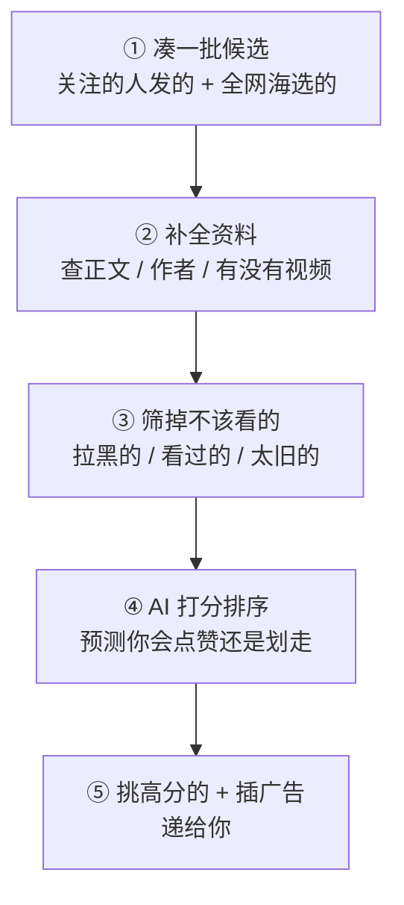

# 白话总览 —— For You 是怎么工作的

> 这是一页"大白话"。不放代码、不放公式,只讲清楚这套系统到底在干什么。
> 想看技术细节,每节末尾都有链接通往对应的技术页。

## 一句话

你打开 X、看到 "For You" 信息流的那零点几秒里,这套系统从**全网海量帖子**里挑出**几十条**最可能让你感兴趣的,排好序递给你。

## 最关键的一点:没有人写"规则"

老式推荐系统靠人工规则:"带图的排前面""粉丝多的加权"……这套系统几乎把这些规则**全删了**。

取而代之的是一个 AI 模型(基于 X 自家的 Grok 改造)。它看你**最近的行为** —— 你点了什么赞、回复了谁、转发了什么、在哪条帖子上停留了很久 —— 然后自己学出"你大概会喜欢什么"。

> 打个比方:不是给你配一本《用户偏好说明书》,而是配一个**观察力极强的朋友**,他盯着你最近刷手机的样子,就知道下一条该给你看什么。

## 一条帖子怎么走进你的 For You

### ① 凑候选 —— 先把"可能的帖子"捞进来

系统先凑一大批"候选帖子",来自**两个篮子**:

- **你关注的人刚发的**(站内)—— 由一个叫 [[thunder-in-network-store|Thunder]] 的"速记本"提供,它把全网最近两天的帖子都记在内存里,你关注谁、谁发了什么,它瞬间能答。
- **你没关注、但可能喜欢的**(站外)—— 由 [[phoenix-retrieval|Phoenix 召回]]从全网"海选"出来。这就是你为什么会刷到陌生人的帖子。

### ② 补资料 —— 候选这时只是一串号码

捞上来的候选其实只有个帖子编号,什么都不知道。这一步去把正文、作者是谁、有没有视频、安不安全等等**查全**。技术上叫"水合"(hydration),想象成给一张白卡片填上信息。

### ③ 筛掉不该看的

把明显不该给你看的踢掉:你拉黑/静音的人、你已经看过的、太旧的、命中你屏蔽词的、你看不到的付费内容……详见 [[filtering-pipeline|过滤流水线]]。

### ④ 打分排序 —— 系统的大脑

留下的每条候选,交给 [[phoenix-ranking|Phoenix 排序模型]](那个 Grok 改的 AI)。它不是只打一个"喜欢分",而是**同时预测你对这条帖子会做很多种动作**:点赞的概率?回复的概率?转发?默默划走?甚至举报?

然后把这些概率**加权加起来**算总分 —— 正面动作(点赞、转发)加分,负面动作(举报、拉黑)减分。详见 [[scoring-and-ranking|打分与排序]]。

### ⑤ 选 + 混广告

按总分从高到低,挑出几十条。再把广告插进合适的"空隙"(不会紧挨着不安全的内容),最后递给你。详见 [[ads-blending|广告混排]]。

## 为什么要分"召回"和"排序"两步

全网每时每刻有海量新帖子。让 AI 大模型给**每一条**都精算一遍?算不过来,也太贵。

所以分两步:

| 步骤 | 干什么 | 像什么 |
|------|--------|--------|
| **召回** | 用"便宜"的方法,从几百万条里粗粗筛出几百条 | 招聘海选:几千份简历快速过一遍,挑出几十份 |
| **排序** | 用"贵"的 AI 模型,给这几百条精细打分 | 面试:对挑出来的几十人认真考察、排名 |

先粗筛、再精选 —— 这是几乎所有大型推荐系统的标准套路。

## 一个聪明的小设计:每条帖子单独判分

排序时,虽然几百条候选是一起喂进 AI 的,但系统用了个特殊技巧,让**每条候选互相"看不见"对方**。

> 像考试单独判卷:你的卷子得几分,只取决于你自己答得怎样,不受同考场其他人影响。

好处:同一条帖子,不管和哪些帖子放在一起,算出来的分都一样 —— 稳定、还能缓存复用。详见 [[candidate-isolation-masking|候选隔离]]。

## 还有一个"幕后"系统:Grox

上面讲的是你点开 App 那一刻发生的事。还有一个叫 [[grox-architecture|Grox]] 的系统在**后台默默干活** —— 它不停地分析新帖子:这条是不是垃圾?安不安全?质量高不高?把这些"标签"提前贴好,等你刷信息流时直接用。

> 像超市的后厨和验货区:你在货架前挑东西(刷信息流)时,验货、贴价签早就在后台做完了。

## 想再深入?

- 系统全貌(技术版):[[system-architecture]]
- 五大组件分别是干嘛的(还是白话):[[the-five-components]]
- 看不懂某个词:[[glossary]]
- 具体疑问:[[faq]]

## 出处

本页是对技术页的白话综合,不引入技术页之外的新结论。核心结论的依据如下(精确行号见对应技术页的「源码锚点」):

| 核心结论 | 技术页 | 主要源码 |
|----------|--------|----------|
| 候选来自站内 + 站外两路 | [[system-architecture]] | `home-mixer/candidate_pipeline/phoenix_candidate_pipeline.rs:250-257` |
| 几乎删除人工特征 / 规则,靠模型从行为学习 | [[system-architecture]] | `README.md:55,325` |
| 五阶段流水线(召回→水合→过滤→打分→选择) | [[candidate-pipeline]] | `candidate-pipeline/candidate_pipeline.rs:88-137` |
| 先召回(粗筛)后排序(精排)两阶段 | [[phoenix-retrieval]]、[[phoenix-ranking]] | `phoenix/README.md` |
| 排序模型预测多种互动概率,再加权求和 | [[scoring-and-ranking]] | `home-mixer/scorers/ranking_scorer.rs:125-239` |
| 候选隔离:每条候选单独打分、互不影响 | [[candidate-isolation-masking]] | `phoenix/grok.py:39-71` |
| 广告插在品牌安全的"空隙",不挨着风险内容 | [[ads-blending]] | `home-mixer/ads/safe_gap_blender.rs`、`partition_organic_blender.rs` |
| Grox 在后台产出安全 / 质量标签 | [[grox-architecture]] | `grox/plans/plan_master.py`、`grox/engine.py` |

## 相关页面

- [[the-five-components]] —— 五大组件白话速览
- [[how-posts-are-picked]] —— 选帖收尾过程的白话版
- [[operating-myths]] —— 运营迷思 vs 源码真相:九个流行说法逐条对源码
- [[posting-guide]] —— 发帖指南:从算法机制反推发帖技巧
- [[visibility-and-shadowban]] —— 限流与 shadowban:算法里到底有哪些"不展示你"的机制
- [[your-data]] —— 算法到底用了你的哪些数据
- [[end-to-end-dataflow]] —— 端到端数据流:一条帖子从发布到被推荐
- [[glossary]] —— 术语速查表
- [[faq]] —— 常见疑问
- [[system-architecture]] —— 技术版系统架构总览
