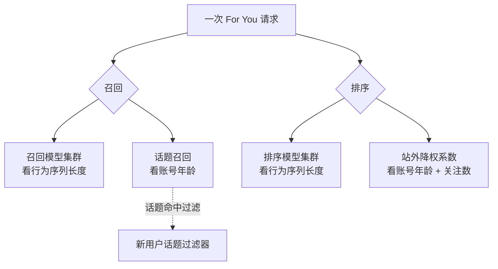

# 新号与冷启动:算法怎么区别对待新账号

> "新号有没有流量扶持""新号是不是被压""养号要养多久"—— 这些问题,源码里有一部分能直接回答。
> `xai-org/x-algorithm` 里**确实有**几条只对新用户走的代码路径。这一页把它们逐条摆出来:它们是什么、为什么存在、又**没有**承诺什么。
> 规矩同 [[operating-myths]]:每条结论都给 `文件:行号`,给不出的不写。

## 一句话结论

新账号的特殊待遇,**不是"红利"也不是"惩罚",而是"补偿"**。

新号的麻烦在于:它**几乎没有历史信号**。这套系统的召回和排序都重度依赖"这个用户过去看过/互动过什么"(行为序列),而新号的序列是空的或极短的。源码里那几条新用户路径,做的都是同一件事 —— 在历史信号稀薄时,给模型一个**能用的替代输入**或**不同的默认值**,让推荐不至于因为"没数据"而垮掉。

还有一个容易被忽略的点:源码里**没有**一个统一的"新用户"标签。"新"是被**好几个互相独立的阈值**分别定义的 —— 有的看账号年龄,有的看关注数,有的看行为序列长度。一个账号可能对某条路径算"新"、对另一条不算。下面逐条看。

## 四条新用户路径

四条路径分属"召回"和"排序"两个阶段,触发条件各不相同。先看排序侧两条,再看召回侧两条。

### 路径一|排序模型:新用户专属推理集群

排序阶段要调 Phoenix 排序模型给候选打分。源码在选"调哪个模型集群"时,先查一道新用户阈值。

`PhoenixScorer` 的 `resolve_cluster()`(`home-mixer/scorers/phoenix_scorer.rs:25-58`):它先取默认集群,然后看你这次打分序列里的**动作数**;如果动作数**低于** `PhoenixRankerNewUserHistoryThreshold` 这个阈值,就改用**新用户推理集群** `PhoenixRankerNewUserInferenceClusterId`(`phoenix_scorer.rs:29-43`)。

通俗说:行为历史太短的用户,被路由到一个**单独的排序模型**上打分,而不是和老用户共用同一个。为什么要这样 —— 一个在"信号充足的老用户"上调好的模型,直接套到"几乎没有信号的新用户"身上未必合适;给新用户一个专门的模型(很可能是用更适合冷启动的方式训练/配置的),是更稳妥的做法。

注意这里的判定口径是**行为序列长度**,不是账号注册了多久。一个注册很久但很少互动的"僵尸号",序列照样短,照样可能走这条新用户集群。

### 路径二|站外降权:对新用户放宽

排序的最后一步会给**站外内容**(out-of-network,你没关注的人发的)乘一个小于 1 的降权系数,站内不乘 —— 这是 [[scoring-and-ranking]] 讲的 OON 降权。而这个系数,对符合条件的新用户**会放宽**。

`RankingScorer` 的 `effective_oon_weight()`(`home-mixer/scorers/ranking_scorer.rs:220-239`):正常情况用常规系数 `OonWeightFactor`;但如果判定为**符合条件的新用户**,就改用一个单独的系数 `NEW_USER_OON_WEIGHT_FACTOR`(`ranking_scorer.rs:225-238`)。

这里的"符合条件的新用户"口径,和路径一**不一样**,要同时满足两条(`ranking_scorer.rs:227-232`):

1. **账号年龄** 小于阈值 `NewUserAgeThresholdSecs`;
2. **关注数** 不低于一个下限 `NEW_USER_MIN_FOLLOWING`。

为什么要放宽站外降权?逻辑很直接:**新号关注的人少,站内(关注流)内容本来就没几条**。如果还按老用户的力度压制站外内容,新号的信息流会非常空。所以对新号,把站外内容的折扣调得温和一些,让信息流先填得满。

为什么还要加"关注数不低于下限"这个第二条件?可以理解为一道**质量/真实性门槛** —— 一个刚注册、还一个人都没关注的账号,放宽它的站外内容意义不大(它连"想看什么"的信号都没给);要求至少关注了若干人,既说明这是个真在用的账号,也给了召回一点可依据的兴趣信号。

> 同样要强调:这是**对新用户放宽**站外降权,不是"给新用户的内容加权"。它影响的是"**新用户自己刷到的**信息流里站外内容占多少",**不是**"新用户发的帖子更容易被推给别人"。方向别搞反。

### 路径三|召回模型:新用户专属推理集群

和路径一对称 —— 召回阶段也有一个新用户集群开关。

`PhoenixSource` 的 `resolve_cluster()`(`home-mixer/sources/phoenix_source.rs:21-58`)与排序侧几乎是同一套逻辑:取默认召回集群,再看**召回序列**的动作数;低于 `PhoenixRetrievalNewUserHistoryThreshold` 阈值,就改用新用户召回集群 `PhoenixRetrievalNewUserInferenceClusterId`(`phoenix_source.rs:25-39`)。

意思是:历史太短的用户,**召回**这一步也会被切到一个单独的双塔模型上 —— 道理同路径一,只是发生在更早的"从全网粗筛候选"阶段。这条路径在 [[home-mixer-orchestration]] 里也有提及。

留意:路径一(排序)看的是 `scoring_sequence`,路径三(召回)看的是 `retrieval_sequence`,**两个序列、两个阈值,各判各的**。

### 路径四|冷启动话题:从"关注的话题"召回 + 过滤

前三条路径都是"换一个模型/换一个数值"。第四条不一样,它给新号引入了一种**额外的信号来源**:用户**关注的 Grok 话题**。

新号没有行为历史,但它在引导流程里可能选过自己感兴趣的话题。源码用这个来兜底冷启动。链路分三段:

**第一段 —— 把"关注的话题"读进请求。** `FollowedGrokTopicsQueryHydrator`(`home-mixer/query_hydrators/followed_grok_topics_query_hydrator.rs`)在 `hydrate()` 里:当新用户话题相关开关启用、且**账号年龄**小于阈值 `NewUserTopicAgeThresholdSecs` 时,把用户关注的话题写进请求字段 `new_user_topic_ids`(`followed_grok_topics_query_hydrator.rs:44-60`)。注意这里又是一个**独立的"新"判定** —— 只看账号年龄,不看关注数、不看序列长度。

**第二段 —— 用话题来召回。** `PhoenixTopicsSource`(`home-mixer/sources/phoenix_topics_source.rs`)在新用户话题召回开启、且请求里有 `new_user_topic_ids` 时被激活,直接拿这些话题去做**话题定向召回**(`phoenix_topics_source.rs:26-48`)。与此同时,常规的通用站外召回源 `PhoenixSource` 在这种情况下会被**关掉**(`phoenix_source.rs:63-68` 的 `enable()` 条件)—— 也就是说:对触发了这条路径的新号,站外召回从"通用双塔"**整体切换**成"按你关注的话题来召回"。这很合理:通用双塔靠行为向量工作,新号没有行为,不如直接用它明确给出的话题。

**第三段 —— 话题过滤。** `NewUserTopicIdsFilter`(`home-mixer/filters/new_user_topic_ids_filter.rs`)是一个过滤器:开关 `EnableNewUserTopicFiltering` 启用、请求里有 `new_user_topic_ids`、且不是话题页请求时生效(`new_user_topic_ids_filter.rs:9-14`)。它的 `filter()` 把候选分成两拨 —— **保留**站内候选,以及话题命中 `new_user_topic_ids`(经话题层级展开后)的候选;其余**剔除**(`new_user_topic_ids_filter.rs:16-30`)。

合起来看第四条路径:对一个够新、又选过话题的账号,系统**用它关注的话题代替它不存在的行为历史** —— 既靠话题去召回内容,又用话题过滤掉跑题的候选,让新号的第一波信息流尽量贴着它自己声明的兴趣。

## "新"到底怎么定义:四个阈值,各判各的

把上面四条路径的触发条件并排,就能看清:**源码里没有一个统一的"新用户"概念**。

| 路径 | 判定依据 | 阈值参数 |
|------|----------|----------|
| 排序模型集群 | 打分行为序列的动作数 | `PhoenixRankerNewUserHistoryThreshold` |
| 站外降权放宽 | 账号年龄 **且** 关注数 | `NewUserAgeThresholdSecs` + `NEW_USER_MIN_FOLLOWING` |
| 召回模型集群 | 召回行为序列的动作数 | `PhoenixRetrievalNewUserHistoryThreshold` |
| 冷启动话题 | 账号年龄 | `NewUserTopicAgeThresholdSecs` |

几个推论:

- **"新号"不是一个状态,而是四个维度上的四把尺子。** 一个账号可能在"行为序列短"上算新(走新用户排序集群)、却在"账号年龄"上不算新(不放宽 OON)。它们各判各的。
- **行为序列长度,可能比"注册多久"更关键。** 四条里有两条(排序集群、召回集群)看的是行为序列,不看注册时长。这意味着:**一个注册很久但极少互动的账号,在召回和排序侧仍可能被当作"新用户"对待** —— 因为它确实没给模型留下多少信号。"养号"养的若只是时间、不产生真实互动,在这两条路径上不改变什么。
- **这些阈值的具体数值,不在开源仓库里**(见下一节)。所以"序列要多长才不算新""账号要满多少天",源码回答不了。

## 边界:机制看得见,数值看不见

这一页最该说清的一条:**上述四条路径的"机制"在源码里清清楚楚,但触发它们的"数值"几乎全部不在开源快照里。**

具体说:

- 四个阈值参数(`PhoenixRankerNewUserHistoryThreshold` 等)都是 **feature switch 参数**。feature switch 是 X 的线上灰度/实验配置系统(见 [[home-mixer-orchestration]]),参数的**实际取值不在代码仓库**,由线上配置下发,X 不发版就能改、还能对不同人群下发不同值、还能跑 A/B。
- `NEW_USER_OON_WEIGHT_FACTOR`、`NEW_USER_MIN_FOLLOWING` 这两个看似"写死的常量",以及判断账号年龄的工具函数 `duration_since_creation_opt`,在开源快照里**只有引用、没有定义文件** —— 它们来自仓库未包含的内部模块。所以连这两个"常量"的值也看不到。

能确定的,只是**方向与结构**:

- 新用户**有**专属的排序集群和召回集群 —— 但具体是哪个集群、那集群和默认集群差在哪,看不到。
- 新用户的站外降权**会被放宽** —— 但放宽到什么程度,看不到。
- 冷启动**会用关注的话题**来召回和过滤 —— 但触发它的账号年龄门槛是多少,看不到。

任何"新号前 X 天有 Y 倍流量"这种**带数字**的说法,都不可能从这个开源仓库推出来。这个仓库给的是"有这么一档机制",不是"这档机制的刻度"。

## 给新账号的几条务实结论

不吹不黑,从上面四条路径能落到实处的:

1. **真正稀缺的是"行为信号",不是"时间"。** 召回和排序的新用户判定都盯着行为序列长度。让账号脱离"新用户冷启动态"的,是产生真实的浏览、互动 —— 不是干等注册时长。
2. **去关注、去选话题,是在主动喂信号。** 站外降权放宽要求"关注数达标";冷启动话题路径直接吃"你关注的话题"。一个什么都不关注、不选兴趣的新号,等于把这两条对自己有利的路径都关掉了。
3. **这些机制改善的是"新号自己刷到的体验",不是"新号发帖的传播"。** 站外放宽、话题召回,作用对象都是**该新用户的信息流**。新号发的**内容**怎么被分发,走的是和所有人一样的召回+排序+过滤(见 [[posting-guide]]),源码里**没有**"新作者内容加权"这种路径。别把"新用户体验补偿"误读成"新号发帖红利"。
4. **没有"新号红利",也没有"新号被压"。** 四条路径都是中性的补偿机制:历史信号薄,就换个模型、放宽个系数、借用话题来兜底。它们不偏袒新号,也不打压新号 —— 只是不让"没数据"把推荐拖垮。

## 出处

| 核心结论 | 源码 |
|----------|------|
| 行为序列短 → 走新用户**排序**集群 | `home-mixer/scorers/phoenix_scorer.rs:25-58` |
| 新用户(账号年龄 + 关注数)→ 放宽 OON 降权系数 | `home-mixer/scorers/ranking_scorer.rs:220-239` |
| 行为序列短 → 走新用户**召回**集群 | `home-mixer/sources/phoenix_source.rs:21-58` |
| 新号(账号年龄)→ 把关注的话题写入 `new_user_topic_ids` | `home-mixer/query_hydrators/followed_grok_topics_query_hydrator.rs:44-60` |
| 新号话题召回开启时,用话题召回、并关掉通用 `PhoenixSource` | `home-mixer/sources/phoenix_topics_source.rs:26-48`、`home-mixer/sources/phoenix_source.rs:63-68` |
| 新用户话题过滤:保留站内 + 话题命中的候选 | `home-mixer/filters/new_user_topic_ids_filter.rs:9-30` |
| 阈值/常量是线上参数,不在开源仓库 | feature switch 机制见 [[home-mixer-orchestration]] |

精确语义以技术页与源码为准;feature switch 与候选源装配的细节见 [[home-mixer-orchestration]] 的「源码锚点」。

## 相关页面

- [[scoring-and-ranking]] —— OON 降权的完整三步打分,新用户系数在 `effective_oon_weight()`
- [[home-mixer-orchestration]] —— 召回集群路由、feature switch 系统、候选源如何装配
- [[phoenix-retrieval]] —— 双塔召回:为什么它重度依赖用户行为序列,新号为何需要兜底
- [[phoenix-ranking]] —— 排序模型:`PhoenixScorer` 调用的对象
- [[operating-myths]] —— 运营迷思 vs 源码真相:用同样的"对源码"方法论打穿流行说法
- [[posting-guide]] —— 发帖指南:新号发的内容怎么被分发,走的是通用链路
- [[filtering-pipeline]] —— 过滤阶段总览,`NewUserTopicIdsFilter` 是其中一环
