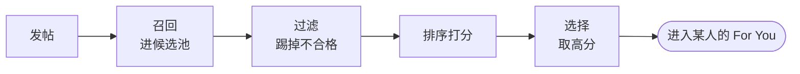

# 发帖指南 —— 从算法机制反推

> 这是一份发帖指南,但它不是"运营攻略"。
> 区别只有一条:这里的每一项,都从 `xai-org/x-algorithm` 的一个**源码机制**反推而来,并标注行号。不来自机制的,不写。
> 配套:[[operating-myths]] 告诉你哪些流行说法是错的;本页告诉你机制到底意味着什么、你能怎么做。

## 一条总纲

算法删光了打分侧的**每一个手工特征**(`README.md:55, 324-325`)。这意味着:**没有"格式""关键词""结构"这类技巧可以套** —— 打分模型根本不看这些。

它只量一件事:**像你受众这样的人,看到这条帖子,会不会产生正向行为**(点赞、回复、转发、停留……)。

所以下面所有"技巧",本质都是同一句话的推论 —— 要么帮你的好内容拿到它应得的分,要么避免被某个结构性机制白白扣分。**这里没有"骗算法",因为没什么可骗的。**

## 你的帖子要过的几道关

一条帖子要先**被召回**、**不被过滤**、再在**排序**里拿到够高的分,才会出现在某个人的信息流里。下面按这几关来。

## 召回关:先让帖子进得了候选池

### 主题聚焦 —— 让模型能把你"放进对的篮子"

站外触达靠**双塔召回**:一个塔把用户编码成向量,一个塔把帖子编码成向量,比相似度取 top-K(`README.md:191-195`)。一条主题聚焦的帖子,语义向量信号清晰,更容易被匹配给真正感兴趣的人;一条什么都聊一点的帖子,信号是糊的。

> ❌「今天好累……顺便说下我对 RAG 的看法,对了周末有人爬山吗」—— 三个主题挤一条,向量糊成一团。
> ✅ 一条只讲一件事。想讲三件,发三条(注意下面的"节奏")。

(这是从"召回靠 embedding 相似度"得出的合理推断,不是源码里的硬规则。)

### 趁新鲜 —— 帖子的分发有时间窗

`AgeFilter` 会把**超过最大帖龄**的帖子直接过滤掉,进不了候选池(见 [[filtering-pipeline]])。帖子不是永久在分发池里,它有一个新鲜窗口,过了就基本不再被推。

推论:别指望旧帖被"算法重新翻红";要让一条帖子在它还新鲜时,尽量多地遇到活跃的受众。

## 排序关:算法在量的正向信号

排序模型对每条候选预测约 **22 种行为概率**,`RankingScorer` 加权求和成最终分(`ranking_scorer.rs:12-39, 125-170`)。你没法直接操纵 22 个,但它们归结成几类"你的内容该做到的事":

| 算法在量的正向行为 | 你的内容要做到 |
|---|---|
| 停留 `dwell` / `dwell_time` | 让人停下来看完 —— 开头有钩子、信息密度高、排版可读 |
| 回复 `reply` | 留出讨论空间 —— 抛观点、提真问题、有可接的话茬 |
| 转发 / 引用 `retweet` / `quote` | 值得"我也要让别人看到" —— 有信息增量、有转发的理由 |
| 点赞 `favorite` | 说出别人想说没说的 —— 观点清晰、有共鸣 |
| 点击 / 展开 `click` / `photo_expand` | 首句、首图给**真实**信息钩子(不是夸张标题) |
| 主页点击 / 关注 `profile_click` / `follow_author` | 让人想点进你主页、想长期追你 |
| 视频质量观看 `vqv` | 视频够长、前几秒留住人 |

几个值得展开的:

**停留(dwell)**是最该重视的信号之一 —— 它是正向加权项,而它的反面 `not_dwelled`(划走没停留)是负向项(`ranking_scorer.rs:83`)。一条帖子的开头几秒决定它是被读还是被划走。

> ❌ 开头铺垫三行才进正题。✅ 第一句就给最硬的那个信息或判断。

**回复(reply)**奖励"没把话说死"的内容。一条结论完整、无可补充的帖子,没有回复的入口;一条留了一个真问题、或一个可被反驳的判断的帖子,有。

**关注(follow_author)**:模型会预测"看到这条会不会关注作者"。所以每条帖子顺带回答一句"你是谁、为什么值得追"是有价值的 —— 这也是把一次性曝光转成长期受众的机制入口。

**视频**:`vqv`(视频质量观看)是加权项,但它的权重会**按视频时长动态置 0** —— 太短的视频,连 `vqv` 这一项的分都拿不到(`home-mixer/scorers/vm_ranker.rs:103` 的 `vqv_ineligible`)。发视频,要够长到能产生一次"质量观看"。

## 扣分关:别白白丢分

### 五个负向行为 —— 标题党的代价写死在源码里

22 个行为里有 5 个是**负权重**:`not_interested`、`block_author`、`mute_author`、`report`、`not_dwelled`,汇成 `negative_sum`(`ranking_scorer.rs:83`)。最终分算的是**正向减负向**。

最反直觉、也最重要的一条:**"招黑"比"没人理"更糟。** 一条无人问津的帖子,负向信号也低;一条靠夸张标题骗来点击、却让人点进来就划走/反感的帖子,是**净亏**的。

> ❌「不看后悔!这个方法太炸了!!!」→ 骗到 `click`,但点进来发现内容空 → `not_dwelled` 拉满 → 倒扣。
> ✅ 标题就把价值说清楚 → 点进来的人是真想看 → 停留、读完。

### 作者多样性衰减 —— 别在一次刷新里自我刷屏

`RankingScorer` 有一步作者多样性衰减:同一作者在一次信息流计算里,排在后面的帖子,分数乘一个递减系数 `(1-floor)·decay^N+floor`(`ranking_scorer.rs:186-217`)。同时处于"新鲜窗口"的帖子越多,越容易在同一次计算里撞上,触发衰减。

> ❌ 十分钟内连发 4 条 → 它们很可能在同一次 feed 计算里相遇,第 2、3、4 条被逐级压分。
> ✅ 把帖子在时间上摊开,让每条都尽量以"该作者第一次出现"的满乘数被打分。

这不是"少发帖",是"别让自己的帖子在同一屏里互相踩"。

### 安全红线 —— 触发就直接出局

选后过滤的 `VFFilter` 会按可见性服务的判定,剔除删帖、spam、暴力血腥等内容(`phoenix_candidate_pipeline.rs:317-321`);后台的 [[grox-classifiers|Grox]] 还会跑 spam 检测与 PTOS 安全策略判定。这些是**过滤**,不是扣分 —— 命中就是从候选里被拿掉,分数再高也没用。

推论:别让内容长得像 spam(纯链接、群发感、重复刷);合规是地基,不是加分项。

## 破圈:站外触达的真相

破圈要过**两道关**:

**第一道是召回。** 你的帖子要进一个陌生人的候选池,得先被双塔召回模型按相似度选中(见上文「召回关 · 主题聚焦」)—— 这一关淘汰"泛而糊"的内容,奖励"锐而准"的内容。没被召回,后面这一切都不发生。

**第二道才是 OON 折扣。** 就算被召回了,`RankingScorer` 最后一步还会给**站外**候选乘一个小于 1 的 OON 系数,**站内**(你的粉丝)不乘(`ranking_scorer.rs:220-239, 272-275`)。

三个推论:

1. **关注你的人是基本盘。** 你的内容对他们默认"全价"分发,不打折 —— 先把关注你的人服务好,这是回报最确定的地方。
2. **破圈是"窄门 + 折扣"。** 先靠内容的"锐度"挤进陌生人的召回 top-K(窄门),再靠"强度"扛住 OON 折扣。两者缺一不可 —— 这也是"做泛内容轻松破圈"为什么错:泛内容连第一道窄门都进不去。
3. **涨粉的真实价值**,不是一个数字,而是把"默认全价分发"的受众池做大。

## 发帖节奏:由机制决定,不由玄学决定

源码里**没有**"最佳发帖时间"这种东西。但几个机制合起来,有明确推论:

- **频率**:受作者多样性衰减约束 —— 不是"别多发",是"别让多条挤在同一个新鲜窗口里互相压分"。把好内容摊开。
- **时效**:受 `AgeFilter` 约束 —— 帖子有新鲜窗口,在受众活跃时发,让它在窗口内多遇到人。
- **一次性**:`PreviouslySeenPostsFilter` 会过滤用户已看过的帖(见 [[filtering-pipeline]])—— 同一个人基本不会反复刷到你同一条。**一条帖子对单个用户,机会基本只有一次**,所以第一句和首图格外关键。

## 不要做的事(反面清单)

每一条都对应 [[operating-myths]] 里被源码打穿的迷思:

- ❌ 堆关键词、套"爆款模板" —— 打分侧没有识别这些的特征。
- ❌ 标题党骗点击 —— `not_dwelled` 直接扣分。
- ❌ 短时间刷屏 —— 作者多样性衰减。
- ❌ 买假互动 —— 招来的"划走/不感兴趣"是净亏,且对真实受众契合毫无帮助。
- ❌ 迷信一套"万能打法" —— 打分是 per-user 的,权重还是随时可调的参数。

## 把指南用在一条帖子上

同一个内容,两种发法:

**踩坑版**

> 【爆】AI 又变天了!!!这个工具我不允许还有人不知道!!速看 👇
> [一个纯链接]

问题逐条对:标题党 → `not_dwelled`;纯链接无正文 → 像 spam,过 Grox spam 判定有风险;零信息密度 → 没有 `dwell` 价值;没有讨论缺口 → 没有 `reply` 入口;主题靠喊不靠内容 → 召回向量糊。

**顺着机制版**

> 用了三周某 AI 代码审查工具,说个反直觉的结论:它最大的价值不是找 bug,是逼我把 PR 拆小。
> 因为它对超过 400 行的 diff 基本给不出有用意见 —— 这反而成了团队里"PR 该多大"的硬约束。
> [一张相关截图]
> 你们是把 AI 审查当"多一双眼睛",还是当"卡门槛的规则"?我越来越倾向后者。

逐条对:首句"反直觉的结论" = 钩子(`click` + `dwell`);"三周""400 行"等具体信息 = 信息密度(`dwell`);一个非共识判断 = 可引用的观点(`quote` / `retweet`);结尾一个真问题 = 讨论缺口(`reply`);全程聚焦"AI 代码审查"一个主题 = 召回向量清晰;无标题党、无纯链接、不刷屏 = 不踩扣分项。

注意:"顺着机制版"也**不保证**爆 —— 它只保证你的内容没有被结构性机制白白坑掉。剩下的,看内容本身。

## 别忘了边界

- **机制 ≠ 数值**:源码给的是方向(这是正信号、那是负信号、这里有衰减),不含线上真实权重值。本页只说方向,不说"值多少分"。
- **算法只分发,不创作**:算法把内容匹配给可能喜欢的人,它不会把平庸内容变好。所有"正向行为"最终由真实的人决定 —— 这份指南帮你不被机制坑掉,但替代不了"内容本身值得被看"。
- **权重会变**:22 个行为权重、多样性 `decay`、OON 系数都是 feature switch 参数(`ranking_scorer.rs:42-66`),X 随时可调。别把任何具体打法当永恒。

## 出处

| 建议 | 机制依据 |
|------|----------|
| 主题聚焦利于召回 | 双塔召回 `README.md:191-195`、[[phoenix-retrieval]] |
| 帖子有新鲜窗口 / 一次性曝光 | `AgeFilter`、`PreviouslySeenPostsFilter`,[[filtering-pipeline]] |
| 22 种行为加权,围绕正向信号创作 | `ranking_scorer.rs:12-39, 125-170` |
| 避开 5 个负向行为,标题党招 `not_dwelled` | `ranking_scorer.rs:83` |
| 别在一次刷新里自我刷屏 | 作者多样性衰减 `ranking_scorer.rs:186-217` |
| 安全/spam 触发即出局 | `VFFilter`(`phoenix_candidate_pipeline.rs:317-321`)、[[grox-classifiers]] |
| 站内是基本盘,破圈要更强 | OON 降权 `ranking_scorer.rs:220-239, 272-275` |
| 打分侧无手工特征,无模板可套 | `README.md:55, 324-325` |

每条「详见」的技术页都附 `文件:行号` 锚点,可逐条核对。

## 相关页面

- [[operating-myths]] —— 配对页:九个流行运营迷思,逐条对源码
- [[how-it-works]] —— 端到端白话总览:帖子怎么走进 For You
- [[scoring-and-ranking]] —— 打分三步:加权求和 / 多样性衰减 / OON 降权
- [[filtering-pipeline]] —— 17 个过滤器:哪些帖子会被直接踢掉
- [[phoenix-retrieval]] —— 双塔召回:站外触达的技术通道
- [[visibility-and-shadowban]] —— 限流与 shadowban:别把召回不力误判成"被限流"
- [[new-account-cold-start]] —— 新号与冷启动:算法怎么区别对待新账号
- [[system-architecture]] —— 技术版系统架构总览
