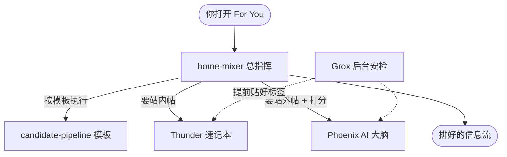

# 白话 —— 五大组件速览

> 这套系统由五个部分组成。这一页用大白话说清**每个是干嘛的、为什么需要它**。
> 想看技术细节,跟着每节的链接走。

## 一张表先看全

| 组件 | 一句话 | 类比 |
|------|--------|------|
| **home-mixer** | 总指挥,把所有步骤串起来 | 厨房总管 |
| **candidate-pipeline** | 流水线的标准模板 | 菜谱的固定格式 |
| **Thunder** | 站内帖子的速记本 | 随身记事本 |
| **Phoenix** | AI 大脑:海选 + 精排 | 招聘的 HR + 面试官 |
| **Grox** | 后台的安检与贴标签 | 超市验货区 |

---

## 1. home-mixer —— 总指挥

**定位**:整个 For You 流程的"总指挥",对外提供"给我一份 For You"的接口。

你点开 App,请求先到 home-mixer。它负责**按顺序把活派下去**:让 Thunder 出站内帖、让 Phoenix 海选站外帖、安排补资料、过滤、打分、最后插广告递出去。它自己不"干苦活",只负责调度。

> 像餐厅的厨房总管:不亲自炒菜,但喊"备料组上!""炒锅组上!""摆盘!" —— 保证一道菜按流程走完。

技术版:[[home-mixer-orchestration]]

---

## 2. candidate-pipeline —— 流水线的标准模板

**定位**:一套可复用的"流水线模板",规定推荐流程长什么样。

它本身**不知道**什么是帖子、什么是广告。它只定义一套骨架:一条推荐流水线分哪些阶段(出候选 → 补资料 → 过滤 → 打分 → 选择 → 收尾)、哪些阶段能同时做、哪些必须排队做。home-mixer 就是往这个模板的每个阶段里"填空"。

> 像一张标准菜谱格式:"备料 → 主料处理 → 调味 → 装盘"。格式是固定的,具体填"番茄"还是"鸡蛋"由厨师定。

为什么单独抽出来?因为系统里不止一条流水线(主信息流、广告混排各一条),用同一个模板省去重复、不容易出错。

技术版:[[candidate-pipeline-framework]]、[[candidate-pipeline]]

---

## 3. Thunder —— 站内帖子的速记本

**定位**:一个全内存的小型库,专门快速回答"我关注的这些人,最近发了什么"。

它从 X 的实时数据流里不停接收新帖子,把**全网最近约两天**的帖子按作者记在内存里。你关注了几百上千人,它能在**一毫秒内**把这些人的近期帖子全捞出来 —— 不查数据库,因为查库太慢。

> 像一本随身速记本:常用的、最近的信息记在手边,翻一下就有,不用每次跑去档案室。

它只保证"新",不做相关性排序 —— 那是 Phoenix 的活。超过保留期的旧帖会被自动清掉。

技术版:[[thunder-in-network-store]]、[[thunder-kafka-ingestion]]、[[post-store]]

---

## 4. Phoenix —— AI 大脑

**定位**:这套系统的"智能"所在,基于 X 的 Grok 模型。它干**两件事**:

- **召回**:从全网几百万条帖子里,海选出几百条你可能感兴趣的(包括你没关注的人)。用的是"双塔"办法 —— 把"你"和"每条帖子"各自压成一串数字,谁和你最接近就选谁。
- **排序**:对召回来的候选精细打分,预测你会点赞、回复、转发、还是划走、举报。

> 像招聘:召回是 HR 海选简历(快、粗),排序是面试官逐个深谈打分(慢、准)。

它的核心是一个移植自 Grok 的 transformer 模型 —— 你可以理解成"和 ChatGPT 同源的那种 AI",只不过这里不是用来聊天,而是用来读懂你的兴趣。

技术版:[[phoenix-retrieval]]、[[phoenix-ranking]]、[[grok-transformer]]、[[recsys-model]]、[[recsys-retrieval-model]]

---

## 5. Grox —— 后台的安检与贴标签

**定位**:一个**不在你请求路径上**的后台服务。它默默地理解每一条新帖子。

它用视觉语言模型(能同时看文字和图片的 AI)给帖子做判断:这是不是垃圾评论?有没有不安全内容?质量高不高(是不是"banger")?并把帖子转成一串数字(嵌入),供召回用。

这些活为什么不在你点开 App 时做?因为太慢。所以提前在后台做好,把"标签"存起来,你刷信息流时直接取用。

> 像超市:你在货架前挑东西时,验货、贴价签、分类上架早在后台做完了。

技术版:[[grox-architecture]]、[[grox-classifiers]]、[[multimodal-embedders]]

---

## 它们怎么配合(一句话串起来)

你点开 For You → **home-mixer** 按 **candidate-pipeline** 模板执行 → 找 **Thunder** 要站内帖、找 **Phoenix** 海选站外帖并打分 → 而 **Grox** 早已在后台把每条帖子的安全/质量标签备好 → 最后 home-mixer 选高分的、插广告,递给你。

## 出处

每个组件的关键源码如下(精确行号、结构体 / 函数名见对应技术页的「源码锚点」):

| 组件 | 技术页 | 关键源码 |
|------|--------|----------|
| home-mixer | [[home-mixer-orchestration]] | `home-mixer/server.rs`、`home-mixer/main.rs` |
| candidate-pipeline | [[candidate-pipeline-framework]]、[[candidate-pipeline]] | `candidate-pipeline/candidate_pipeline.rs`、`candidate-pipeline/lib.rs` |
| Thunder | [[thunder-in-network-store]]、[[post-store]] | `thunder/posts/post_store.rs`、`thunder/thunder_service.rs` |
| Phoenix | [[phoenix-retrieval]]、[[phoenix-ranking]]、[[grok-transformer]] | `phoenix/recsys_retrieval_model.py`、`phoenix/recsys_model.py`、`phoenix/grok.py` |
| Grox | [[grox-architecture]] | `grox/engine.py`、`grox/dispatcher.py`、`grox/plans/plan_master.py` |

## 相关页面

- [[how-it-works]] —— 端到端白话总览
- [[how-posts-are-picked]] —— 白话:帖子是怎么被选中的
- [[operating-myths]] —— 运营迷思 vs 源码真相:逐条对源码行号
- [[posting-guide]] —— 发帖指南:从算法机制反推发帖技巧
- [[end-to-end-dataflow]] —— 端到端数据流:五大组件串起来,一条帖子从发布到被推荐
- [[glossary]] —— 术语速查表
- [[faq]] —— 常见疑问
- [[system-architecture]] —— 技术版系统架构
