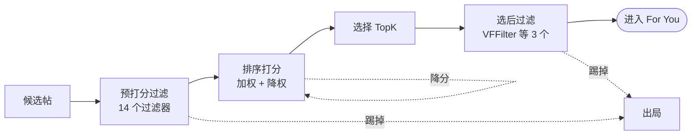

# 限流与 shadowban：源码级真相

> 创作者最焦虑的问题：「我是不是被限流了？被 shadowban 了？」
> 这一页只做一件事：把 `xai-org/x-algorithm` 开源源码翻一遍，看清算法里**到底有哪些"不展示你"的机制**，再把民间"shadowban"的说法逐条拉到源码前对质 —— 哪些是真的，哪些是误解。
> 规矩同 [[operating-myths]]：每条结论的精确 `文件:行号` 锚点见末尾「出处」与对应技术页。

## 一句话先说结论

源码里**确实有**会让你的帖子"不被展示"的机制，但它们分三类，没有一类是民间想象的那个"账号级限流开关"：

1. **可见性过滤**：违规内容（删帖、垃圾、暴力血腥等）会被整条剔除 —— 这是真的"压制"，但它针对**内容**，由一个**不在开源仓库里**的可见性服务判定。
2. **过滤器踢人**：拉黑、静音、帖子太旧、各种去重 —— 这些是确定的规则，命中即出局，但每一条都有明确的、与"惩罚"无关的系统理由。
3. **排序降权**：作者多样性衰减、站外（OON）降权 —— 这是**降分**，不是封禁，而且不针对任何特定账号。

下面逐类拆开。

## 算法里真实存在的"压制"机制

帖子要进某人的 For You，先经过滤、再排序、再选择（见 [[how-it-works]]）。"压制"可能发生在两处：过滤阶段被**整条踢掉**，或排序阶段被**降分**。

### 机制一：选后可见性过滤 —— 违规内容确实会被压制

这是民间"shadowban"里**唯一对得上**的硬机制。

在 TopK 选择之后，流水线跑三个选后过滤器（`phoenix_candidate_pipeline.rs:317-321`），其中两个专门做可见性剔除：

- **`VFFilter`** —— 每个候选身上挂着一个"可见性原因"`visibility_reason`。`VFFilter` 按这个原因判断要不要丢弃：如果原因是一个"安全结果"且其 `action` 是 `Drop`，丢弃；如果是**其它任何**可见性原因，也一律丢弃；没有原因才保留（`vf_filter.rs:22-30`）。删帖、垃圾、暴力血腥等内容就是在这里被整条剔除的。
- **`AncillaryVFFilter`** —— 处理"附属帖"：如果一条候选引用、转发、或回复了一条被判定要丢弃的帖子，这条候选会被标记 `drop_ancillary_posts`，然后被 `AncillaryVFFilter` 连带剔除（`ancillary_vf_filter.rs:13-15`）。也就是说，你转发/引用一条违规帖，可能把自己这条也搭进去。

这个"可见性原因"是怎么来的？由上游一个 `VFCandidateHydrator` 调用**可见性过滤服务**得到的（`vf_candidate_hydrator.rs:36-39`）。它对站内帖用一个安全等级、对站外帖用另一个安全等级分别查询（`vf_candidate_hydrator.rs:76-90`）。

**所以**：如果你的帖子内容触发了平台的安全/合规判定，它会在进入任何人 For You 的最后一关被**整条拿掉** —— 这不是"降权"，是"不展示"。这一条，民间说的"违规会被压"是对的。

> ⚠️ 重要边界，下面「诚实边界」一节会专门讲：开源仓库里有 `VFFilter` 这个**消费端**，但**产生**可见性标签的那个服务本身不在仓库里。所以"哪些内容会被判违规、判多严"——源码无法回答。

### 机制二：14 个预打分过滤器里，会"踢掉你"的那几个

打分之前，流水线先跑 14 个过滤器筛掉不合格候选（`phoenix_candidate_pipeline.rs:274-289`，逐个逻辑见 [[filtering-pipeline]]）。其中和"我的帖子没被看到"直接相关的：

| 过滤器 | 什么情况下踢掉你的帖子 | 这是"针对你"吗 |
|--------|------------------------|----------------|
| `AuthorSocialgraphFilter` | 看的人**拉黑或静音**了你；或**你拉黑了**看的人 | 不是。是这一对用户的私人关系，不是平台对你的判定 |
| `AgeFilter` | 你的帖子**太旧**了（超过最大帖龄） | 不是。是时效规则，对所有帖子一视同仁 |
| `DropDuplicatesFilter` / `RetweetDeduplicationFilter` | 同一条帖子在候选里出现多次，只留一条 | 不是。是去重 |
| `PreviouslySeenPostsFilter` 等三件套 | 这个用户**已经刷到过**你这条 | 不是。是"别给同一个人重复看" |
| `MutedKeywordFilter` | 帖子命中了**用户自己设的**屏蔽词 | 不是。是用户的个人偏好设置 |

重点看 `AuthorSocialgraphFilter`，它最容易被误解成"被限流"。它的判定很直白（`author_socialgraph_filter.rs:46-52`）：命中以下任一即剔除 —— 作者被该用户静音、作者被该用户拉黑、作者拉黑了该用户、引用帖作者与该用户互相拉黑、该用户拉黑了被转发的作者。

**所以**：如果 A 拉黑了你，你的帖子永远进不了 A 的 For You。但这是 **A 和你之间**的事，由 A 的拉黑/静音名单决定 —— 换一个没拉黑你的用户 B，这个过滤器对你毫无影响。它不是一个挂在你账号上的全局开关。`AgeFilter` 同理：它踢的是"旧帖"，不是"你"，新帖完全不受影响（这也是 [[posting-guide]] 强调"趁新鲜发"的原因）。

### 机制三：排序里的"降权" —— 是降分，不是封禁

就算过了所有过滤器，排序阶段 `RankingScorer` 还会做两步可能拉低你分数的调整（机制细节见 [[scoring-and-ranking]]）：

- **作者多样性衰减**：在**同一次** For You 计算里，把候选按分降序排，同一个作者第 N 次出现的帖子，分数乘一个随 N 递减的系数（`ranking_scorer.rs:186-217`）。你在同一屏里出现越多次，靠后的那几条被压得越狠。
- **站外（OON）降权**：如果一条候选对当前用户是"站外"的（不是他关注的人），最终分会乘一个小于 1 的 OON 系数；"站内"的则不乘（`ranking_scorer.rs:272-275`）。

**所以**：这两步是**降分**，不是**剔除**。被降分的帖子还在候选池里、还参与排序，只是分数低了、排名靠后了。它和"封禁/不展示"是两回事。而且关键在于 —— 它们**不针对特定账号**：多样性衰减对所有作者用同一个公式，OON 降权对所有"站外"内容用同一个系数。这是下一节要逐条澄清的重点。

## 民间"shadowban"逐条对质

把流传最广的几条"shadowban"说法，逐条拉到源码前。

### 「平台给我账号挂了个限流标记」—— 源码里找不到

**流行说法**：被 shadowban 的账号会被打上一个标记，所有帖子的曝光被悄悄全局压低。

**源码怎么说**：翻遍 `home-mixer` 的 14 个预打分过滤器和 3 个选后过滤器，**没有任何一个**过滤器读取"这个作者是否被限流"这类账号级标志。会踢人的过滤器，判据全是别的东西：拉黑/静音名单（`AuthorSocialgraphFilter`）、帖龄（`AgeFilter`）、是否重复、用户是否看过、用户的屏蔽词。排序侧的 `RankingScorer` 也一样 —— 它的输入是 22 种行为预测概率、作者多样性位置计数、是否站内（`ranking_scorer.rs`），没有一个"账号限流系数"。

**判定**：在**这个开源仓库**里，**没有**一个"你被限流了"的账号级总开关。压制要么是内容触发可见性过滤（机制一）、要么是某个具体过滤器的具体规则（机制二）、要么是不针对账号的排序降权（机制三）。

> 严谨边界：这只能说"开源出来的 home-mixer 推荐链路里没有这个开关"。可见性过滤**服务**内部有没有账号维度的逻辑，不在仓库、无法定论 —— 见「诚实边界」。

### 「违规内容会被压」—— 这条是真的

**流行说法**：发了平台不喜欢的内容，帖子会被悄悄压住没人看到。

**源码怎么说**：对得上机制一。`VFFilter` 会按可见性服务给出的原因，把判定为应丢弃的帖子在选后阶段整条剔除（`vf_filter.rs:22-30`）。`AncillaryVFFilter` 还会连带处理引用/转发了违规帖的附属帖。这确实是一种"你看不到、别人也看不到"的压制。

**判定**：**真的**。违规内容会被可见性过滤压制 —— 这是 17 个过滤器里实打实的一环。区别只在于：它针对的是**这条内容**，不是给你账号挂标记；判定违规与否的逻辑在仓库外的服务里。

### 「我的帖子推不出去 = 被限流了」—— 多半是召回这道窄门

**流行说法**：帖子没几个陌生人看到，一定是被限流了。

**源码怎么说**：你的帖子要进一个陌生人的 For You，**第一关是召回**，不是过滤、也不是排序。站外内容靠双塔模型按向量相似度取 top-K（见 [[phoenix-retrieval]]、[[operating-myths]] 迷思三）——**没被召回进候选池，后面的过滤、排序、压制根本都不会发生**。一条"泛而糊"的内容进不了任何兴趣簇的召回 top-K，看起来就像"推不出去"，但这不是"被限流"，是它在召回这道窄门外就落选了。

**判定**：**常见误解**。"推不出去"绝大多数情况是**没被召回**或**排序分不够高**，而不是某个压制开关被打开。把召回不力误判成"被限流"，会让人去找根本不存在的"申诉解封"路径，而不是去改内容。

### 「站外降权是平台在惩罚我」—— 误解，它是系统平衡旋钮

**流行说法**：我的帖子在陌生人那儿被打了折，是算法在惩罚我、限制我破圈。

**源码怎么说**：OON 降权的代码是 `Some(false) => after_diversity * effective_oon`（`ranking_scorer.rs:272-275`）—— 它的判据是 `in_network`：这条帖对**当前这个用户**是不是站内（他关注的人）。对你的粉丝，你的帖子是"站内"，不打折；对陌生人，是"站外"，乘 OON 系数。这个系数对**所有人的所有站外内容**都一样，是站内/站外内容比例的一个全局平衡旋钮（[[scoring-and-ranking]] 称之为"站内/站外平衡的核心旋钮"）。

**判定**：**误解**。OON 降权不是针对你的惩罚 —— 它对全平台每一条站外候选一视同仁，连大 V 也一样。它存在的目的是让 For You 不至于全是陌生人内容、保留一定比例的关注流。你不在任何"惩罚名单"上，你只是在那个用户的视角里恰好是"站外"。

### 「同一作者的帖子被衰减 = 该作者被限流」—— 误解，它防的是刷屏

**流行说法**：我连发的帖子后面几条没量，是我被算法盯上了。

**源码怎么说**：作者多样性衰减（`ranking_scorer.rs:186-217`）的作用域是**单次 For You 计算**：在某一个用户的某一次刷新里，把候选按分排序，同一作者出现第 0 次乘 1.0、第 1 次起逐条乘递减系数。它衰减的是"同一作者在**这一屏**里的第 2、3、4 条"，**不是**"这个账号的所有帖子"。换一次刷新、换一个用户，计数从头开始。

**判定**：**误解**。这是个**反刷屏**机制，防的是单屏被一个作者刷满，不是账号级惩罚。[[operating-myths]] 迷思一说得很直接：刷屏不是多曝光，是"自我稀释"——你后发的帖子被自己前一条压分，而不是被平台压。

### 「掉粉/没量是因为账号被降权」—— 源码里没有这个变量

**流行说法**：最近数据差，是账号权重被下调了。

**源码怎么说**：`RankingScorer` 算最终分时，没有任何"账号权重""作者信誉分"这类输入。它算的是 22 种**行为预测概率**的加权和（`ranking_scorer.rs:146-170`），其中 5 个是负向行为（`not_interested`、`block_author`、`mute_author`、`report`、`not_dwelled`），权重为负（`ranking_scorer.rs:83`）。也就是说：如果你的内容让很多人"划走没停留""点不感兴趣""举报"，分数会被这些**负向预测**实实在在地拉低 —— 但这是模型对**这条内容**的真实用户反应的预测，不是挂在账号上的一个降权乘数。

**判定**：**误解**（机制存在，归因错了）。数据下滑可能真实发生，但源码里它的成因是"模型预测这条内容会招来更多负向行为"或"召回/排序竞争中落败"，不是一个"账号降权"变量被调低。详见 [[operating-myths]] 迷思二、[[posting-guide]]「扣分关」。

## 诚实边界：开源仓库给了什么、没给什么

这是本页最重要的一节 —— 不说清楚，前面所有结论都会被误读。

**仓库里有的（可核验）**：

- 可见性过滤的**消费端**：`VFFilter` / `AncillaryVFFilter` 怎么按 `visibility_reason` 剔除候选（`vf_filter.rs`、`ancillary_vf_filter.rs`），`VFCandidateHydrator` 怎么去**调用**可见性服务取回这个原因（`vf_candidate_hydrator.rs`）。
- 全部 17 个过滤器、排序 `RankingScorer` 的完整逻辑 —— 所以"home-mixer 推荐链路里有没有账号级限流开关"这个问题，**能**回答：没有。

**仓库里没有的（无法定论）**：

- **产生可见性标签的可见性过滤服务本身**。`VFFilter` 用到的 `FilteredReason`、`Action`、安全等级 `SafetyLevel` 这些类型，都来自一个外部 crate `xai_visibility_filtering`，它的实现不在 `x-algorithm` 的目录树里。所以"一条内容会不会被判违规、判得多严、有没有账号维度的考量"——**源码里看不到，不能下结论**。
- **线上 feature switch 的真实数值**：OON 系数、多样性衰减因子、最大帖龄、22 个行为权重 —— 全是可调参数，开源仓库不含生产数值。所以本页只能说"机制是降权""这是负权重"，不能说"降到几折""旧帖几小时后失效"。
- 生产级训练模型、训练数据、A/B 实验配置。

**一句话**：本页能负责任地说的，是**机制层面**的真相 —— 推荐链路里有哪些压制机制、它们各自的触发条件和系统目的。本页**不能**说的，是可见性服务内部如何运作、线上参数是多少。把"我看不到这个服务"老实说出来，本身就是和那些言之凿凿的"shadowban 攻略"的根本区别。

## 总结：焦虑的真正出口

| 民间"shadowban"说法 | 源码判定 |
|---|---|
| 账号被挂了个全局限流标记 | 开源推荐链路里**没有**这个开关 |
| 违规内容会被压住不展示 | **真的** —— `VFFilter` 按可见性服务判定整条剔除 |
| 帖子推不出去 = 被限流 | **多半是误解** —— 通常是没被召回 / 排序分不够 |
| 站外降权是平台惩罚我 | **误解** —— 对全平台站外内容一视同仁的平衡旋钮 |
| 同作者帖子被衰减 = 账号被盯上 | **误解** —— 单次刷新内的反刷屏机制 |
| 掉量是账号权重被下调 | **误解** —— 源码里没有"账号权重"这个变量 |

把六条合起来看，民间"shadowban"概念错在同一处：它把分散在算法各处、各有系统目的的机制（内容可见性过滤、拉黑去重、排序降权），想象成**一个挂在你账号上、可以被平台一键打开的总开关**。

源码给的答案是：

1. **真正会"不展示你"的，是内容可见性过滤** —— 它针对内容、不针对账号，判定逻辑在仓库外。守住内容合规这条线，是唯一对得上"shadowban"的实在动作。
2. **过滤器踢人，每一条都有别的理由** —— 拉黑是用户私人关系、`AgeFilter` 是时效、去重是去重。没有一个是"因为你是你"。
3. **排序降权是降分不是封禁，且不认人** —— 多样性衰减防刷屏、OON 降权平衡站内外，对所有人同一套公式。你逆着它们走会白丢分（别刷屏、别只指望站外），但它们不是针对你的惩罚。

所以，与其找一个并不存在的"解除限流"按钮，不如把精力放回 [[posting-guide]] 给出的、从机制反推的真问题上：内容能不能被召回（够不够"锐"）、能不能拿到正向行为预测、有没有踩中负向信号或合规红线。算法这一侧能做的，就这些。

## 出处

| 核心结论 | 源码 / 技术页 |
|----------|---------------|
| 选后 3 个过滤器装配位置 | `home-mixer/candidate_pipeline/phoenix_candidate_pipeline.rs:317-321` |
| `VFFilter` 按 `visibility_reason` 剔除（违规内容压制） | `home-mixer/filters/vf_filter.rs:22-30`、[[filtering-pipeline]] |
| `AncillaryVFFilter` 连带剔除附属帖 | `home-mixer/filters/ancillary_vf_filter.rs:13-15` |
| `visibility_reason` 由外部可见性服务经 `VFCandidateHydrator` 取回 | `home-mixer/candidate_hydrators/vf_candidate_hydrator.rs:11-14, 36-39, 76-90` |
| 14 个预打分过滤器装配位置 | `home-mixer/candidate_pipeline/phoenix_candidate_pipeline.rs:274-289`、[[filtering-pipeline]] |
| `AuthorSocialgraphFilter`：拉黑/静音才踢，是用户对关系 | `home-mixer/filters/author_socialgraph_filter.rs:46-52` |
| `AgeFilter`：踢的是旧帖、不是账号 | `home-mixer/filters/age_filter.rs:17-21` |
| 作者多样性衰减作用于单次计算、不针对账号 | `home-mixer/scorers/ranking_scorer.rs:186-217`、[[scoring-and-ranking]] |
| OON 降权按 `in_network` 判定、对全平台站外内容一致 | `home-mixer/scorers/ranking_scorer.rs:272-275`、[[scoring-and-ranking]] |
| 5 个负向行为权重为负（掉量的真实成因之一） | `home-mixer/scorers/ranking_scorer.rs:83`、[[operating-myths]] |
| 推荐链路里无账号级"限流开关" | 全部过滤器 + `RankingScorer` 输入中均无此变量 |
| 可见性过滤**服务**本身不在仓库（边界） | `xai_visibility_filtering` 为外部 crate，仓库目录树内无其实现 |

精确语义以技术页与源码为准；每条机制的精确行号见对应技术页的「源码锚点」。

## 相关页面

- [[filtering-pipeline]] —— 17 个过滤器的完整技术细节：`VFFilter` / `AncillaryVFFilter` / `AuthorSocialgraphFilter` 等
- [[scoring-and-ranking]] —— 排序三步：加权求和 / 作者多样性衰减 / OON 降权
- [[operating-myths]] —— 运营迷思 vs 源码真相：九个流行说法逐条对质
- [[posting-guide]] —— 发帖指南：从算法机制反推创作者能做什么
- [[phoenix-retrieval]] —— 双塔召回：帖子"推不出去"的真正第一关
- [[how-it-works]] —— 端到端白话总览：帖子怎么走进 For You
- [[system-architecture]] —— 技术版系统架构总览
