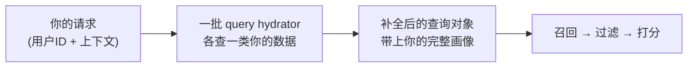

# 算法用了你的哪些数据

> 这一页只回答一个问题:**`xai-org/x-algorithm` 这个开源仓库里,For You 推荐算法实际读取了你的哪些数据?**
> 规矩照旧:每条都对得上源码。源码里看得到的才写,看不到的不写、不猜。
> 这是一份**"开源代码所展示的算法输入清单"** —— 它忠实回答"这套代码用了什么",不回答"X 公司还收集了什么"。仓库外的数据收集不在本页范围。

## 先理解一件事:数据是"现查"的

你打开 X、刷出 For You 的那一刻,`home-mixer` 服务收到一个请求。请求本身只带了很少的东西(你的用户 ID、国家、语言、客户端信息、你刚看过哪些帖子……)。其余关于"你是谁"的数据,是算法在这一刻**现去各个存储里查的**。

干这件"查数据"活儿的组件,源码里叫 **query hydrator**(查询水合器)—— 把一个信息稀少的请求,补全成一个信息完整的查询对象。每个 hydrator 负责查一类数据。所以"算法用了你哪些数据",等价于一个很具体的问题:**有哪些 query hydrator、各自去查了什么。**

下面就逐类列出。**注意:本页只列与"你这个人"相关的数据;关于候选帖子本身的资料补全(正文、作者、有没有视频等)不算用户数据,见 [[filtering-pipeline]]。**

## 一、你的社交图与设置

这一类数据,源码里集中放在一个叫 `UserFeatures` 的结构里。它一共**只有 6 个字段**(`home-mixer/models/user_features.rs:7-14`),逐个列清:

| 数据 | 源码字段 | 算法拿它做什么 |
|------|----------|----------------|
| **关注名单** | `followed_user_ids` | 决定哪些是"站内"帖子。也是给 [[thunder-in-network-store|Thunder]] 拉关注流的输入 |
| **拉黑名单** | `blocked_user_ids` | 你拉黑的人发的帖,直接从候选里剔除 |
| **静音名单** | `muted_user_ids` | 你静音的人发的帖,直接剔除 |
| **订阅名单** | `subscribed_user_ids` | 用于付费订阅内容的可见性判定 |
| **屏蔽词** | `muted_keywords` | 帖子正文命中你设的屏蔽词,直接剔除 |
| **粉丝数** | `follower_count` | 你自己的粉丝数 |

关于这一类,有几点要讲清楚:

- **拉黑 / 静音 / 屏蔽词,是"剔除",不是"降权"。** 命中即从候选里拿掉,不参与后面打分。拉黑名单还会顺带检查:被引用的人、被转发的人有没有被你拉黑(`author_socialgraph_filter.rs:33-52`、`muted_keyword_filter.rs:45-52`)。
- **屏蔽词是系统里关键词唯一的角色** —— 它是**你自己设的过滤器**,不是别人用来给内容加分的工具。详见 [[operating-myths]] 迷思四。
- **关注名单是多用途的**:除了划分站内/站外,你"关注了多少人"还会参与一个新用户判定 —— 新账号且关注数达到阈值,排序时站外内容的降权系数会不一样(`ranking_scorer.rs:229-238`)。
- 这一类数据的查询,由社交图谱服务相关的几个 hydrator 完成(`phoenix_candidate_pipeline.rs:192-203`)。

## 二、你最近的互动行为序列(算法的核心输入)

这是整套算法**最重要**的一类数据,也是它"懂你"的根据。

打分用的 AI 模型(那个 Grok 改的 transformer)不靠"你填的兴趣标签"工作。它读的是一条**你最近的真实行为序列** —— 你最近点了哪些赞、回复了谁、转发了什么、点开了什么、在哪条帖子上停留了多久。模型从这条序列里**自己学**出"你大概会喜欢什么"。

> 打个比方:不是看你的简历自我介绍,而是看你最近一段时间的"行为录像"。

源码里,这条序列由 **`ScoringSequenceQueryHydrator`** 去拉(`home-mixer/query_hydrators/scoring_sequence_query_hydrator.rs`)—— 它向一个"用户行为聚合服务"请求你的聚合行为序列。另有一条**给召回用的**序列,由 `RetrievalSequenceQueryHydrator` 拉(`retrieval_sequence_query_hydrator.rs`),内容同源、参数不同。两者都挂在生效的流水线上(`phoenix_candidate_pipeline.rs:186-191`)。

序列里每个帖子,都带着"你对它做过哪些动作"和"停留多久"。模型会把"做了"和"没做"都当信号 —— 它既知道你点赞了什么,也知道你刷到却没停留(`not_dwelled`)的是什么。技术细节见 [[phoenix-ranking]] 的"动作嵌入"和"历史动作"部分。

**一句话**:算法对你的判断,几乎全部建立在"你最近实际做了什么"上。不是你说你喜欢什么,是你的手指投了什么票。

> 边界说明:源码里还有两个文件 `user_action_seq_query_hydrator.rs` 和 `user_features_query_hydrator.rs`,但它们**没有**被登记进模块树(`query_hydrators/mod.rs`),也没有挂进任何流水线 —— 属于未生效的旧代码。当前真正生效的行为序列拉取器是上面说的 `ScoringSequence` / `RetrievalSequence` 两个。

## 三、这次请求的上下文

每次请求,你的客户端会带上一批"此刻的上下文"信息。源码里它们进入查询对象 `ScoredPostsQuery`(`home-mixer/models/query.rs:24-95`),由请求入口 `QueryBuilder` 从 proto 请求直接填入(`home-mixer/server.rs:89-121`):

| 数据 | 源码字段 | 说明 |
|------|----------|------|
| 用户 ID | `user_id` | 你的账号标识,一切查询的钥匙 |
| 国家 | `country_code` | 请求所在国家 |
| 语言 | `language_code` | 请求语言 |
| 客户端 | `client_app_id` / `client_version` | 哪个 App、哪个版本 |
| 设备信息 | `device_id` / `mobile_device_id` / `mobile_device_ad_id` / `user_agent` | 设备与广告标识 |
| 网络 / 时区 | `device_network_type` / `time_zone` | 网络类型、时区 |
| IP 地址 | `ip_address` | 见下方"可开关项" |
| 翻页位置 | `cursor` / `is_bottom_request` / `is_top_request` | 你在信息流里翻到哪了 |

这些大多是"让推荐适配你当前所处环境"的常规上下文(给你看本国本语言的内容、适配你的客户端)。

## 四、去重记录:你看过 / 被推过什么

为了不把同一条帖子反复推给你,算法会查几份"你已经见过什么"的记录。这些记录也都进入 `ScoredPostsQuery`(`query.rs` 第 29-30、36、93 行):

| 记录 | 源码字段 | 含义 | 谁来查 |
|------|----------|------|--------|
| 已看 ID | `seen_ids` | 你刚刷过的帖子(客户端随请求直接带上) | 请求自带 |
| 已服务 ID | `served_ids` | 系统过去递给过你的帖子 | `ServedHistoryQueryHydrator` |
| 服务历史 | `served_history` | 过去若干次 For You 递了什么的完整记录 | `ServedHistoryQueryHydrator` |
| 曝光布隆过滤器 | `bloom_filter_entries` | 一种压缩的"看过集合",空间换效率 | `ImpressionBloomFilterQueryHydrator` |
| 已曝光帖 ID | `impressed_post_ids` | 又一份曝光记录(见下方边界说明) | —— |

`seen_ids` 和布隆过滤器一起,被 `PreviouslySeenPostsFilter` 用来踢掉你已看过的候选(`previously_seen_posts_filter.rs:23-30`);`served_ids` 被 `PreviouslyServedPostsFilter` 用(`previously_served_posts_filter.rs:25-29`)。服务历史还顺带决定 "Who to follow" 模块的疲劳度(隔多久才再给你看一次,`served_history_query_hydrator.rs:91-109`)。

此外 `seen_ids` 还会被一个 side effect 写进 Kafka(`publish_seen_ids_to_kafka_side_effect.rs`,受开关 `EnablePublishSeenIdsToKafka` 控制)—— 也就是说,"你看过什么"既用于本次去重,也会作为曝光数据流向下游。

> 边界说明:`impressed_post_ids` 这个字段,确实有一个过滤器 `PreviouslySeenPostsBackupFilter` 会读它(`previously_seen_posts_backup_filter.rs:14`)。但在当前这版代码里,负责填它的 `ImpressedPostsQueryHydrator` 被构造成了一个**未挂载的局部变量**(`phoenix_candidate_pipeline.rs:234-236`,变量名带下划线前缀),没有进流水线。所以该字段当前不被任何生效的 hydrator 填充 —— 这是源码现状,如实记下。

## 五、可开关的画像数据

除了上面那些"基本盘",源码里还有一批 hydrator 查的是更细的画像数据。它们的共同点是:**都带 `enable()` 开关**,由 feature switch(灰度/实验开关)控制,不一定每次请求都生效。逐个列出(均在 `phoenix_candidate_pipeline.rs:185-232` 挂载):

| 数据 | hydrator | 开关(节选) |
|------|----------|--------------|
| 关注的 Grok 话题 | `FollowedGrokTopicsQueryHydrator` | `EnableContextFeatures` 等 |
| 关注的 Starter Pack | `FollowedStarterPacksQueryHydrator` | `EnableContextFeatures` |
| 推断的 Grok 话题 | `InferredGrokTopicsQueryHydrator` | `EnableGrokTopicsHydration` |
| 用户画像(demographics) | `UserDemographicsQueryHydrator` | `EnableContextFeatures` |
| 推断性别 | `UserInferredGenderQueryHydrator` | `EnableInferredGenderHydration` |
| IP 推断的地理位置 | `IpQueryHydrator` | `EnableIpFeature` + IP 非空 |
| 互关 minhash | `MutualFollowQueryHydrator` | `EnableMutualFollowJaccardHydration` |
| 上次请求时间戳 | `PastRequestTimestampsQueryHydrator` | `EnableUrtMigrationComponents` |

关于这一类:

- **"关注的话题 / Starter Pack"是你主动选的;"推断的话题 / 推断性别"是算法估的** —— 注意区分。推断类是模型对你的猜测,不是你填的。
- **新账号会触发额外推断**:比如推断性别,若存储里查不到、且判断你是新用户,会现场调一个预测服务算一个(`user_inferred_gender_query_hydrator.rs:35-39`)。
- **带 `enable()` 开关意味着"用不用是可调的"**。某次请求到底查没查这些,取决于你这个用户命中了哪组 feature switch 配置。开源仓库给了机制(有这些 hydrator),但**没给**线上开关的真实状态。所以诚实的说法是:这些是算法**有能力**读取的数据,具体某次读没读,不在开源仓库能确定的范围。

## 把它收成一句话

把开源代码里"算法读你哪些数据"摊开,大致是四块:

1. **你的社交图与设置** —— 关注/拉黑/静音/订阅名单、屏蔽词、粉丝数。其中拉黑/静音/屏蔽词是你给自己设的"剔除规则"。
2. **你最近的真实互动行为** —— 这是核心。模型从你点赞、回复、转发、停留的行为序列里学你的偏好,而不是读你填的标签。
3. **这次请求的上下文** —— 国家、语言、设备、客户端、翻到第几页。
4. **去重与画像** —— 你看过/被推过什么(防重复);以及一批可开关的细粒度画像(话题、地理、推断属性)。

最该记住的一点:**算法对你的判断,主力来自"你实际做了什么"**(第 2 块)。这也是为什么 [[operating-myths]] 反复强调"你面对的不是算法,是你自己行为的回声"。

> 再说一次边界:本页是对**开源仓库 `xai-org/x-algorithm`** 的忠实清点 —— 列的是这套代码里看得见的 query hydrator 和它们查的字段。它不声称这是 X 公司收集数据的全集,也不推测仓库之外的事。能追溯到 `文件:行号` 的才写进来了。

## 出处

| 核心结论 | 技术页 / 源码 |
|----------|----------------|
| `UserFeatures` 共 6 字段:关注/拉黑/静音/订阅/屏蔽词/粉丝数 | `home-mixer/models/user_features.rs:7-14` |
| 拉黑/静音的作者被剔除候选 | `home-mixer/filters/author_socialgraph_filter.rs:33-52` |
| 屏蔽词命中正文即剔除候选 | `home-mixer/filters/muted_keyword_filter.rs:45-52` |
| 关注名单参与站内判定 + 新用户判定 | `home-mixer/candidate_hydrators/in_network_candidate_hydrator.rs:21-33`、`scorers/ranking_scorer.rs:229-238` |
| 互动行为序列由 `ScoringSequence`/`RetrievalSequence` hydrator 拉取 | `home-mixer/query_hydrators/scoring_sequence_query_hydrator.rs`、`retrieval_sequence_query_hydrator.rs`;模型如何用见 [[phoenix-ranking]] |
| 行为序列是模型核心输入,含动作与停留 | [[phoenix-ranking]];`phoenix/recsys_model.py` |
| 请求上下文(user_id/国家/语言/设备/cursor)由 QueryBuilder 从 proto 填入 | `home-mixer/models/query.rs:24-95`、`home-mixer/server.rs:89-121` |
| `seen_ids`/布隆过滤器用于去重过滤 | `home-mixer/filters/previously_seen_posts_filter.rs:23-30` |
| `served_ids`/服务历史由 `ServedHistoryQueryHydrator` 查 | `home-mixer/query_hydrators/served_history_query_hydrator.rs` |
| 15 个内层 query hydrator 的完整挂载清单 | `home-mixer/candidate_pipeline/phoenix_candidate_pipeline.rs:185-232` |
| 可开关画像数据各带 `enable()`,由 feature switch 控制 | 各 hydrator 文件的 `enable()` 方法 |
| `impressed_post_ids` 的 hydrator 当前未挂载 | `home-mixer/candidate_pipeline/phoenix_candidate_pipeline.rs:234-236` |

精确语义与行号以技术页的「源码锚点」为准。

## 相关页面

- [[how-it-works]] —— 白话总览:For You 端到端怎么运转
- [[operating-myths]] —— 运营迷思 vs 源码真相:为什么"你面对的是自己行为的回声"
- [[phoenix-ranking]] —— 排序模型如何用你的互动行为序列
- [[home-mixer-orchestration]] —— query hydrator 在编排层的位置
- [[filtering-pipeline]] —— 拉黑/静音/屏蔽词/去重在过滤流水线里的细节
- [[thunder-in-network-store]] —— 关注名单如何用于拉取站内帖子
- [[glossary]] —— 术语速查表
